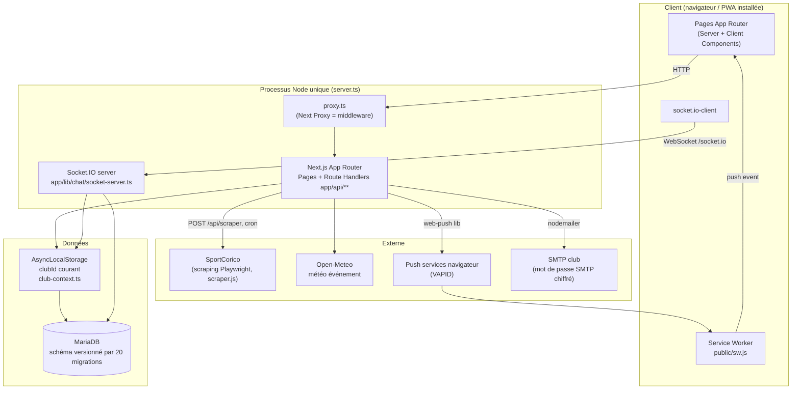
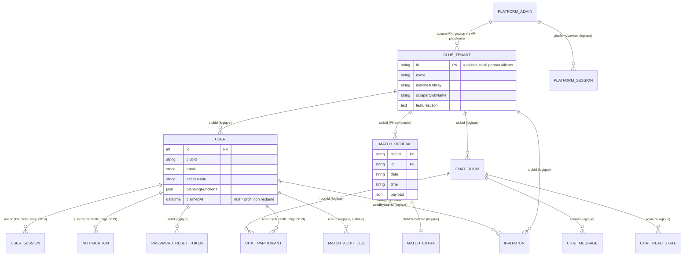
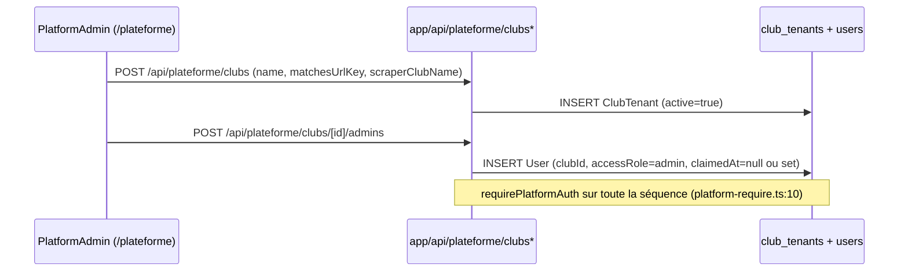
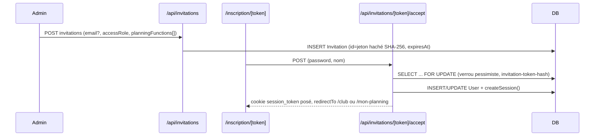
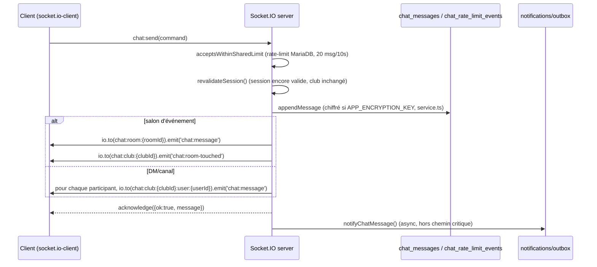
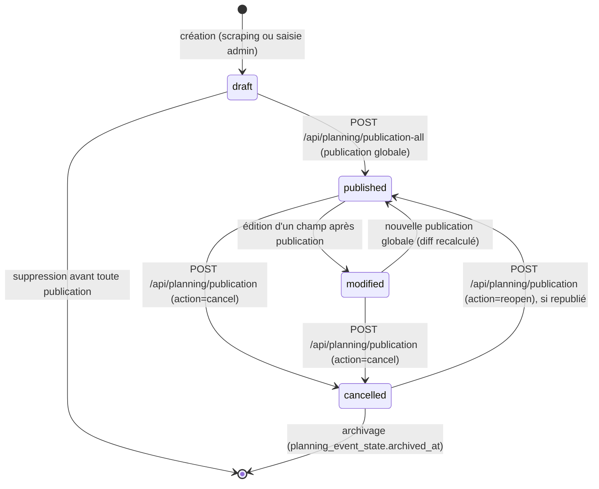

# Audit 00 — Cartographie globale AFP Planning

**Repository :** `https://github.com/brahmiamine/afp-planning`
**Périmètre analysé :** code présent dans `/workspace` (branche de travail basée sur `origin/main` @ `8e1c98f`) au 2026-09-10
**Méthode :** analyse statique exhaustive (Glob/Grep/Read) de `app/**`, `app/api/**`, `app/lib/**`, `proxy.ts`, `server.ts`, `scraper.js`, `.github/workflows/**`, `docs/**`, `package.json`. Commandes réellement exécutées dans la session des audits 01–08 : `pnpm lint` (106 warnings, FAIL), `pnpm type-check` (4 erreurs TS, FAIL), `pnpm test` sans MariaDB (11 tests failed / 666 passed / 286 skipped), `pnpm routes:coverage` (52/92), `pnpm audit --prod` (0 high/critical). CI GitHub `main` run `34512699676` : **lint, type-check, build, test, e2e = failure**. `pnpm dev`/`build`/`e2e` locaux non lancés. Toute affirmation porte sa référence `fichier:ligne`.
**Relation avec la version précédente de ce document :** cartographie 00 conservée ; **complétée** après exécution des commandes 01–08 (CI rouge, bootstrap ALS, parser scrape dual). Voir §16 lignes 16–19 et §19.
**Audits spécialisés 01–08 :** tous réécrits le 2026-09-10 — ne plus se fier aux versions courtes antérieures.

---

## Sommaire

1. [Synthèse exécutive](#1-synthèse-exécutive)
2. [Architecture globale](#2-architecture-globale)
3. [Inventaire des routes pages (`app/**/page.tsx`)](#3-inventaire-des-routes-pages)
4. [Inventaire des API (`app/api/**/route.ts`)](#4-inventaire-des-api)
5. [Rôles, fonctions et permissions](#5-rôles-fonctions-et-permissions)
6. [Modèle de données](#6-modèle-de-données)
7. [Fonctionnalités par domaine](#7-fonctionnalités-par-domaine)
8. [Workflows métier](#8-workflows-métier)
9. [Architecture SportCorico (scraping)](#9-architecture-sportcorico-scraping)
10. [Cycle de vie match / événement](#10-cycle-de-vie-match--événement)
11. [Notifications et chat / Socket.IO](#11-notifications-et-chat--socketio)
12. [PWA](#12-pwa)
13. [Design System](#13-design-system)
14. [Tests et CI/CD](#14-tests-et-cicd)
15. [Configuration & exploitation](#15-configuration--exploitation)
16. [Zones à risque (renvoi vers audits 01–08)](#16-zones-à-risque)
17. [Contradictions code / documentation](#17-contradictions-code--documentation)
18. [Corrections apportées par rapport à la version précédente de cet audit](#18-corrections-apportées-par-rapport-à-la-version-précédente-de-cet-audit)
19. [Non vérifiable en exécution](#19-non-vérifiable-en-exécution)
20. [Fichiers d'audit](#20-fichiers-daudit)

---

## 1. Synthèse exécutive

Clubika (`clubika`, `package.json:3`) est une application **Next.js 16.3.3 App Router** (`package.json:39`, React 19.2.3) multi-club de gestion de planning sportif (arbitres, encadrants, accompagnateurs). Il n'y a pas de backend séparé : les API Routes Next.js et un serveur Node custom (`server.ts`) cohabitent dans le même processus, ce dernier existant uniquement pour brancher **Socket.IO** (chat temps réel) sur le même `http.Server` que Next (`server.ts:1-28`).

| Couche | Technologie constatée | Preuve |
|---|---|---|
| Framework web | Next.js 16.3.3 App Router | `package.json:39` |
| Langage | TypeScript 5, `strict: true` + `noUnusedLocals` | `tsconfig.json:10-14` |
| ORM / DB | TypeORM 0.3.31 (`EntitySchema`, pas de decorators) + MariaDB (driver `mariadb`) | `package.json:48,45`, `app/lib/db/data-source.ts:33` |
| Migrations | Runner interne versionné (pas TypeORM CLI), table `schema_migrations` | `app/lib/db/migrations/runner.ts:1-205`, `schema-migrations.ts:56-396` |
| Temps réel | Socket.IO 4.8.3, serveur attaché dans `server.ts` | `server.ts:24`, `app/lib/chat/socket-server.ts:186-240` |
| Scraping | Playwright piloté par un script `scraper.js` autonome, invoqué en sous-processus | `app/lib/scraper/run-scraper.ts:119` (`execFileAsync`), `scraper.js` (53 777 octets) |
| PWA | Manifest dynamique par club, service worker statique, Web Push (VAPID) | `app/manifest.ts`, `public/sw.js`, `app/lib/push/**` |
| Tests | Vitest (**183** fichiers sous `app/` + 2 hors app = **185** total) + Playwright (**5** specs E2E) | décompte `find` 2026-09-10 ; **CI actuellement rouge** — §14 / audit 08 |
| CI | GitHub Actions : `ci.yml` (lint/type-check/build/test/e2e) + `planning-reminders.yml` (cron applicatif) | `.github/workflows/*.yml` |

**Points structurants :**
- **Multi-tenant par `clubId` (chaîne)**, pas par `tenantId` numérique : chaque table métier porte une colonne `clubId`, la portée courante est posée dans un `AsyncLocalStorage` (`app/lib/auth/club-context.ts:10-26`) par `requireAuth` (`app/lib/auth/require.ts:18`), les sockets (`socket-server.ts:296`) et les jobs cron (`runWithClubId`, `app/api/cron/scraper/route.ts:37`).
- **Deux notions de rôle bien séparées et non substituables** (`app/lib/auth/roles.ts:1-12`) : `ClubAccessRole` (`admin`/`dirigeant`, droits d'écriture) et `PlanningFunction` (`arbitre_club`/`encadrant`/`accompagnateur`, éligibilité aux affectations), plus un rôle **plateforme** (`PlatformAdmin`) totalement disjoint du modèle club (`app/lib/db/schemas.ts:636-679`, `app/lib/auth/platform-require.ts:10-21`).
- **`synchronize()` TypeORM n'est jamais appelé en production** (`app/lib/db/data-source.ts:23-29,40,67`) : le schéma vient exclusivement des 20 migrations versionnées (`schema-migrations.ts`). Le schéma applique désormais des **contraintes FOREIGN KEY** sur 3 relations critiques (migration 0019) — voir §6.
- **Web push, e-mail SMTP et chiffrement des messages de chat** dépendent d'une clé `APP_ENCRYPTION_KEY` obligatoire en production, vérifiée au démarrage du serveur (`server.ts:6-13`, `assertEncryptionConfiguredForProduction`).
- Le fichier `proxy.ts` à la racine du dépôt joue le rôle de middleware Next.js (convention **« Proxy »** de Next 16, cf. commentaire `proxy.ts:7`) : c'est la seule porte d'entrée commune à `/club`, `/mon-planning`, `/plateforme` et aux API.

---

## 2. Architecture globale

**Lecture :**
- Aucun reverse-proxy applicatif propre au repo : `TRUST_PROXY_HEADERS`/`x-real-ip` (`app/lib/chat/socket-security.ts:12-19`) suppose un proxy en amont (non fourni dans le dépôt) pour l'IP réelle en production.
- `proxy.ts` résout la session **avant** les Route Handlers uniquement pour les pages/API qui en ont besoin (`proxy.ts:115-118`) — sinon `NextResponse.next()` laisse le handler final faire sa propre vérification via `requireAuth`/`requireRole`/`requirePlatformAuth`. Il n'y a donc pas de double source de vérité systématique : le `proxy.ts` filtre au tracé (redirection, 401 générique), le handler applique le contrôle métier fin (rôle, club).
- Le seul serveur HTTP est démarré par `server.ts` (jamais `next start` seul en prod — `package.json:14` `"start": "tsx server.ts"`), ce qui explique pourquoi Socket.IO peut partager le port 3000 avec Next.

---

## 3. Inventaire des routes pages

**Total : 45 fichiers `page.tsx`** (décompte `find app -name page.tsx | wc -l` = 45), regroupés sous 3 `layout.tsx` (`app/layout.tsx`, `app/club/layout.tsx`, `app/plateforme/layout.tsx`) — **il n'existe pas de `app/mon-planning/layout.tsx`** (vérifié par `find`) : les pages `/mon-planning/**` héritent directement du layout racine (`AuthProvider`, `PwaProvider`, `MobileTabBar`, `app/layout.tsx:47-58`) et affichent elles-mêmes leur coquille (`AuthShell`/`DashboardShell`, `app/components/layout/AuthShell.tsx`, `DashboardShell.tsx`).

Protection observée : toutes les pages sous `/club/**` sont filtrées par `proxy.ts` (`isAdminOnlyPage`, `proxy.ts:38-40,155-159`) qui redirige vers `/mon-planning` si la session n'a pas `accessRole === 'admin'` (`canEdit`, `roles.ts:56-58`). Les pages `/mon-planning/**` exigent seulement une session valide (cookie 64 hex + résolution DB), sans filtre de rôle applicatif dans `proxy.ts` — le contrôle fin (ex. accès à un événement précis) est refait côté Route Handler/`event-access.ts`.

### 3.1 Public / Auth (8 pages)

| Route | Fichier | Protection | Données |
|---|---|---|---|
| `/` | `app/page.tsx` | Publique — landing, redirige selon session côté client | Client |
| `/login` | `app/login/page.tsx` | Publique ; redirige vers `/club` ou `/mon-planning` si déjà connecté (`proxy.ts:130-137`) | Client |
| `/mot-de-passe-oublie` | `app/mot-de-passe-oublie/page.tsx` | Publique (`PUBLIC_PAGE_PATHS`, `proxy.ts:14`) | Client |
| `/reinitialiser/[token]` | `app/reinitialiser/[token]/page.tsx` | Publique par préfixe (`proxy.ts:17`) ; jeton validé côté API | Client |
| `/inscription/[token]` | `app/inscription/[token]/page.tsx` | Publique par préfixe (`proxy.ts:17`) ; jeton invitation SHA-256 validé côté API | Client |
| `/partage/[token]` | `app/partage/[token]/page.tsx` | Publique par préfixe (`proxy.ts:17`, issue #211) ; jeton = seule protection | Client (fetch `/api/public/planning/[token]`) |
| `/plateforme/login` | `app/plateforme/login/page.tsx` | Publique, espace plateforme distinct (`isPlatformRoute`, `proxy.ts:46-49`) | Client |
| `/plateforme` | `app/plateforme/page.tsx` | Cookie `platform_session` requis (`handlePlatformRoute`, `proxy.ts:51-67`) | Client |

### 3.2 Espace admin `/club/**` (24 pages, `accessRole=admin` requis)

| Route | Fichier |
|---|---|
| `/club` | `app/club/page.tsx` |
| `/club/configuration` | `app/club/configuration/page.tsx` |
| `/club/utilisateurs` | `app/club/utilisateurs/page.tsx` |
| `/club/utilisateurs/nouveau` | `app/club/utilisateurs/nouveau/page.tsx` |
| `/club/utilisateurs/[id]` | `app/club/utilisateurs/[id]/page.tsx` |
| `/club/invitations` | `app/club/invitations/page.tsx` |
| `/club/profil` | `app/club/profil/page.tsx` |
| `/club/notifications` | `app/club/notifications/page.tsx` |
| `/club/parametres-notifications` | `app/club/parametres-notifications/page.tsx` |
| `/club/chat` | `app/club/chat/page.tsx` |
| `/club/indisponibilites` | `app/club/indisponibilites/page.tsx` |
| `/club/disponibilites` | `app/club/disponibilites/page.tsx` |
| `/club/demandes-disponibilite` | `app/club/demandes-disponibilite/page.tsx` |
| `/club/archives` | `app/club/archives/page.tsx` |
| `/club/evenements` | `app/club/evenements/page.tsx` |
| `/club/evenements/[eventType]/[eventId]` | `app/club/evenements/[eventType]/[eventId]/page.tsx` |
| `/club/planning` | `app/club/planning/page.tsx` |
| `/club/planning/controle` | `app/club/planning/controle/page.tsx` |
| `/club/planning/charge` | `app/club/planning/charge/page.tsx` |
| `/club/planning/statistiques` | `app/club/planning/statistiques/page.tsx` |
| `/club/planning/historique` | `app/club/planning/historique/page.tsx` |
| `/club/planning/recurrent` | `app/club/planning/recurrent/page.tsx` |
| `/club/planning/echanges` | `app/club/planning/echanges/page.tsx` |
| `/club/planning/partage` | `app/club/planning/partage/page.tsx` |
| `/club/planning/evenement/[eventType]/[eventId]` | `app/club/planning/evenement/[eventType]/[eventId]/page.tsx` |

Navigation feature-flaggée : `app/club/layout.tsx:52-105` construit les sections de menu puis retire dynamiquement les entrées liées à un flag désactivé (`assignmentSwaps`, `recurringEvents`, `publicSharing` — `app/club/layout.tsx:62,65,69,103`), sans bloquer l'accès direct par URL (le blocage réel est fait par `planningFeatureGuard` côté API, `app/lib/planning/feature-guard.ts:7-16`, → 409).

**Note :** 25 fichiers `page.tsx` recensés sous `/club/**` (24 listés ci-dessus + `/club/planning/controle` déjà inclus) — vérifié : la liste ci-dessus contient exactement 25 lignes ; `/club/planning/controle` n'apparaît pas dans la cartographie de menu (`club/layout.tsx`), c'est une page existante mais non reliée à la navigation principale — **zone d'ombre à vérifier dynamiquement** (page orpheline ou accessible par lien direct uniquement).

### 3.3 Espace personnel `/mon-planning/**` (12 pages, session valide requise, tout rôle)

| Route | Fichier |
|---|---|
| `/mon-planning` | `app/mon-planning/page.tsx` |
| `/mon-planning/evenements` | `app/mon-planning/evenements/page.tsx` |
| `/mon-planning/evenements/[eventType]/[eventId]` | `app/mon-planning/evenements/[eventType]/[eventId]/page.tsx` |
| `/mon-planning/mon-calendrier` | `app/mon-planning/mon-calendrier/page.tsx` |
| `/mon-planning/disponibilites` | `app/mon-planning/disponibilites/page.tsx` |
| `/mon-planning/mes-indisponibilites` | `app/mon-planning/mes-indisponibilites/page.tsx` |
| `/mon-planning/mes-echanges` | `app/mon-planning/mes-echanges/page.tsx` |
| `/mon-planning/chat` | `app/mon-planning/chat/page.tsx` |
| `/mon-planning/notifications` | `app/mon-planning/notifications/page.tsx` |
| `/mon-planning/parametres-notifications` | `app/mon-planning/parametres-notifications/page.tsx` |
| `/mon-planning/preferences-planning` | `app/mon-planning/preferences-planning/page.tsx` |
| `/mon-planning/profil` | `app/mon-planning/profil/page.tsx` |

8 + 24 + 12 = 44 pages listées explicitement (la 25ᵉ, `/club/planning/controle`, porte le total réel à **45**, cohérent avec le décompte `find`).

---

## 4. Inventaire des API

**Total : 93 fichiers de route** — 92 `route.ts` + **1 `route.tsx`** (`app/api/pwa/icon/route.tsx`, génère une image PNG via `next/og` — `app/api/pwa/icon/route.tsx:1-14`). Ce fichier `.tsx` est absent de tout `find … -name route.ts` simple ; c'est une correction par rapport à la version précédente de cet audit qui annonçait 92 routes (voir §18).

Auth observée par grep systématique sur `requireAuth|requireRole|requirePlatformAuth` dans chaque fichier :
- **`requireAuth`** (`app/lib/auth/require.ts:8-20`) : session valide, pose `clubId` dans l'ALS, aucun contrôle de rôle.
- **`requireRole(request, WRITE_ROLES)`** (`require.ts:23-39`, `WRITE_ROLES = ['admin']`, `roles.ts:20`) : réservé aux comptes `admin`.
- **`requirePlatformAuth`** (`app/lib/auth/platform-require.ts:10-21`) : cookie `platform_session`, complètement disjoint du modèle club.
- **Secret applicatif** (`CRON_SECRET`, comparaison `timingSafeEqual`) pour les deux endpoints `/api/cron/*`.
- **Jeton dans l'URL** (SHA-256, sans session) pour `/api/ical/[token]`, `/api/public/planning/[token]`, `/api/invitations/[token]` (GET) et `/api/invitations/[token]/accept` (POST).
- **Public sans contrôle applicatif** pour `/api/push/config` (GET) — expose seulement `enabled` et la clé VAPID publique (non secrète par nature) et `/api/pwa/icon` (image dérivée du branding, déjà publique via le manifest).

### 4.1 Table complète (93 endpoints)

| Fichier | Méthodes | Auth | Domaine |
|---|---|---|---|
| `app/api/accompagnateurs/route.ts` | GET,PUT,POST,DELETE | requireRole | Référentiel personnes |
| `app/api/auth/login/route.ts` | POST | public (rate-limité, `login-rate-limit.ts`) | Auth club |
| `app/api/auth/logout/route.ts` | POST | requireAuth implicite (révoque session) | Auth club |
| `app/api/auth/me/route.ts` | GET | requireAuth | Auth club |
| `app/api/auth/password-reset/confirm/route.ts` | POST | public (jeton haché) | Auth club |
| `app/api/auth/password-reset/request/route.ts` | POST | public (webhook e-mail) | Auth club |
| `app/api/availability-requests/route.ts` | GET,POST,DELETE | requireAuth (GET/POST), requireRole (DELETE) | Campagnes disponibilité |
| `app/api/availability-requests/[id]/respond/route.ts` | POST | requireAuth | Campagnes disponibilité |
| `app/api/categories/route.ts` | GET,PUT,DELETE,POST | requireRole | Référentiels |
| `app/api/chat/attachments/[id]/route.ts` | GET | requireAuth | Chat |
| `app/api/chat/channels/route.ts` | POST | requireAuth | Chat |
| `app/api/chat/channels/[id]/route.ts` | PATCH,DELETE | requireAuth | Chat |
| `app/api/chat/direct/route.ts` | POST | requireAuth | Chat |
| `app/api/chat/events/route.ts` | GET,POST | requireAuth | Chat |
| `app/api/chat/rooms/route.ts` | GET | requireAuth | Chat |
| `app/api/chat/rooms/[id]/messages/route.ts` | GET,PATCH | requireAuth | Chat |
| `app/api/chat/upload/route.ts` | POST | requireAuth | Chat |
| `app/api/chat/users/route.ts` | GET | requireAuth | Chat |
| `app/api/club/archives/route.ts` | GET | requireRole | Club admin |
| `app/api/club/indisponibilites/route.ts` | GET | requireRole | Indisponibilités |
| `app/api/club/indisponibilites/review/route.ts` | POST | requireRole | Indisponibilités |
| `app/api/clubs/route.ts` | GET | requireRole | Référentiel clubs adverses |
| `app/api/cron/planning-reminders/route.ts` | POST | `CRON_SECRET` Bearer (`route.ts:17-25`) | Cron |
| `app/api/cron/scraper/route.ts` | POST | `CRON_SECRET` Bearer (`route.ts:16-24`) | Cron / scraping |
| `app/api/dashboard/club/route.ts` | GET | requireRole | Club admin |
| `app/api/encadrants/route.ts` | GET,PUT,POST,DELETE | requireRole | Référentiel personnes |
| `app/api/entrainements/route.ts` | GET,POST,PUT,DELETE | requireRole | Événements |
| `app/api/ical/[token]/route.ts` | GET | jeton URL (`icalToken` par utilisateur) | Export calendrier |
| `app/api/invitations/route.ts` | GET,POST | requireRole | Invitations |
| `app/api/invitations/[token]/route.ts` | GET,DELETE | GET public (validation jeton) ; DELETE requireRole | Invitations |
| `app/api/invitations/[token]/accept/route.ts` | POST | public (jeton haché, transaction verrou pessimiste — `route.ts:33-40`) | Invitations |
| `app/api/logo-proxy/route.ts` | GET | requireAuth | Divers |
| `app/api/matches/route.ts` | GET | requireRole | Événements |
| `app/api/matches/[id]/route.ts` | GET,PUT | requireRole | Événements |
| `app/api/matches/[id]/audit-log/route.ts` | GET | requireRole | Audit |
| `app/api/matches-amicaux/route.ts` | GET,POST,PUT,DELETE | requireRole | Événements |
| `app/api/matches-extras/route.ts` | GET | requireRole | Événements |
| `app/api/me/assignment-swaps/route.ts` | GET,POST | requireAuth | Mon Planning |
| `app/api/me/assignments/respond/route.ts` | POST | requireAuth | Mon Planning |
| `app/api/me/availability/route.ts` | GET,PUT | requireAuth | Mon Planning |
| `app/api/me/notification-preferences/route.ts` | GET,PUT | requireAuth | Mon Planning |
| `app/api/me/planning/route.ts` | GET | requireAuth | Mon Planning |
| `app/api/me/planning-preferences/route.ts` | GET,PUT | requireAuth | Mon Planning |
| `app/api/me/profile/route.ts` | PUT | requireAuth | Mon Planning |
| `app/api/notifications/route.ts` | GET,PATCH | requireAuth | Notifications |
| `app/api/officiels/route.ts` | GET,PUT,POST,DELETE | requireRole | Référentiel personnes |
| `app/api/planning/analytics/route.ts` | GET | requireRole | Planning |
| `app/api/planning/assignment-swaps/route.ts` | GET,POST | requireRole | Planning |
| `app/api/planning/attachments/[id]/route.ts` | GET,DELETE | requireAuth | Planning (pièces jointes) |
| `app/api/planning/attendance/route.ts` | POST | requireRole | Planning |
| `app/api/planning/auto-assign/route.ts` | POST | requireRole | Planning |
| `app/api/planning/event-templates/route.ts` | GET,POST,DELETE | requireRole | Planning |
| `app/api/planning/events/[eventType]/route.ts` | POST | requireRole | Planning (création) |
| `app/api/planning/events/[eventType]/[eventId]/route.ts` | GET,PUT,DELETE | requireAuth (GET) + requireRole (PUT/DELETE) | Planning |
| `app/api/planning/events/[eventType]/[eventId]/attachments/route.ts` | GET,POST | requireAuth | Planning (collab) |
| `app/api/planning/events/[eventType]/[eventId]/collaboration/route.ts` | GET,POST,PATCH,DELETE | requireAuth | Planning (collab) |
| `app/api/planning/events/[eventType]/[eventId]/reports/route.ts` | GET,POST | requireAuth | Planning (collab) |
| `app/api/planning/export/route.ts` | GET | requireRole | Exports |
| `app/api/planning/historique/route.ts` | GET | requireRole | Planning |
| `app/api/planning/overview/route.ts` | GET | requireRole | Planning |
| `app/api/planning/publication/route.ts` | POST | requireRole | Publication (cancel/reopen — voir §8, §10) |
| `app/api/planning/publication-all/route.ts` | GET,POST | requireRole | Publication (globale — seule à publier) |
| `app/api/planning/reminders/route.ts` | POST | requireRole | Planning |
| `app/api/planning/saved-filters/route.ts` | GET,POST,DELETE | requireRole | Planning |
| `app/api/planning/shares/route.ts` | GET,POST,DELETE | requireRole | Partage public |
| `app/api/planning/suggestions/route.ts` | GET | requireRole | Planning |
| `app/api/planning/travel/route.ts` | POST | requireAuth | Planning |
| `app/api/planning/waitlist/route.ts` | GET,POST,DELETE | requireRole | Planning |
| `app/api/planning/weather/route.ts` | GET | requireAuth | Planning |
| `app/api/planning/workload/route.ts` | GET | requireRole | Planning |
| `app/api/plateaux/route.ts` | GET,POST,PUT,DELETE | requireRole | Événements |
| `app/api/plateforme/login/route.ts` | POST | public (rate-limité) | Plateforme |
| `app/api/plateforme/logout/route.ts` | POST | implicite (révoque `platform_session`) | Plateforme |
| `app/api/plateforme/me/route.ts` | GET | requirePlatformAuth | Plateforme |
| `app/api/plateforme/clubs/route.ts` | GET,POST | requirePlatformAuth | Plateforme (tenants) |
| `app/api/plateforme/clubs/[id]/route.ts` | GET,PATCH | requirePlatformAuth | Plateforme (tenants) |
| `app/api/plateforme/clubs/[id]/admins/route.ts` | GET,POST | requirePlatformAuth | Plateforme (comptes admin) |
| `app/api/plateforme/clubs/[id]/admins/[userId]/route.ts` | PATCH | requirePlatformAuth | Plateforme |
| `app/api/plateforme/clubs/[id]/opponent-clubs/route.ts` | GET,POST,PUT,DELETE | requirePlatformAuth | Plateforme (référentiel clubs adverses) |
| `app/api/public/planning/[token]/route.ts` | GET | jeton URL, `timingSafeEqual` | Partage public |
| `app/api/push/config/route.ts` | GET | public (clé VAPID publique) | Push |
| `app/api/push/subscribe/route.ts` | POST | requireAuth | Push |
| `app/api/push/unsubscribe/route.ts` | POST | requireAuth | Push |
| `app/api/pwa/icon/route.tsx` | GET (implicite, `ImageResponse`) | public (image de branding) | PWA |
| `app/api/recurring-events/route.ts` | GET,POST | requireRole | Planning récurrent |
| `app/api/recurring-events/[seriesId]/route.ts` | PUT,DELETE | requireRole | Planning récurrent |
| `app/api/scraper/route.ts` | GET,POST | requireRole | Scraping manuel |
| `app/api/settings/route.ts` | GET,PUT | GET public pour le club courant (branding page login, `proxy.ts:18-20`) ; PUT requireRole | Config club |
| `app/api/settings/planning-features/route.ts` | GET,PUT | requireRole | Feature flags |
| `app/api/stades/route.ts` | GET,PUT,DELETE,POST | requireRole | Référentiels |
| `app/api/users/route.ts` | GET,POST | requireRole | Utilisateurs |
| `app/api/users/[id]/route.ts` | PUT,DELETE | requireRole | Utilisateurs |
| `app/api/users/[id]/regenerate-ical-token/route.ts` | POST | requireAuth (self ou admin — à vérifier dans le handler) | Utilisateurs |

**Consommateurs frontend :** vérifiés par sondage pour les domaines structurants — `app/hooks/useCurrentUser.ts` → `/api/auth/me` ; `app/hooks/useAppSettings.ts` → `/api/settings` ; `app/hooks/useUnreadNotificationsCount.ts` → `/api/notifications` ; `ScraperButton`/`pnpm scrape` → `/api/scraper` ; le chat HTTP (`app/lib/chat/http.ts`) sert de repli aux endpoints `/api/chat/**` quand Socket.IO est indisponible. Une cartographie endpoint-par-endpoint des composants appelants n'a pas été faite pour la totalité des 93 routes (effort disproportionné pour cet audit de cadrage) — **à approfondir dans l'audit 06** si un contrat d'API strict est requis.

---

## 5. Rôles, fonctions et permissions

### 5.1 Modèle (issue #209, `app/lib/auth/roles.ts:1-71`)

| Concept | Type | Valeurs | Effet |
|---|---|---|---|
| Rôle d'accès club | `ClubAccessRole` | `admin` \| `dirigeant` | Seul `admin` peut écrire (planning, comptes, config) — `canEdit()`, `roles.ts:56-58` |
| Fonction opérationnelle | `PlanningFunction` | `arbitre_club` \| `encadrant` \| `accompagnateur` | Cumulable, sans effet sur les permissions ; conditionne l'éligibilité aux affectations (`hasPlanningFunction`, `roles.ts:60-65`) |
| Rôle plateforme | `PlatformAdmin` (entité séparée) | — | Cross-club, cookie `platform_session` dédié, jamais mélangé au modèle `User`/`clubId` (`schemas.ts:636-679`) |

Un compte `admin` **sans** fonction opérationnelle n'a pas d'affectations à consulter dans « Mon Planning » (`hasAnyPlanningFunction`, `roles.ts:68-70`) ; un `dirigeant` avec au moins une fonction voit ses affectations publiées. Terminologie planning ≠ terminologie fonction : le rôle d'affectation `'arbitre'` (`PlanningRole`, `event-store.ts`) correspond à la fonction `'arbitre_club'` et au `PersonType` `'officiel'` — mapping centralisé dans `app/lib/planning/person-link.ts:10-27` (`personTypeForFunction`, `functionForPersonType`, `functionForPlanningRole`).

### 5.2 Matrice de permissions (vérifiée par lecture des `requireRole`/`requireAuth` de chaque route, §4)

| Action | admin | dirigeant | plateforme | public/token |
|---|:---:|:---:|:---:|:---:|
| Gérer planning, publier | ✅ (`requireRole(WRITE_ROLES)`) | ❌ | ❌ | ❌ |
| CRUD utilisateurs / invitations | ✅ | ❌ | ❌ | ❌ |
| Déclencher le scraping manuel | ✅ (`/api/scraper` `requireRole`) | ❌ | ❌ | ❌ |
| Consulter/répondre à ses affectations (Mon Planning) | seulement si fonction tenue | ✅ si fonction tenue | ❌ | ❌ |
| Déclarer une indisponibilité | ✅ | ✅ (`requireAuth`, `/api/me/availability`) | ❌ | ❌ |
| Chat club (DM, salons) | ✅ | ✅ (`requireAuth`) | ❌ | ❌ |
| Modifier la configuration du club (PUT `/api/settings`) | ✅ | ❌ | ❌ | ❌ |
| Créer/désactiver un club (tenant), gérer les admins d'un club | ❌ | ❌ | ✅ (`requirePlatformAuth`) | ❌ |
| Consulter un planning partagé | — | — | — | ✅ (jeton `/partage/[token]`, `/api/public/planning/[token]`) |
| Exporter son iCal personnel | — | — | — | ✅ (jeton `icalToken` par utilisateur, `/api/ical/[token]`) |

### 5.3 Bootstrap des comptes

- Premier `PlatformAdmin` créé au démarrage si aucun n'existe, via `PLATFORM_ADMIN_EMAIL`/`PLATFORM_ADMIN_PASSWORD` (`app/lib/db/platform-bootstrap.ts:12-24`) — sinon avertissement et `/plateforme` reste inutilisable.
- Premier `User admin` d'un club via `user-bootstrap.ts` avec `BOOTSTRAP_SUPERADMIN_EMAIL`/`BOOTSTRAP_SUPERADMIN_PASSWORD` (utilisé aussi en CI, `.github/workflows/ci.yml:68-69,106-107`) et/ou `BOOTSTRAP_ADMIN_EMAIL`/`BOOTSTRAP_ADMIN_PASSWORD` (variables distinctes trouvées toutes deux dans le code — **à clarifier dynamiquement lequel prime**, voir §16 audit 02).

---

## 6. Modèle de données

### 6.1 Entités TypeORM (22, `EntitySchema`, `app/lib/db/schemas.ts:681-704`)

`Club` (club **adverse** dans un match, à ne pas confondre avec le tenant — voir contradiction §17), `Categorie`, `Stade`, `MatchOfficial`, `MatchAmical`, `Entrainement`, `Plateau`, `MatchExtra`, `AppMeta`, `User`, `UserSession`, `Invitation`, `MatchAuditLog`, `Notification`, `PasswordResetToken`, `ChatRoom`, `ChatParticipant`, `ChatMessage`, `ChatReadState`, `ClubTenant` (le vrai tenant), `PlatformAdmin`, `PlatformSession`.

Ownership tenant de chaque entité :

| Entité | Table | Colonne(s) d'ownership club | PK |
|---|---|---|---|
| `Club` (adverse) | `clubs` | `clubId` (défaut `APP_CLUB_ID`) | `id` auto |
| `Categorie` | `categories` | `clubId` | `id` auto |
| `Stade` | `stades` | `clubId` | `id` auto |
| `MatchOfficial` | `matches_officiels` | `clubId` **dans la PK composite** | `(clubId, id)` — `schemas.ts:141-142` |
| `MatchAmical` | `matches_amicaux` | `clubId` dans la PK | `(clubId, id)` |
| `Entrainement` | `entrainements` | `clubId` dans la PK | `(clubId, id)` |
| `Plateau` | `plateaux` | `clubId` dans la PK | `(clubId, id)` |
| `MatchExtra` | `matches_extras` | `clubId` dans la PK | `(clubId, matchId)` |
| `AppMeta` | `app_meta` | **aucune** — table globale (clé/valeur), un seul enregistrement historique mono-club | `key` |
| `User` | `users` | `clubId`, unicité `(clubId, email)` (`uq_users_club_email`, `schemas.ts:263`) | `id` auto |
| `UserSession` | `user_sessions` | indirecte via `userId → users.clubId` | `id` (jeton) |
| `Invitation` | `invitations` | `clubId` | `id` |
| `MatchAuditLog` | `match_audit_log` | `clubId` **explicite à l'écriture, jamais déduit d'`APP_CLUB_ID`** (`schemas.ts:373-375`) | `id` auto |
| `Notification` | `notifications` | indirecte via `userId → users.clubId` | `id` auto |
| `PasswordResetToken` | `password_reset_tokens` | indirecte via `userId` | `tokenHash` |
| `ChatRoom` | `chat_rooms` | `clubId` | `id` |
| `ChatParticipant` | `chat_participants` | indirecte via `roomId`/`userId` | `(roomId, userId)` |
| `ChatMessage` | `chat_messages` | indirecte via `roomId` | `id` |
| `ChatReadState` | `chat_read_states` | indirecte via `roomId` | `(roomId, userId)` |
| `ClubTenant` | `club_tenants` | **est** le tenant (pas de colonne club, `id` = clubId) | `id` (string) |
| `PlatformAdmin` | `platform_admins` | aucune — cross-tenant par nature | `id` auto |
| `PlatformSession` | `platform_sessions` | indirecte via `platformAdminId` | `id` |

### 6.2 Tables SQL additionnelles (hors `EntitySchema`, créées par le runner de migrations)

`planning_records`, `planning_attachments` (0001), `planning_event_state` (0002), `push_subscriptions` (0003), `planning_notification_outbox` (0004), `chat_attachments` (0005), `scraper_sync_runs` (0006), `planning_assignment_state` (0007), `login_rate_limits` (0014), `chat_rate_limit_events` (0020), `schema_migrations` (créée par le runner lui-même, `runner.ts:136-143`).

### 6.3 Migrations — registre complet (20 migrations, `app/lib/db/migrations/schema-migrations.ts:56-396`)

| Version | Nom | Objet |
|---|---|---|
| 0001 | `planning_records_et_attachments` | Tables `planning_records`/`planning_attachments` + colonne `club_id` |
| 0002 | `planning_event_state` | Archivage d'événement par club |
| 0003 | `push_subscriptions` | Abonnements Web Push |
| 0004 | `planning_notification_outbox` | File de livraison notifications |
| 0005 | `chat_attachments` | Pièces jointes chat |
| 0006 | `scraper_sync_runs` | Historique des runs de scraping |
| 0007 | `planning_assignment_state` | État d'affectation (accepté/refusé/présence) |
| 0008 | `cles_primaires_evenements_tenant_scoped` | PK composite `(clubId, id)` sur les 4 tables d'événements (issue #125) |
| 0009 | `audit_log_tenant_scoped` | `clubId` sur `match_audit_log`, jamais par défaut implicite (issue #126) |
| 0010 | `roles_acces_club_et_fonctions_planning` | Sépare `accessRole`/`planningFunctions` de l'ancien `roles[]` (issue #209) |
| 0011 | `chat_attachment_quota_indexes` | Index quotas pièces jointes chat |
| 0012 | `profils_dirigeants_sans_acces` | `claimedAt` (comptes techniques non réclamés, issue #204) |
| 0013 | `invitations_token_hash` | Hachage rétroactif des jetons d'invitation |
| 0014 | `login_rate_limits` | Limitation de débit login (issue #274) |
| 0015 | `planning_records_token_hash` | Colonne indexée `token_hash` pour les partages publics (issue #277) |
| 0016 | `planning_notification_outbox_idempotency` | Clé d'idempotence outbox (issue #276) |
| 0017 | `email_unique_par_club` | Unicité e-mail `(clubId, email)` au lieu de globale (issue #266) |
| 0018 | `tables_entites_typeorm` | DDL complet des 22 entités, remplace `synchronize()` (issue #283) |
| 0019 | `integrite_referentielle_utilisateurs` | **Purge des orphelins puis pose 3 FOREIGN KEY** (issue #350) |
| 0020 | `chat_rate_limit_events` | Fenêtres glissantes de rate-limit Socket.IO partagées entre instances (issue #352) |

**Correctif important par rapport à la documentation existante :** contrairement à une affirmation répandue dans ce projet (« aucune FK en base »), la migration **0019** (`app/lib/db/migrations/referential-integrity.ts:48-70,135-149`) pose bel et bien 3 contraintes `FOREIGN KEY ... ON DELETE CASCADE ON UPDATE CASCADE` :
- `user_sessions.userId → users.id`
- `notifications.userId → users.id`
- `chat_participants.userId → users.id`

Toutes les autres relations (dont tout ce qui touche `clubId`/`club_tenants`, les tables SQL brutes `planning_*`, et les entités événementielles) restent **sans FK**, intégrité déléguée au code applicatif — c'est donc une affirmation **nuancée** et non plus binaire à porter dans l'audit 06.

Le runner de migrations est **immuable et auto-vérifiant** : chaque migration a une empreinte SHA-256 (statements + logique `up()`) recalculée à chaque démarrage ; toute modification a posteriori d'une migration déjà appliquée fait échouer le démarrage (`runner.ts:181-184`). Un verrou `GET_LOCK` MariaDB empêche l'exécution concurrente sur plusieurs instances (`runner.ts:124-131`).

### 6.4 Diagramme ER (relations principales)

**Particularité de modélisation :** les données métier d'un événement (match, entraînement, plateau) ne sont **pas normalisées en colonnes** : `payload` est un blob `simple-json` (`schemas.ts:145,163,181,199,212`) contenant équipes, lieu, affectations (`personType`/`personId`), statut de publication, etc. Les entités TypeORM ne portent que l'identité (`clubId`, `id`, `date`, `time`) + le blob — toute la logique métier vit dans `app/lib/planning/**` au-dessus de ce blob (voir `docs/decisions/json-payloads-cartography.md`, non audité en détail ici).

---

## 7. Fonctionnalités par domaine

Statuts croisés entre le code (routes/lib présentes) et la matrice fonctionnelle du `README.md` (issue #153, `README.md:6-9`), qui distingue déjà **Disponible / Partiel / Roadmap** — reprise ici en `complet` / `partiel` / `stub-non-branché` :

| Domaine | Statut | Preuve |
|---|:---:|---|
| Multi-club (plateforme, tenants) | complet | `app/api/plateforme/**`, `ClubTenantSchema` |
| Auth club (login, sessions, reset mdp) | complet | `app/lib/auth/**`, `app/api/auth/**` |
| Invitations ciblées (rôle + fonctions) | complet | `app/api/invitations/**`, migration 0010 |
| Scraping SportCorico (manuel + cron) | complet | `scraper.js`, `run-scraper.ts`, `/api/scraper`, `/api/cron/scraper` |
| Matchs officiels/amicaux/entraînements/plateaux | complet | `app/api/matches*`, `entrainements`, `plateaux` |
| Affectations (arbitre/encadrant/accompagnateur) | complet | `event-store.ts`, `person-link.ts` |
| Publication (par événement cancel/reopen + globale) | complet | `publication/route.ts`, `publication-all/route.ts`, `global-publication.ts` |
| Mon Planning (acceptation/refus, motif) | complet | `app/api/me/**`, `personal-planning.ts` |
| Indisponibilités + revue admin | complet | `/api/club/indisponibilites`, `/api/club/indisponibilites/review` |
| Campagnes de disponibilité | complet | `/api/availability-requests` |
| Échanges d'affectation (swap) | complet | `assignment-swaps.ts`, `/api/planning/assignment-swaps`, `/api/me/assignment-swaps` |
| Auto-affectation | complet | `/api/planning/auto-assign`, `assignment-suggestions.ts` |
| Liste d'attente / remplacement | complet | `/api/planning/waitlist` |
| Événements récurrents | complet | `/api/recurring-events/**` (protégés par flag `recurringEvents`) |
| Modèles d'événements | complet | `/api/planning/event-templates` |
| Chat (DM, salons d'événement, canaux) | complet | `app/lib/chat/**`, `socket-server.ts` |
| Notifications in-app + outbox multi-canal | complet | `app/lib/notifications/**`, 22 types documentés (§11) |
| Web Push / PWA installable | complet | `public/sw.js`, `app/lib/push/**`, `app/manifest.ts` |
| Exports (PDF/CSV/iCal) | complet | `app/lib/planning/export.ts`, `/api/ical/[token]` |
| Partage public de planning | complet | `public-share.ts`, `/api/planning/shares`, `/partage/[token]` |
| Archives | complet | `app/lib/archives/**`, `/api/club/archives` |
| Statistiques planning | complet | `analytics.ts`, `/api/planning/analytics`, `/club/planning/statistiques` |
| Météo par événement (Open-Meteo) | complet | `app/lib/planning/weather.ts`, `/api/planning/weather` |
| Trajet/itinéraire | complet | `app/lib/planning/travel.ts`, `/api/planning/travel` |
| Collaboration (commentaires, tâches, rapports) | complet | `/api/planning/events/**/collaboration`, `/reports`, `/attachments` |
| Feature flags par club | complet | `app/lib/settings.ts`, `feature-guard.ts`, `feature-surfaces.ts` |
| Branding dynamique par club (thème, logo, PWA) | complet | `applyThemeVariables`, `resolvePwaBranding`, `/api/pwa/icon` |
| **Ressources, réservations, transport** | **stub / non branché** | `app/lib/planning/resources.ts` existe mais sans route API ni page — confirmé également par `README.md` (« Roadmap », issue #187) |
| Filtres enregistrés | complet | `/api/planning/saved-filters` |

Aucune fonctionnalité mentionnée par le README ou les hooks n'a été trouvée sans trace de code correspondante lors de ce sondage — le seul stub confirmé est **Ressources/réservations/transport**.

---

## 8. Workflows métier

### 8.1 Création club → premier admin (plateforme)

### 8.2 Invitation → activation de compte

### 8.3 Scraping → préparation → publication

```mermaid
flowchart LR
  A["POST /api/scraper (admin) OU POST /api/cron/scraper (CRON_SECRET)"] --> B["scraper.js (sous-processus Playwright)"]
  B --> C["parseScraperOutput (output.ts)"]
  C --> D["assertScrapedClubIdentity (run-scraper.ts:62-79)"]
  D --> E["syncOfficialMatchesWithIdentityReconciliation (match-reconciliation.ts)"]
  E --> F["MatchOfficial + MatchExtra (payload draft)"]
  F --> G["Affectations admin (event-store.ts)"]
  G --> H["POST /api/planning/publication-all (publication globale, seule à publier)"]
  H --> I["published-planning snapshot + notifications outbox"]
  I --> J["GET /api/me/planning (Mon Planning)"]
```

### 8.4 Message de chat (Socket.IO)

---

## 9. Architecture SportCorico (scraping)

| Étape | Composant | Référence |
|---|---|---|
| Configuration source | `ClubTenant.matchesUrlKey` + `ClubTenant.scraperClubName`, saisis uniquement via `/plateforme` | `run-scraper.ts:35-59` |
| Verrouillage anti-concurrence | `GET_LOCK` MariaDB par club (`scraperRunLockName`, hash SHA-256 du `clubId`) | `run-scraper.ts:81-84,105-113` |
| Invocation | Sous-processus Node isolé (`execFileAsync(process.execPath, ['scraper.js'])`), timeout 120s, buffer 20 Mo | `run-scraper.ts:119-128` |
| Parsing | `scraper.js` parse **inline** via `page.evaluate` ; le module testé `sportcorico-parser.dom.js` (catégorie #353, fixtures #340) est chargé (`runDomParser` `scraper.js:21-28`) mais **jamais appelé** — dual path, voir audit **03** | `scraper.js:1227-1241`, `sportcorico-parser.test.ts` |
| Vérification d'identité club | `assertScrapedClubIdentity` : comparaison stricte puis repli tolérant sur forme compacte (nom configuré ET clé d'URL) — bloque un mismatch de source (issue #221) | `run-scraper.ts:62-79` |
| Matching de matchs | `match-reconciliation.ts` : score de similarité (seuil auto = 85, `AUTO_RECONCILE_SCORE`), écart d'ambiguïté minimal 10, tolérance de décalage de date ≤ 14 jours | `match-reconciliation.ts:12-15` |
| Persistance | `json-migrator.ts` (`syncOfficialMatchesData`) : upsert `MatchOfficial`, un match absent 2 observations de suite passe `missing` | référencé par `match-reconciliation.ts:6-8` |
| Déclencheurs | Bouton admin (`/api/scraper`, `requireRole`) ; cron applicatif (`/api/cron/scraper`, `CRON_SECRET`) itérant sur **tous les clubs actifs** (`listActiveClubIds`) | `app/api/scraper/route.ts`, `app/api/cron/scraper/route.ts:33-50` |
| Feature flag | Le flag `scraperSync` bloque `/api/scraper` et `/api/cron/scraper` (409) sans supprimer les données déjà importées | `feature-surfaces.ts:72-77`, `planningFeatureGuard` appelé dans `cron/scraper/route.ts:39` |
| Notifications post-scraping | `deliverOfficialMatchSyncNotifications` (créations, changements, disparitions) | `run-scraper.ts:133`, `match-sync-notifications.ts` |
| Historisation des runs | Table `scraper_sync_runs` (start/finish/erreur, compteurs actifs/créés/mis à jour/manquants) | migration 0006, `runs.ts` |

**Non déterminable statiquement :** le comportement réel du parseur face à un changement de structure HTML de SportCorico (site tiers, hors contrôle du dépôt) — couvert par tests sur fixtures figées, mais pas par une exécution live. → **Audit 03**.

---

## 10. Cycle de vie match / événement

`PlanningPublicationStatus` (`types/match.ts`, normalisé par `normalizePlanningStatus`, `app/lib/planning/p0-rules.ts:10-17`) :

Statuts complémentaires, **orthogonaux** au statut de publication :
- `AssignmentStatus` (par personne affectée) : `pending` → `accepted` \| `declined` (`p0-rules.ts:23-25`).
- `AttendanceStatus` (post-événement) : `unknown` → `present` \| `excused` \| `absent` \| `replaced` (`p0-rules.ts:27-36`), saisissable uniquement après la fin de l'événement.
- `sourceStatus` scrapé (actif/manquant) : piloté par `syncOfficialMatchesData`, indépendant du `planningStatus` (un match peut rester `published` alors que la source l'a fait disparaître, jusqu'à confirmation par 2 observations manquantes).

Fenêtre de réponse : se ferme au coup d'envoi (`isResponseWindowClosed`, `p0-rules.ts:95-97`) ; au-delà, seules présence et rapport post-événement restent modifiables (issue #43).

**Nuance par rapport à une lecture rapide de l'UI :** seule `POST /api/planning/publication-all` publie réellement un snapshot global (§4, §8.3) ; `POST /api/planning/publication` (singulier) ne fait que `cancel`/`reopen` un événement déjà dans un snapshot existant (`publication/route.ts:18-20`) — il n'existe **pas** de publication événement-par-événement au sens « rendre visible pour la première fois ».

---

## 11. Notifications et chat / Socket.IO

### 11.1 Notifications — 22 types (matrice exhaustive, `docs/notifications-matrix.md:9-31`, testée par `app/lib/notifications/matrix.test.ts` et `chat/notifications.test.ts`)

Catégories : publication (`planning-published-{added,removed,rescheduled,cancelled,reconfirmation-required}`), affectation hors publication (`assignment-{created,removed,response,replacement-required,reminder-manual}`), échanges (`assignment-swap-{requested,cancelled,admin-review}`), disponibilités (`availability-{updated,request,response}`), préférences (`planning-preferences-updated`), rapports (`post-event-report`), chat (`chat-dm`, `chat-event-message`, `chat-channel-message`, `chat-mention`).

Pipeline : écriture `notifications` (in-app, filtrée par préférences utilisateur) **puis** intentions dans `planning_notification_outbox` (push/email/WhatsApp) — **aucun envoi réseau dans la transaction métier** (`docs/notifications-matrix.md:3-6`), retries avec clé d'idempotence (migration 0016). Canaux secondaires : Web Push (`app/lib/push/service.ts`), e-mail SMTP par club (`app/lib/notifications/email.ts`, mot de passe chiffré `smtpPasswordEncrypted`), WhatsApp via webhook Meta Graph (`app/lib/notifications/whatsapp.ts`, `WHATSAPP_META_*`).

### 11.2 Socket.IO (`app/lib/chat/socket-server.ts`, détail au §8.4)

- **Auth handshake** : cookie `session_token` lu depuis les en-têtes bruts (`cookieValue`, `socket-server.ts:78-90`), résolu via `getSessionUser` dans un middleware `io.use` (`socket-server.ts:242-253`) — pas de JWT dédié au socket.
- **Origine contrôlée** avant même l'auth (`isAllowedOrigin`, `socket-server.ts:92-125`) : localhost en dev, `APP_BASE_URL` ou hôte de la requête en prod.
- **Rooms** : `chat:club:{clubId}:user:{userId}` (privé), `chat:club:{clubId}` (signal léger « room-touched »), `chat:room:{roomId}` (contenu complet, rejoint seulement après vérification d'accès via `chat:resume`).
- **Revalidation périodique** (15s, `socket-server.ts:286-289`) de la session — gère un changement de club ou une révocation en cours de connexion (issue #288).
- **Rate limiting partagé multi-instance** via MariaDB (`chat_rate_limit_events`, migration 0020) : 60 actions/10s, 20 messages/10s, 1 frappe/2s, handshake limité par IP — remplace un ancien état en mémoire non partagé entre pods (`socket-server.ts:161-184`).
- **Révocation de session en direct** : `onSessionRevocation` déconnecte immédiatement les sockets concernés (`socket-server.ts:442-448`).

---

## 12. PWA

| Élément | Fichier | Détail |
|---|---|---|
| Manifest dynamique | `app/manifest.ts:6-49` | Régénéré par club (`resolvePwaBranding`), icônes servies par `/api/pwa/icon` |
| Icônes dynamiques | `app/api/pwa/icon/route.tsx` | `next/og` `ImageResponse`, tailles 192/512, variante `badge`/`plain`, logo club encodé ou proxy |
| Service worker | `public/sw.js` (100 lignes) | `skipWaiting`/`clients.claim` immédiats ; gère `push` avec repli sur un fetch `/api/notifications` si le payload est absent (compat anciens abonnements sans chiffrement, `sw.js:50-53`) |
| Web Push | `app/lib/push/service.ts`, `vapid.ts`, `store.ts` | Clés `VAPID_PUBLIC_KEY`/`VAPID_PRIVATE_KEY`/`VAPID_SUBJECT`, exposées publiquement via `/api/push/config` et `NEXT_PUBLIC_VAPID_PUBLIC_KEY` |
| Abonnements | `push_subscriptions` (migration 0003), `/api/push/subscribe`, `/api/push/unsubscribe` | Clé d'unicité `endpoint_hash` |
| Enregistrement client | `app/components/providers/pwa-provider.tsx` | Non lu ligne à ligne dans cet audit — **à vérifier en audit 07** pour le cycle d'installation/mise à jour |
| Mode standalone | `app/manifest.ts:17` (`display: 'standalone'`), styles `safe-area` dans `app/globals.css` | — |

---

## 13. Design System

| Couche | Emplacement | Détail |
|---|---|---|
| Tokens CSS | `app/globals.css` (172 lignes) | `@theme inline` (Tailwind v4), palette **OKLCH**, `--primary`/`--secondary` recalculés dynamiquement par club (`applyThemeVariables()`), `color-mix` pour les variantes « soft » |
| Primitives UI | `app/components/ui/**` — 33 composants applicatifs + 2 fichiers de test colocalisés (`export-button.test.tsx`, `export-modal-layout.test.tsx`) | Radix UI (accordion, dialog, dropdown, popover, switch, tabs…) + composants métier (`club-combobox`, `officiel-combobox`, `team-logo`) |
| Layout | `app/components/layout/` : `DashboardShell`, `AuthShell`, `MobileTabBar`, `Header`, `page-primitives.tsx` | `DashboardShell` pilote la nav feature-flaggée de `/club` (§3.2) ; `MobileTabBar` monté globalement dans `app/layout.tsx:57` |
| Thème club | `applyThemeVariables()` (référencé depuis `club/layout.tsx`, `settings.ts`) | Couleur primaire/secondaire, logo, nom court — pilotés par `ClubTenant`/`AppSettings` |
| Dark mode | `next-themes` (`ThemeProvider attribute="class"`, `app/layout.tsx:52`) + bloc `.dark`/`prefers-color-scheme` dans `globals.css` | — |
| Domaines de composants | `app/components/{planning,chat,availability,archives,configuration,events,indisponibilites,matches,notifications,plateforme,profile,providers,landing}` | 16 sous-dossiers au total, non détaillés composant par composant ici — **audit 07** |

---

## 14. Tests et CI/CD

| Outil | Commande (`package.json`) | Décompte vérifié |
|---|---|---|
| Vitest | `pnpm test` (`vitest run`) | **183** fichiers sous `app/` + `proxy.test.ts` + `public/sw.test.ts` = **185**. Local sans DB : 112 passed / 5 failed / 68 skipped. CI MariaDB : 76 files failed (ALS + FK). |
| Playwright E2E | `pnpm e2e` | **5 specs** : chat-direct-message, club-isolation, planning-mobile-responsive, post-publication-republish, publication-cycle. CI e2e rouge (`Contexte club manquant`). |
| ESLint | `pnpm lint` (`--max-warnings 99`) | **Exécuté : 106 warnings → FAIL** (audit 08). |
| TypeScript | `pnpm type-check` (`tsc --noEmit`) | **Exécuté : 4 erreurs TS → FAIL**. |
| Build | `pnpm build` (`next build`) | CI FAIL (mêmes erreurs TS que type-check). |
| Couverture de routes | `pnpm routes:coverage --check` (`scripts/route-test-coverage.mjs`, comparé à `scripts/route-test-coverage.baseline.json`) | Job CI dédié |

### 14.1 CI GitHub Actions (`.github/workflows/ci.yml`, déclenché sur `pull_request` et `push main`)

| Job | Étapes | Dépendance externe |
|---|---|---|
| `lint` | install → `pnpm run lint` | aucune |
| `type-check` | install → `pnpm run type-check` | aucune |
| `build` | install → `pnpm run build` | aucune |
| `test` | install → `pnpm run db:migrate` → `pnpm run test` → `pnpm run routes:coverage -- --check` | service `mariadb:latest` (healthcheck `healthcheck.sh`), `REQUIRE_DB_TESTS=1` |
| `e2e` | install → Playwright install → `pnpm run db:migrate` → `pnpm run e2e` | service `mariadb:latest` |

**État réel CI `main` (run `34512699676`, 2026-09-10) :** les 5 jobs ont **échoué**. Cause dominante test/e2e : `ensureJsonDataMigrated` appelle `getCurrentClubId()` sans ALS (`json-migrator.ts:453`, `db/index.ts:18-19`) sur base fraîche. Lint/type-check/build échouent indépendamment. Détail et plan → **audit 08**. Protection de branche GitHub : toujours non déterminable dans le dépôt.

### 14.2 Cron applicatif via GitHub Actions (`.github/workflows/planning-reminders.yml`)

Déclenché toutes les heures (`cron: '15 * * * *'`) **seulement si** la variable de repo `vars.AFP_PLANNING_SCHEDULE_ENABLED == 'true'` (interrupteur explicite, `planning-reminders.yml:20`), appelle `POST {AFP_PLANNING_BASE_URL}/api/cron/planning-reminders` avec `Authorization: Bearer {AFP_PLANNING_CRON_SECRET}`. Le scraping (`/api/cron/scraper`) n'a **pas** d'équivalent GitHub Actions dans ce dépôt — son déclenchement périodique (s'il existe) est donc externe et **non déterminable statiquement**.

---

## 15. Configuration & exploitation

### 15.1 Variables d'environnement recensées (grep exhaustif `process.env.*`, aucun `.env.example` trouvé dans le dépôt — voir §17)

| Variable | Rôle | Référence |
|---|---|---|
| `DB_HOST`, `DB_PORT`, `DB_USER`, `DB_PASSWORD`, `DB_NAME` | Connexion MariaDB | `data-source.ts:34-38` |
| `APP_CLUB_ID` | Club par défaut historique mono-club (repli, jamais dans le chemin de scoping planning) | `schemas.ts:5`, `club-tenants.ts:14` |
| `APP_BASE_URL` | Origine de confiance CORS/Socket.IO | `socket-server.ts:111-116` |
| `APP_ENCRYPTION_KEY` | Chiffrement messages chat + mots de passe SMTP, **obligatoire en prod** | `server.ts:6-13` |
| `SESSION_TTL_DAYS` | Durée de vie session club (défaut 30j) | `session.ts:55-58` |
| `PLATFORM_SESSION_TTL_DAYS` | Durée de vie session plateforme | (référencé, non détaillé ici) |
| `PLATFORM_ADMIN_EMAIL`, `PLATFORM_ADMIN_PASSWORD` | Bootstrap premier admin plateforme | `platform-bootstrap.ts:18-19` |
| `BOOTSTRAP_SUPERADMIN_EMAIL`, `BOOTSTRAP_SUPERADMIN_PASSWORD`, `BOOTSTRAP_ADMIN_EMAIL`, `BOOTSTRAP_ADMIN_PASSWORD` | Bootstrap premier admin club — **deux paires distinctes trouvées dans le code**, priorité non vérifiée dynamiquement | `user-bootstrap.ts` |
| `CRON_SECRET` | Authentification des 2 endpoints `/api/cron/*` | `cron/scraper/route.ts:17-19`, `cron/planning-reminders/route.ts:18-19` |
| `VAPID_PUBLIC_KEY`, `VAPID_PRIVATE_KEY`, `VAPID_SUBJECT`, `NEXT_PUBLIC_VAPID_PUBLIC_KEY` | Web Push | `push/vapid.ts` |
| `SMTP_HOST`, `SMTP_PORT`, `SMTP_SECURE`, `SMTP_USER`, `SMTP_PASSWORD`, `SMTP_FROM` | SMTP par défaut (repli si le club n'a pas sa propre config) | `notifications/email.ts` |
| `NOTIFICATION_EMAIL_WEBHOOK_URL`, `NOTIFICATION_EMAIL_WEBHOOK_TOKEN` | Webhook de secours pour l'e-mail | `notifications/email.ts` |
| `NOTIFICATION_WHATSAPP_WEBHOOK_URL`, `NOTIFICATION_WHATSAPP_WEBHOOK_TOKEN`, `WHATSAPP_META_ACCESS_TOKEN`, `WHATSAPP_META_GRAPH_VERSION`, `WHATSAPP_META_PHONE_NUMBER_ID`, `WHATSAPP_DEFAULT_COUNTRY_CODE` | Notifications WhatsApp | `notifications/whatsapp.ts` |
| `PASSWORD_RESET_WEBHOOK_URL`, `PASSWORD_RESET_WEBHOOK_TOKEN` | Envoi du lien de réinitialisation | `app/api/auth/password-reset/**` |
| `OPEN_METEO_FORECAST_URL`, `OPEN_METEO_GEOCODING_URL` | Service météo | `planning/weather.ts` |
| `ROUTING_API_BASE_URL` | Service d'itinéraire | `planning/travel.ts` |
| `PLANNING_PUBLICATION_PAST_DAYS` | Fenêtre de publication rétroactive | `published-planning.ts` |
| `TRUST_PROXY_HEADERS`, `TRUSTED_PROXY_COUNT` | Confiance dans `x-real-ip`/`x-forwarded-*` (reverse-proxy) | `socket-security.ts:12` |
| `CHAT_INSTANCE_COUNT` | Documente le nb d'instances derrière le LB (avertissement uniquement) | `socket-server.ts:174-184` |
| `SCRAPER_MATCHES_URL_KEY`, `SCRAPER_CLUB_NAME` | Injectées au sous-processus scraper (dérivées de `ClubTenant`, pas à définir manuellement) | `run-scraper.ts:122-125` |
| `TYPEORM_SYNCHRONIZE` | Opt-in dev uniquement (jamais en production) | `data-source.ts:24-29` |
| `REQUIRE_DB_TESTS`, `CI` | Bascule des tests d'intégration nécessitant une vraie DB | CI uniquement |
| `PORT`, `HOSTNAME`, `NODE_ENV` | Serveur Node | `server.ts:15-17` |

**Aucun fichier `.env.example` ni équivalent n'existe dans le dépôt** (`find . -maxdepth 1 -iname ".env*"` : aucun résultat) — seule source documentaire : le code lui-même et `README.md`/`PLANNING_REMINDERS.md`. C'est un écart par rapport à une pratique 12-factor standard (config déclarée et documentée en un seul endroit) → **audit 02** (exploitation/config) et **audit 06**.

### 15.2 Migrations, seed, santé

- **Migrations** : `pnpm run db:migrate` (`tsx scripts/run-migrations.ts`) exécute `runSchemaMigrations` — appelé aussi implicitement au premier accès DB via `getDataSource()` (`data-source.ts:66`). Documentation dédiée : `docs/database-migrations.md`.
- **Seed** : `pnpm run db:import:categories-clubs` (`scripts/import-categories-clubs.mjs`) — import ponctuel, pas un seed de démonstration complet.
- **Bootstrap comptes** : voir §5.3 — dépend uniquement de variables d'environnement, pas de script SQL de seed.
- **Health-check applicatif** : **aucune route `/api/health` ou équivalent trouvée** dans `app/api/**` (vérifié par la liste exhaustive §4) — seul un healthcheck MariaDB existe côté CI (`healthcheck.sh`, service Docker de `ci.yml:57-61`), rien pour l'application elle-même. → zone à signaler en audit 02 (exploitation).
- **Déploiement** : `Dockerfile` multi-stage (deps → build → runner), démarrage `sh -c "pnpm run db:migrate && pnpm run start"` (`Dockerfile:34`) — migration systématique avant démarrage, cohérent avec le refus de `synchronize()` en prod.
- **Logs** : `console.warn`/`console.error` uniquement (`runner.ts`, `socket-server.ts`, handlers d'erreur des routes) — **aucun système de logging structuré ou d'observabilité externe** (pas de Sentry, pas de OpenTelemetry) trouvé dans `package.json` ni dans le code.

---

## 16. Zones à risque

| # | Zone | Constat | Audit à approfondir |
|---|---|---|---|
| 1 | Isolation multi-tenant — repli `APP_CLUB_ID` résiduel | Le chemin planning central (`club-context.ts:32`) interdit désormais tout repli silencieux (issue #333), mais `APP_CLUB_ID` reste utilisé comme valeur par défaut dans `schemas.ts` (colonnes), `session.ts:80,137`, `club-tenants.ts:14` (bootstrap sans `ClubTenant`) et `settings-store.ts:52`. Un déploiement multi-club mal configuré (pas de ligne `club_tenants`, ou variable partagée entre environnements) pourrait encore faire converger des données vers le même `clubId` par défaut. | **02** (sécurité/multi-tenant) |
| 2 | Deux variables de bootstrap admin club (`BOOTSTRAP_SUPERADMIN_*` et `BOOTSTRAP_ADMIN_*`) coexistent dans le code sans priorité documentée ici | Risque de configuration ambiguë en production. | **02**, **06** |
| 3 | Absence de `.env.example` et de documentation centralisée des ~40 variables d'environnement recensées (§15.1) | Écart 12-factor ; risque d'oubli d'une variable critique (`APP_ENCRYPTION_KEY`, `CRON_SECRET`) au déploiement. | **02** |
| 4 | Absence de route de health-check applicatif | Pas de vérification automatisable de l'état du service (DB, migrations appliquées) en dehors d'un simple `GET /` — impacte l'observabilité en production. | **02** |
| 5 | Scraping dépendant d'un site tiers (SportCorico) sans contrat d'API stable | Le parseur DOM (`sportcorico-parser.js`) est fragile par nature à un changement de structure HTML ; couvert par fixtures figées, pas par un contrat live. | **03** |
| 6 | `assertScrapedClubIdentity` avec repli tolérant sur forme compacte | Le repli (`compactClubIdentity`) pourrait, dans des cas limites (deux clubs à noms très proches), valider une source incorrecte — à tester avec des cas réels de collision de nom. | **03** |
| 7 | Modèle FK partiel (3 relations vers `users` seulement depuis la migration 0019) | Toutes les autres relations (`clubId` vers `club_tenants`, événements ↔ affectations, chat ↔ événements) restent sans contrainte DB — intégrité 100 % applicative en dehors de ces 3 FK. | **06** |
| 8 | Rate-limit Socket.IO partagé nécessite la migration 0020 sur **toutes** les instances | `CHAT_INSTANCE_COUNT` n'est qu'un avertissement de log (`socket-server.ts:174-184`), pas un blocage — une instance non migrée en environnement multi-pod dégraderait silencieusement la protection anti-abus. | **02**, **05** |
| 9 | Page `/club/planning/controle` présente en code mais absente de la navigation (`club/layout.tsx`) | Accessible potentiellement par URL directe sans lien affiché — à vérifier dynamiquement si elle est volontairement masquée ou orpheline. | **01**, **07** |
| 10 | `pnpm lint` `--max-warnings 99` | **Dépassé** : 106 warnings font échouer lint sur `main` (plus un masquage, une porte fermée). | **08** |
| 11 | `docs/multi-tenant-plan.md` décrit un chantier multi-tenant **non commencé** alors que le multi-club est déjà largement implémenté (`ClubTenant`, `/plateforme`, `clubId` partout) | Document de planification obsolète pouvant induire en erreur un contributeur qui s'y fierait pour comprendre l'état réel du multi-tenant. Voir contradiction détaillée §17. | **01**, **02**, **06** |
| 12 | Consommateurs frontend non mappés endpoint par endpoint pour les 93 routes API | Cet audit a vérifié l'auth de chaque endpoint mais pas systématiquement son ou ses appelants UI — un endpoint orphelin ou un appel non protégé côté client resteraient à identifier. | **06** |
| 13 | Payload JSON non normalisé (`simple-json`) porteur de toute la logique métier événement | Les entités TypeORM ne valident pas la forme du payload au niveau DB ; toute la validation est applicative (`app/lib/planning/validation.ts`) — un bug de désérialisation ou une migration de format incomplète serait invisible en base. | **04**, **06** |
| 14 | Accessibilité (WCAG 2.2 AA) et responsive non vérifiés dans cet audit de cadrage | Design system (§13) recensé mais non testé visuellement. | **07** |
| 15 | RGPD/CNIL — données personnelles (identité, téléphone, indisponibilités, messages de chat chiffrés) sans politique de rétention documentée trouvée dans le code | Aucun mécanisme de purge/anonymisation automatique trouvé au-delà de l'anonymisation ponctuelle des messages transférés (`forwardedFromUserId`). | **01**, **02** |
| 16 | Bootstrap JSON (`ensureJsonDataMigrated`) appelle `getCurrentClubId()` sans ALS | Première `getDb()` sur base neuve (CI, Docker, E2E) lève `Contexte club manquant` — login/tests cassés. Preuve : `json-migrator.ts:453`, CI run `34512699676`. | **01** (FUNC-001), **06** (DB-001), **08** (TEST-001/002) |
| 17 | Parser SportCorico dual : module testé ≠ `scraper.js` production | `runDomParser` jamais appelé ; `categorie` #353 absente du payload live. Tests verts ne protègent pas le scrape réel. | **03** (SCRAPE-001/002), **08** |
| 18 | Révocation d'invitation UI re-hashe un id déjà hashé | `invitations/page.tsx:278` vs `invitations/[token]/route.ts:60` — 404 systématique. Tests utilisent le jeton brut. | **01** (FUNC-002), **08** |
| 19 | CI `main` rouge (lint 106>99, tsc, bootstrap, FK fixtures) | Filet de non-régression hors service tant que les 5 jobs échouent. | **08** |

---

## 17. Contradictions code / documentation

| # | Sujet | Documentation | Code réel |
|---|---|---|---|
| 1 | Entité `Club` | Le nom `Club` suggère naturellement le tenant | `Club`/`ClubSchema` (`schemas.ts:89-101`) désigne le **club adverse** dans un match ; le tenant réel est `ClubTenant`. `docs/multi-tenant-plan.md:9-13` documente explicitement cette ambiguïté et propose un renommage (`Club` → `ClubAdverse`) **jamais réalisé** dans le code actuel. |
| 2 | Multi-tenant | `docs/multi-tenant-plan.md` (non daté explicitement dans le texte lu) présente le multi-tenant comme *« le plus gros chantier envisagé […], plus gros que tout ce qui a été construit jusqu'ici »*, à faire via un nouveau `tenantId` numérique et un renommage de `Club` | Le multi-club est **déjà implémenté** et en production dans le code actuel via `clubId` (chaîne), `ClubTenant`, `/plateforme`, `PlatformAdmin` — un modèle différent de celui décrit dans le plan (pas de `tenantId` numérique, pas de sous-domaine par club observé). Ce document de planification est donc **obsolète par rapport à l'état du code** — à confirmer avec l'équipe s'il documente une V1 dépassée ou une ambition encore ouverte pour une V2 (sous-domaines, etc.). |
| 3 | Absence de FK en base | Croyance répandue dans les commentaires plus anciens du code (« les tables TypeORM et SQL brutes ne portaient aucune FOREIGN KEY MariaDB », `referential-integrity.ts:7`, au passé) | Depuis la migration 0019, **3 FK existent réellement** (`user_sessions`, `notifications`, `chat_participants` → `users.id`). L'affirmation n'est vraie qu'*avant* cette migration ; le commentaire du code lui-même la présente correctement au passé, mais un lecteur pressé (ou un audit précédent, voir §18) peut la généraliser à tort à l'état actuel. |
| 4 | Rôle « arbitre » | Terminologie encore visible dans certains libellés UI/planning (`PlanningRole = 'arbitre'`) | Le rôle d'accès/fonction canonique est `arbitre_club` (`PlanningFunction`, migration 0010) ; `'arbitre'` reste un identifiant de **poste d'affectation** distinct, mappé via `person-link.ts:23-26` — ce n'est pas une incohérence corrigée à moitié mais deux vocabulaires intentionnellement différents (poste vs fonction), **à condition que cette distinction soit bien comprise** par tout futur contributeur (risque de confusion documenté ici pour prévention). |
| 5 | Fallback push `/notifications` | `docs/notifications-matrix.md:38` affirme *« Le fallback push n'est plus `/notifications` (route inexistante) »* | Confirmé dans le code : `public/sw.js:1` utilise `APP_NOTIFICATION_URL = '/club/notifications'`, qui **existe** (`app/club/notifications/page.tsx`) — pas de contradiction, mention faite ici pour tracer la vérification. |
| 6 | Publication « par événement » | Une lecture rapide de l'UI (bouton visible sur chaque carte d'événement) pourrait suggérer une publication événement par événement | Seule `POST /api/planning/publication-all` publie un nouveau snapshot ; `POST /api/planning/publication` ne fait que `cancel`/`reopen` un événement déjà publié (§10) — confirmé par lecture directe des deux fichiers de route. |

---

## 18. Corrections apportées par rapport à la version précédente de cet audit

La version précédente de `/audits/00-global-cartography.md` contenait des affirmations non revérifiées dans le code qui se sont révélées inexactes ou incomplètes. Corrections apportées ici :

1. **Nombre d'endpoints API** : 92 → **93** (l'ancien décompte ratait `app/api/pwa/icon/route.tsx`, seul fichier de route en `.tsx` et donc invisible à un `find … route.ts` non exhaustif).
2. **Nombre de migrations** : l'ancien audit indexait des tables SQL « 0001–0017 » sans lister le registre complet ; le registre réel va de **0001 à 0020** (`schema-migrations.ts`), avec en particulier une migration 0019 dont l'ancien audit ne parlait pas du tout.
3. **« Aucune FK DB »** : affirmation présentée sans nuance dans l'ancien audit (§5, ligne « Particularités ») et reprise telle quelle en zone à risque (§14, « Pas de FK DB »). Le code montre que **3 FK existent depuis la migration 0019** — l'affirmation doit être nuancée (voir §6.3, §17-3 de ce document) plutôt que présentée comme un fait absolu.
4. **Nombre de specs E2E** : l'ancien audit annonçait « 3 specs E2E » ; le dépôt en contient **5** (`e2e/*.spec.ts`, hors `fixtures.ts`).
5. **Nombre de fichiers de test** : 181 → **183** (décompte direct `find` sur `*.test.ts`/`*.test.tsx`).
6. **Risque « Fallback `APP_CLUB_ID` silencieux »** : présenté sans nuance dans l'ancien audit. Le code montre qu'un correctif explicite (issue #333, `club-context.ts:32`) a déjà supprimé ce repli silencieux du chemin de scoping planning central — le risque résiduel est plus étroit (bootstrap sans `ClubTenant`, valeurs par défaut de colonnes) et reformulé en conséquence ici (§16-1).
7. **Absence de `.env.example`** et **absence de route de health-check** : non mentionnées dans l'ancien audit, ajoutées ici (§15, §16) comme zones à risque exploitation/12-factor.
8. **Contradiction `docs/multi-tenant-plan.md` vs code réel** : non identifiée dans l'ancien audit, ajoutée ici (§17-2) — c'est la contradiction la plus significative trouvée dans ce travail de revérification.
9. **Page orpheline `/club/planning/controle`** : non mentionnée dans l'ancien audit (qui listait la page mais sans relever son absence de la navigation), signalée ici comme zone d'ombre.

---

## 19. Non vérifiable en exécution

Les éléments suivants restent des **hypothèses à vérifier dynamiquement** :

- Comportement réel du scraper Playwright contre le HTML live de SportCorico (couvert seulement par fixtures figées d'un parser **non branché** en prod).
- Rendu visuel réel (responsive, dark mode, branding par club, overflow 320px) — nécessite un navigateur (audit 07 statique).
- Priorité effective entre `BOOTSTRAP_SUPERADMIN_*` et `BOOTSTRAP_ADMIN_*` au premier démarrage.
- Statut de protection de branche GitHub (les jobs CI sont-ils réellement bloquants pour merger sur `main` ?).
- Comportement du rate-limit Socket.IO en topologie réellement multi-instance (`CHAT_INSTANCE_COUNT > 1`).
- Fonctionnement effectif du service worker (installation, mise à jour, réception push) sur un appareil réel.
- Existence d'un déclencheur périodique du scraping hors de ce dépôt (aucun équivalent à `planning-reminders.yml` pour `/api/cron/scraper`).

**Désormais vérifié en exécution (session 01–08) :** `pnpm lint`, `pnpm type-check`, `pnpm test` (sans MariaDB), `pnpm routes:coverage`, `pnpm audit --prod`, logs CI GitHub `34512699676`.

---

## 20. Fichiers d'audit

| Fichier | Statut 2026-09-10 |
|---|---|
| `audits/00-global-cartography.md` | ✅ cartographie conservée + complétée (CI, parser dual, bootstrap ALS) |
| `audits/01-functional-business-rules.md` | ✅ réécrit (score 64, FUNC-001 P0) |
| `audits/02-security-multitenancy.md` | ✅ réécrit (score 83, 0 IDOR, 92 routes) |
| `audits/03-sportcorico-scraping.md` | ✅ réécrit (score 74, dual parser P1) |
| `audits/04-planning-publication.md` | ✅ réécrit (score 72, 18 scénarios) |
| `audits/05-notifications-chat.md` | ✅ réécrit (score 82, rooms + unread SQL) |
| `audits/06-database-api.md` | ✅ réécrit (score 68, 20 mig / 3 FK / DB-001) |
| `audits/07-design-ui-ux-responsive.md` | ✅ réécrit (score 70, WCAG, statique) |
| `audits/08-tests-quality.md` | ✅ réécrit (score 48, CI rouge, commandes réelles) |

Aucun fichier hors `/audits/**` n'a été modifié. Aucun code applicatif, migration, configuration CI ou `package.json` n'a été modifié.
