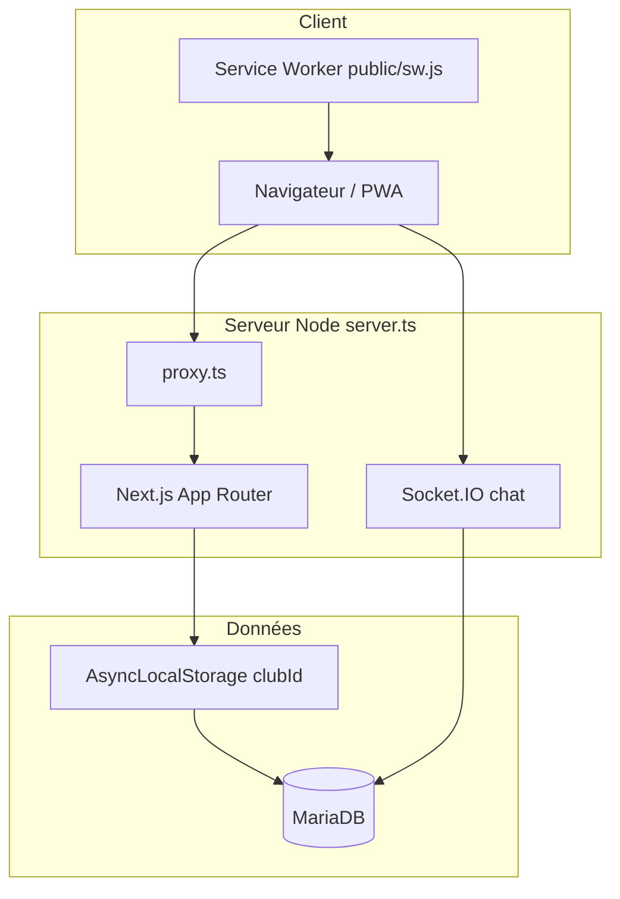
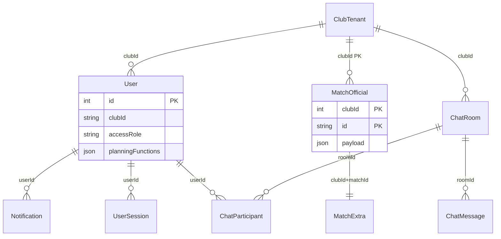
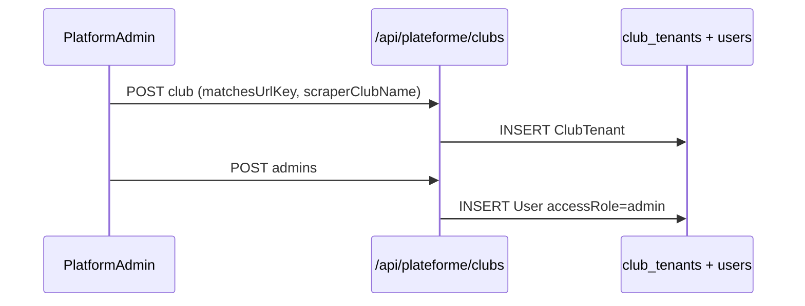
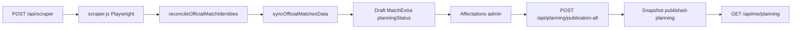
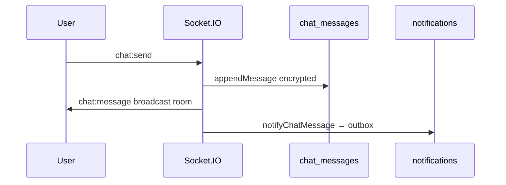

# Audit 00 — Cartographie globale

**Projet :** AFP Planning (PlanningClub)  
**Repository :** https://github.com/brahmiamine/afp-planning  
**Date :** 2026-09-10  
**Périmètre :** branche `main`, analyse statique du code  
**Méthode :** revue récursive du dépôt ; **non vérifié dynamiquement** pour la plupart des workflows (application non démarrée dans cet audit)

---

## Synthèse exécutive

AFP Planning est une application **Next.js 16 (App Router)** multi-tenant pour la gestion du planning sportif de clubs. Le backend repose sur **TypeORM + MariaDB**, un serveur custom **Node (`server.ts`)** avec **Socket.IO** pour le chat temps réel, et une **PWA** (service worker + Web Push).

| Couche | Technologie | Emplacement principal |
|--------|-------------|----------------------|
| Frontend | React 19, Tailwind v4, Radix UI | `app/**`, `app/components/**` |
| API | Next.js Route Handlers | `app/api/**/route.ts` (92 routes) |
| Auth | Cookies HttpOnly + sessions DB | `app/lib/auth/**` |
| ORM / DB | TypeORM EntitySchema, migrations custom | `app/lib/db/**` |
| Temps réel | Socket.IO | `app/lib/chat/socket-server.ts` |
| Scraping | Playwright (`scraper.js`) | `app/lib/scraper/**` |
| Tests | Vitest + Playwright | 181 fichiers test |
| CI | GitHub Actions | `.github/workflows/ci.yml` |

---

## 1. Architecture globale

**Points clés :**
- Pas de backend séparé : API Routes + custom server unifiés (`server.ts:23-24`).
- Isolation multi-tenant via `session.user.clubId` → `setCurrentClubId()` (`app/lib/auth/club-context.ts`) → filtres SQL.
- Données planning hétérogènes : tables TypeORM (`matches_officiels`, `users`, …) + tables SQL brutes (`planning_records`, `planning_event_state`, …).
- Chiffrement messages chat et secrets SMTP : `APP_ENCRYPTION_KEY` obligatoire en prod (`server.ts:8-12`).

---

## 2. Inventaire des routes pages (`app/**/page.tsx`)

**Total : 45 pages**

### Public / Auth (8)

| Route | Fichier | Rôle |
|-------|---------|------|
| `/` | `app/page.tsx` | Landing / redirection |
| `/login` | `app/login/page.tsx` | Connexion club |
| `/mot-de-passe-oublie` | `app/mot-de-passe-oublie/page.tsx` | Demande reset |
| `/reinitialiser/[token]` | `app/reinitialiser/[token]/page.tsx` | Reset mot de passe |
| `/inscription/[token]` | `app/inscription/[token]/page.tsx` | Acceptation invitation |
| `/partage/[token]` | `app/partage/[token]/page.tsx` | Planning public partagé |
| `/plateforme/login` | `app/plateforme/login/page.tsx` | Connexion superadmin |
| `/plateforme` | `app/plateforme/page.tsx` | Console plateforme (clubs, scraping config) |

### Espace admin `/club/**` (24)

| Route | Fichier |
|-------|---------|
| `/club` | `app/club/page.tsx` |
| `/club/configuration` | `app/club/configuration/page.tsx` |
| `/club/utilisateurs` | `app/club/utilisateurs/page.tsx` |
| `/club/utilisateurs/nouveau` | `app/club/utilisateurs/nouveau/page.tsx` |
| `/club/utilisateurs/[id]` | `app/club/utilisateurs/[id]/page.tsx` |
| `/club/invitations` | `app/club/invitations/page.tsx` |
| `/club/profil` | `app/club/profil/page.tsx` |
| `/club/notifications` | `app/club/notifications/page.tsx` |
| `/club/parametres-notifications` | `app/club/parametres-notifications/page.tsx` |
| `/club/chat` | `app/club/chat/page.tsx` |
| `/club/indisponibilites` | `app/club/indisponibilites/page.tsx` |
| `/club/disponibilites` | `app/club/disponibilites/page.tsx` |
| `/club/demandes-disponibilite` | `app/club/demandes-disponibilite/page.tsx` |
| `/club/archives` | `app/club/archives/page.tsx` |
| `/club/evenements` | `app/club/evenements/page.tsx` |
| `/club/evenements/[eventType]/[eventId]` | `app/club/evenements/[eventType]/[eventId]/page.tsx` |
| `/club/planning` | `app/club/planning/page.tsx` |
| `/club/planning/controle` | `app/club/planning/controle/page.tsx` |
| `/club/planning/charge` | `app/club/planning/charge/page.tsx` |
| `/club/planning/statistiques` | `app/club/planning/statistiques/page.tsx` |
| `/club/planning/historique` | `app/club/planning/historique/page.tsx` |
| `/club/planning/recurrent` | `app/club/planning/recurrent/page.tsx` |
| `/club/planning/echanges` | `app/club/planning/echanges/page.tsx` |
| `/club/planning/partage` | `app/club/planning/partage/page.tsx` |
| `/club/planning/evenement/[eventType]/[eventId]` | `app/club/planning/evenement/[eventType]/[eventId]/page.tsx` |

Layout : `app/club/layout.tsx` → `DashboardShell` + navigation feature-flaggée.

### Espace personnel `/mon-planning/**` (12)

| Route | Fichier |
|-------|---------|
| `/mon-planning` | `app/mon-planning/page.tsx` |
| `/mon-planning/evenements` | `app/mon-planning/evenements/page.tsx` |
| `/mon-planning/evenements/[eventType]/[eventId]` | `app/mon-planning/evenements/[eventType]/[eventId]/page.tsx` |
| `/mon-planning/mon-calendrier` | `app/mon-planning/mon-calendrier/page.tsx` |
| `/mon-planning/disponibilites` | `app/mon-planning/disponibilites/page.tsx` |
| `/mon-planning/mes-indisponibilites` | `app/mon-planning/mes-indisponibilites/page.tsx` |
| `/mon-planning/mes-echanges` | `app/mon-planning/mes-echanges/page.tsx` |
| `/mon-planning/chat` | `app/mon-planning/chat/page.tsx` |
| `/mon-planning/notifications` | `app/mon-planning/notifications/page.tsx` |
| `/mon-planning/parametres-notifications` | `app/mon-planning/parametres-notifications/page.tsx` |
| `/mon-planning/preferences-planning` | `app/mon-planning/preferences-planning/page.tsx` |
| `/mon-planning/profil` | `app/mon-planning/profil/page.tsx` |

---

## 3. Inventaire API (92 endpoints)

Regroupés par domaine. Auth standard : `requireAuth` + ALS ; admin : `requireRole(['admin'])` ; plateforme : `requirePlatformAuth`.

| Domaine | Préfixe | Nb routes | Auth | Notes |
|---------|---------|-----------|------|-------|
| Auth club | `/api/auth/*` | 5 | Mixte | Login multi-club par email |
| Auth plateforme | `/api/plateforme/*` | 8 | Cookie plateforme | Gestion tenants |
| Utilisateurs | `/api/users/*` | 3 | Admin | CRUD scoped `clubId` |
| Invitations | `/api/invitations/*` | 3 | Admin + public token | Hash SHA-256 |
| Planning | `/api/planning/**` | 28 | Admin / mixte | Publication globale |
| Me (personnel) | `/api/me/*` | 7 | Auth | Mon Planning, prefs |
| Matchs / événements | `/api/matches*`, `/api/entrainements`, `/api/plateaux`, `/api/recurring-events` | 12 | Admin | Payload JSON |
| Chat | `/api/chat/**` | 9 | Auth | Fallback HTTP |
| Notifications / Push | `/api/notifications`, `/api/push/*` | 4 | Auth | Outbox séparée |
| Club admin | `/api/club/*`, `/api/dashboard/*`, `/api/settings/*` | 8 | Admin | Config, archives |
| Scraping | `/api/scraper`, `/api/cron/scraper` | 2 | Admin / cron | SportCorico |
| Public | `/api/public/planning/[token]`, `/api/ical/[token]` | 2 | Token | Partage / iCal |
| Divers | `/api/categories`, `/api/stades`, `/api/officiels`, … | 14 | Admin | Référentiels |

Inventaire détaillé endpoint par endpoint : voir **Audit 06** (`/audits/06-database-api.md`).

---

## 4. Rôles, fonctions et permissions

### Modèle (issue #209)

| Concept | Type | Valeurs | Fichier |
|---------|------|---------|---------|
| Rôle d'accès club | `ClubAccessRole` | `admin`, `dirigeant` | `app/lib/auth/roles.ts` |
| Fonction sur match | `PlanningFunction` | `arbitre_club`, `encadrant`, `accompagnateur` | idem |
| Superadmin plateforme | `PlatformAdmin` | cross-club | `app/lib/db/schemas.ts` |

### Matrice permissions réelle

| Action | admin | dirigeant | plateforme | public |
|--------|:-----:|:---------:|:----------:|:------:|
| Gérer planning / publication | ✅ | ❌ | ❌ | ❌ |
| CRUD utilisateurs / invitations | ✅ | ❌ | ❌ | ❌ |
| Scraping manuel | ✅ | ❌ | ❌ | ❌ |
| Mon Planning (affectations publiées) | ❌* | ✅** | ❌ | ❌ |
| Déclarer indisponibilités | ✅ | ✅ | ❌ | ❌ |
| Chat club | ✅ | ✅ | ❌ | ❌ |
| Config club (PUT settings) | ✅ | ❌ | ❌ | ❌ |
| Gérer tenants / scraping config | ❌ | ❌ | ✅ | ❌ |

\* Admin sans fonction planning n'a pas Mon Planning (`hasAnyPlanningFunction`).  
\** Nécessite au moins une `planningFunction`.

**Enforcement :** `canEdit()` = admin only (`roles.ts:56-58`) ; pages `/club/*` protégées par `proxy.ts:146-150`.

---

## 5. Modèle de données

### Entités TypeORM (22) — `app/lib/db/schemas.ts`

`Club`, `Categorie`, `Stade`, `MatchOfficial`, `MatchAmical`, `Entrainement`, `Plateau`, `MatchExtra`, `User`, `UserSession`, `Invitation`, `MatchAuditLog`, `Notification`, `PasswordResetToken`, `ChatRoom`, `ChatParticipant`, `ChatMessage`, `ChatReadState`, `ClubTenant`, `PlatformAdmin`, `PlatformSession`, `AppMeta`.

### Tables SQL additionnelles (migrations 0001–0017)

`planning_records`, `planning_attachments`, `planning_event_state`, `planning_assignment_state`, `push_subscriptions`, `planning_notification_outbox`, `chat_attachments`, `scraper_sync_runs`, `login_rate_limits`, `schema_migrations`.

### Diagramme ER (haut niveau)

**Particularités :**
- **Aucune FK DB** — intégrité applicative uniquement.
- PK événements tenant-scoped : `(clubId, id)` depuis migration 0008.
- Email unique par club : `(clubId, email)` migration 0017.

---

## 6. Fonctionnalités par domaine

| Domaine | Implémenté | Fichiers clés |
|---------|:----------:|---------------|
| Multi-tenant clubs | ✅ | `club_tenants`, ALS |
| Auth sessions | ✅ | `app/lib/auth/**` |
| Invitations ciblées | ✅ | `app/api/invitations/**` |
| Scraping SportCorico | ✅ | `scraper.js`, `run-scraper.ts` |
| Matchs officiels / amicaux / entraînements / plateaux | ✅ | `json-migrator.ts`, API planning |
| Préparation + affectations | ✅ | `event-store.ts` |
| Publication globale | ✅ | `global-publication.ts` |
| Mon Planning | ✅ | `personal-planning.ts` |
| Indisponibilités + review admin | ✅ | `officiel-availability.ts` |
| Campagnes disponibilité | ✅ | `availability-requests` |
| Chat DM + événement + canaux | ✅ | `app/lib/chat/**` |
| Notifications in-app + outbox | ✅ | `app/lib/notifications/**` |
| Web Push / PWA | ✅ | `public/sw.js`, `app/lib/push/**` |
| Exports PDF/CSV/iCal | ✅ | `app/lib/planning/export.ts` |
| Partage planning public | ✅ | `planning/shares` |
| Archives | ✅ | `app/lib/archives/**` |
| Échanges d'affectation | ✅ | `assignment-swaps` |
| Événements récurrents | ✅ | `recurring-events` |
| Plateforme superadmin | ✅ | `/plateforme` |
| Branding dynamique club | ✅ | `applyThemeVariables`, settings |
| Cron rappels / scraper | ✅ | `/api/cron/**` |

---

## 7. Workflows métier (Mermaid)

### Création club → premier admin

### Scraping → préparation → publication

### Chat message

---

## 8. Architecture SportCorico

| Étape | Composant |
|-------|-----------|
| Config | `club_tenants.matchesUrlKey` + `scraperClubName` (plateforme only) |
| URL | `https://www.sportcorico.com/clubs/{matchesUrlKey}` |
| Identité | `assertScrapedClubIdentity` (nom h1 vs config) |
| Parsing | `scraper.js` — list + detail pages |
| Matching | `match-reconciliation.ts` — exact alias puis fuzzy score ≥ 85 |
| Persistance | `json-migrator.ts` — upsert, missing après 2 observations |
| Déclencheurs | Bouton admin, `POST /api/scraper`, cron multi-club |

Détail : **Audit 03** (`/audits/03-sportcorico-scraping.md`).

---

## 9. Cycle de vie match / événement

| Statut `planningStatus` | Signification | Transitions |
|-------------------------|---------------|-------------|
| `draft` | Préparation | défaut à la création |
| `published` | Publié (snapshot global) | publication globale |
| `modified` | Publié puis modifié | édition post-publication |
| `cancelled` | Annulé | admin ou scrape missing |

`sourceStatus` (scrapé) : `active`, `missing`, etc. — indépendant du statut planning.

---

## 10. Notifications et chat

- **22 types** documentés dans `docs/notifications-matrix.md`, testés par `matrix.test.ts`.
- Pipeline : DB `notifications` + outbox `planning_notification_outbox` → push/email/WhatsApp hors transaction.
- Socket.IO : rooms `chat:club:{clubId}:user:{userId}`, `chat:room:{roomId}`.
- Détail : **Audit 05**.

---

## 11. PWA

| Élément | Fichier |
|---------|---------|
| Service worker | `public/sw.js` |
| Push handler | `public/sw.js` — tag par notificationId |
| VAPID public | `NEXT_PUBLIC_VAPID_PUBLIC_KEY` via `/api/push/config` |
| Registration | `app/components/providers/pwa-provider.tsx` |
| Manifest | `app/manifest.ts` (Next.js) |
| Safe area | `app/globals.css` — standalone PWA |

---

## 12. Design System

| Couche | Emplacement |
|--------|-------------|
| Tokens CSS | `app/globals.css` — OKLCH + `@theme inline` |
| Primitives UI | `app/components/ui/**` (34 composants) |
| Layout | `DashboardShell`, `MobileTabBar`, `page-primitives.tsx` |
| Thème club | `applyThemeVariables()` — primary/secondary dynamiques |
| Dark mode | `next-themes` + `.dark` dans globals.css |

Détail : **Audit 07**.

---

## 13. Tests et CI

| Outil | Commande | CI |
|-------|----------|-----|
| Vitest | `pnpm test` | ✅ job `test` + MariaDB |
| Playwright | `pnpm e2e` | ✅ job `e2e` |
| ESLint | `pnpm lint` | ✅ |
| TypeScript | `pnpm type-check` | ✅ |
| Build | `pnpm build` | ✅ |
| Route coverage | `pnpm routes:coverage --check` | ✅ |

**181 fichiers test** ; 3 specs E2E. Détail : **Audit 08**.

---

## 14. Zones à risque

| Zone | Risque | Audit spécialisé |
|------|--------|------------------|
| Isolation multi-tenant | Fallback `APP_CLUB_ID` silencieux | 02 |
| Scraping logos AFP hardcodés | Clubs non-AFP | 03 |
| Publication vs save affectation | Indispo non bloquée à la sauvegarde | 01, 04 |
| Pas de FK DB | Orphelins, intégrité | 06 |
| Socket cross-room | Test gap | 02, 05 |
| Parser SportCorico fragile | Perte sync | 03 |

---

## 15. Contradictions code / documentation

| Sujet | Doc | Code réel |
|-------|-----|-----------|
| Entités séparées officiels/encadrants | README legacy | Table `users` unifiée avec `planningFunctions[]` (`person-link.ts`) |
| Publication par événement | UI parfois suggestive | Seule `publication-all` publie ; `publication` = cancel/reopen |
| Rôle « arbitre » | Anciennes migrations | Renommé `arbitre_club` (migration 0010) |
| `/notifications` route | Ancien fallback push | Corrigé issue #321 — deep-links événement/chat |

---

## 16. Non vérifiable en exécution

- Comportement Playwright scraper sur HTML SportCorico live
- Rendu visuel responsive (screenshots) — voir Audit 07
- Déploiement production (variables env réelles, multi-instance Socket.IO)
- Workflows complets avec données réelles club

---

## Fichiers d'audit créés

| Fichier | Statut |
|---------|--------|
| `/audits/00-global-cartography.md` | ✅ ce document |
| `/audits/01-functional-business-rules.md` | voir audit 01 |
| `/audits/02-security-multitenancy.md` | ✅ |
| `/audits/03-sportcorico-scraping.md` | ✅ |
| `/audits/04-planning-publication.md` | voir audit 04 |
| `/audits/05-notifications-chat.md` | voir audit 05 |
| `/audits/06-database-api.md` | voir audit 06 |
| `/audits/07-design-ui-ux-responsive.md` | voir audit 07 |
| `/audits/08-tests-quality.md` | voir audit 08 |
