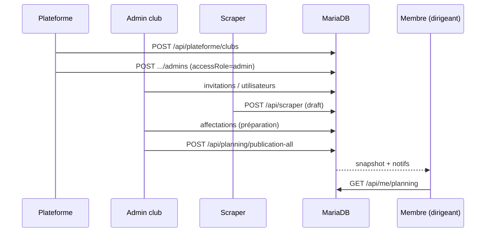

# Audit 01 — Règles métier fonctionnelles

**Repository :** `https://github.com/brahmiamine/afp-planning`  
**Périmètre :** code sur `main` au 2026-09-10 (checkout `8e1c98f`)  
**Méthode :** revue statique exhaustive + recoupement tests + exécution locale `pnpm test` / `pnpm lint` / `pnpm type-check` (sans MariaDB locale). Les workflows UI n’ont pas été rejoués dans un navigateur.  
**Relation avec la version précédente :** ce rapport **ne recopie pas** l’audit 01 antérieur. Plusieurs findings P1 de 2026-09-10 sont **obsolètes** (#335 logos AFP, #336 notifications scrape). Un P0 réel a été identifié (bootstrap DB). Toute affirmation structurante cite `fichier:ligne`.

---

## Sommaire

1. [Score](#1-score)
2. [Résumé exécutif](#2-résumé-exécutif)
3. [Cartographie fonctionnelle](#3-cartographie-fonctionnelle)
4. [Rôles, fonctions et matrice UI/API](#4-rôles-fonctions-et-matrice-uiapi)
5. [Workflows obligatoires](#5-workflows-obligatoires)
6. [Publication](#6-publication)
7. [Cas limites](#7-cas-limites)
8. [Findings](#8-findings)
9. [Décisions produit](#9-décisions-produit)
10. [Causes racines](#10-causes-racines)
11. [Plan de remédiation](#11-plan-de-remédiation)
12. [Definition of Done](#12-definition-of-done)

---

## 1. Score

**Note fonctionnelle : 64 / 100**

| Dimension | Poids | Note | Écart justifié |
|-----------|------:|-----:|----------------|
| Cohérence des workflows | 20 | 12 | Bootstrap `getDb()` casse login/invitation sur base neuve (FUNC-001) ; révocation invitation UI cassée (FUNC-002) |
| Règles métier de publication | 20 | 15 | Serveur solide si flags ON ; contournables via settings + chemin `PUT /api/matches/[id]` |
| Rôles / permissions | 15 | 13 | Séparation accessRole / PlanningFunction claire ; 1 écart UI/API (invitation) |
| Cycle des matchs / affectations | 15 | 10 | Validation d’affectation non uniforme selon l’API d’écriture |
| Indisponibilités / conflits | 10 | 6 | Bloquées à la publication/`saveRoleAssignments` ; ignorées par `PUT matches` |
| Notifications / chat | 10 | 8 | Publication + scrape OK ; types `assignment-created/removed` morts |
| Utilisateurs / invitations | 5 | 2 | Révocation UI 404 systématique |
| Archives | 5 | 4 | Archive retire immédiatement le snapshot |

**Findings :** P0 **1** · P1 **5** · P2 **6** · P3 **3**

---

## 2. Résumé exécutif

Le modèle métier est mature : publication **globale** vers un snapshot, Mon Planning **ne lit que ce snapshot**, rôles d’accès orthogonaux aux fonctions de match. Les correctifs #335 / #336 / #337 / #345 / #348 sont **présents dans le code**.

Trois ruptures fonctionnelles dominent :

1. **P0 — bootstrap JSON sur base vide** : `ensureJsonDataMigrated` appelle `getCurrentClubId()` sans ALS (`json-migrator.ts:453`). Toute première `getDb()` (login, invitation, E2E, CI) lève `Contexte club manquant`. Confirmé par la CI `main` (run `34512699676`, 76 fichiers de test en échec, E2E rouge).
2. **P1 — révocation d’invitation** : l’UI envoie l’empreinte SHA-256 déjà stockée ; l’API la re-hashe → 404. Les tests passent parce qu’ils utilisent le jeton brut.
3. **P1 — validation d’affectation non uniforme** : `saveRoleAssignments` valide les indispos si le flag est ON ; `PUT /api/matches/[id]` non.

Les findings précédents « notifications scrape non émises » et « logos hardcodés AFP » sont **corrigés** (`match-sync-notifications.ts`, `club-identity.ts`).

---

## 3. Cartographie fonctionnelle

| Domaine | Routes UI | API | Entités / tables | État |
|---------|-----------|-----|------------------|------|
| Plateforme | `/plateforme`, `/plateforme/login` | `/api/plateforme/**` | `ClubTenant`, `PlatformAdmin` | complet |
| Clubs / config | `/club/configuration` | `/api/settings`, `/api/categories`, `/api/stades` | `Club`, settings JSON, `ClubTenant` | complet ; scraping **plateforme only** |
| Utilisateurs | `/club/utilisateurs/**` | `/api/users/**` | `User` | complet |
| Invitations | `/club/invitations`, `/inscription/[token]` | `/api/invitations/**` | `Invitation` (id = SHA-256) | **partiel** — revoke UI cassé |
| Matchs scrapés | `/club/planning` | `/api/scraper`, `/api/matches/**` | `MatchOfficial`, `MatchExtra` | complet avec réserves scrape (audit 03) |
| Préparation | `/club/planning`, `/club/planning/controle` | `/api/planning/events/**` | extras JSON + `planning_event_state` | complet |
| Publication | `PublishPlanningControl` | `GET/POST /api/planning/publication-all` | `planning_records` kind `published-planning` | complet |
| Mon Planning | `/mon-planning/**` | `/api/me/planning` | snapshot publié | complet (issue #94) |
| Indisponibilités | `/club/indisponibilites`, `/mon-planning/mes-indisponibilites` | `/api/club/indisponibilites`, `/api/me/availability` | `users.indisponibilites` JSON | complet ; non bloquant sur toutes les API |
| Chat | `/club/chat`, `/mon-planning/chat` | `/api/chat/**` + Socket.IO | `chat_*` | complet |
| Notifications | `*/notifications` | `/api/notifications` | `notifications`, outbox | complet ; types morts (FUNC-007) |
| Archives | `/club/archives` | `/api/club/archives` | `planning_event_state.archivedAt` | complet |

---

## 4. Rôles, fonctions et matrice UI/API

### 4.1 Séparation observée (fait)

```13:20:app/lib/auth/roles.ts
export type ClubAccessRole = 'admin' | 'dirigeant';
export type PlanningFunction = 'arbitre_club' | 'encadrant' | 'accompagnateur';
export const ALL_ACCESS_ROLES: ClubAccessRole[] = ['admin', 'dirigeant'];
export const WRITE_ROLES: ClubAccessRole[] = ['admin'];
```

- `canEdit` = `accessRole === 'admin'` (`roles.ts:56-58`).
- `requireRole` ne lit **jamais** les fonctions (`require.ts:22-38`).
- Session : `accessRole` + `planningFunctions` séparés (`session.ts:66-69`).
- Legacy `roles` tableau → migration `0010` (`club-access-roles.ts:30-56`). `normalizeAccessRole('arbitre')` → `'dirigeant'` (tests `roles.test.ts`).
- Fonctions de match (`PlanningRole` `arbitre`/`encadrant`/`accompagnateur`) mappées via `functionForPlanningRole` (`person-link.ts:22-27`) — **ne pas confondre** avec `accessRole`.

### 4.2 Matrice permissions UI vs API

| Action | UI dirigeant | API dirigeant | UI admin | API admin | Écart |
|--------|:------------:|:-------------:|:--------:|:---------:|-------|
| Accéder `/club/**` | redirect `proxy.ts:155-158` | — | ✅ | — | cohérent |
| Modifier affectations | masqué | 403 `WRITE_ROLES` | ✅ | ✅ | cohérent |
| Publier | bouton absent / disabled | 403 | ✅ (disabled si `changed===0`) | POST accepté même si noop | UI plus stricte (FUNC-010) |
| Sauver affectation indispo | N/A | 403 | client bloque (`EventCardDrag.tsx:232-234`) | `saveRoleAssignments` bloque si flag ; `PUT matches` **autorise** | **API plus permissive** → corrélation audit 02 |
| Révoquer invitation | N/A | 403 | bouton visible | 404 si hash UI | **UI/API incohérent** FUNC-002 |
| Voir Mon Planning | ✅ si fonction | 403 si aucune fonction (`me/planning/route.ts:18-22`) | Header peut cacher le lien (`Header.tsx:107`) | proxy autorise `/mon-planning` | mineur |
| Scraping config | masqué | settings strippe les champs (`settings/route.ts:66-71`) | masqué aussi | plateforme only | cohérent |

**Legacy :** plus de rôle unique `arbitre` comme accès club. Les payloads dispo réécrivent `"arbitre"` → `"arbitre_club"` (`club-access-roles.ts:147-155`).

---

## 5. Workflows obligatoires



### 5.1 Création et configuration d’un club

**Étapes :** `POST /api/plateforme/clubs` (`plateforme/clubs/route.ts:70-132`) → tenant + flags par défaut (`settings.ts:50-66`) → `POST .../admins` crée un admin `planningFunctions: []` (`admins/route.ts:88-100`). Config scraping (`matchesUrlKey` / `scraperClubName`) **uniquement plateforme** (`plateforme/clubs/[id]/route.ts:75-109`) ; l’admin club ne peut pas les modifier (`settings/route.ts:104-105`).  
**Statut :** complet. Club peut exister sans admin (aucune contrainte « premier admin obligatoire »).

### 5.2 Invitation, inscription, rattachement

**Étapes :** admin `POST /api/invitations` stocke `id: hashInvitationToken(rawToken)` (`invitations/route.ts:161`) et renvoie `url: /inscription/${rawToken}` (`:182`). Accept public `POST .../accept` : lock pessimiste, one-shot `usedAt` (`accept/route.ts:33-127`). Profils `@sans-acces.local` (`placeholder-account.ts:4-16`, migration 0012).  
**Rupture :** révocation — voir FUNC-002.  
**Statut :** partiel.

### 5.3 Scraping SportCorico et impact fonctionnel

`run-scraper.ts` → identité club (`assertScrapedClubIdentity`, `:62-78`) → `syncOfficialMatchesData`. Nouveau match → `planningStatus:'draft'` (`json-migrator.ts:336-338`). Changement horaire publié → `modified` + notif admin (`match-sync-notifications.ts`, #336). Disparition confirmée 2 fois → cancel (`json-migrator.ts:405-417`). Affectations préservées (spread `currentExtras`).  
**Statut :** complet côté métier ; parser prod vs tests = audit 03.

### 5.4 Création manuelle et coexistence scrapé

Officiel scrapé : DELETE interdit (`events/.../route.ts:363-367`). Amical / entraînement / plateau = tables manuelles. Fuzzy matching scrape (`match-reconciliation.ts`) peut créer un **doublon** si le slug change et le nom diverge.  
**Statut :** géré avec risque de doublon (FUNC-008).

### 5.5 Préparation des matchs

`/club/planning` → `PlanningPreparationView`. Écritures admin. Statuts live `draft` / `modified` / `published` / `cancelled` (`types/match.ts:5`).

### 5.6 Affectation arbitre / encadrant / accompagnateur

Admin only. `findAssignablePerson` : même club + `active` + fonction (`person-link.ts:46-74`). Multi-fonctions **autorisées** (`personal-planning.ts:321-323`).  
`saveRoleAssignments` valide si `assignmentValidation` (`event-store.ts:461-468`, #337).  
`PUT /api/matches/[id]` **ne valide pas** (`matches/[id]/route.ts:65-97`) — FUNC-003.

### 5.7 Contrôle indisponibilités et conflits

`validateAssignmentSet` : indispo + overlap ±30 min (`validation.ts:157-174`). Suggestions excluent les indispos. Indispo **après** affectation : pas de désaffectation auto ; bloqué au prochain save/publish si flag ON.

### 5.8 Publication du planning

Uniquement globale `publishGlobalPlanning` (`global-publication.ts:218-438`). Transaction snapshot + statuts + outbox. Blockers : orphelins/inactifs **toujours** ; staffing si `publicationReadiness` ; indispos/conflits si `assignmentValidation`. 409 si blockers (`publication-all/route.ts:35-36`).  
**Non contournable par payload** si flags ON. **Contournable** en désactivant les flags (admin settings) — décision produit.

### 5.9 Visibilité `/mon-planning/**`

`listPersonalAssignments` lit **uniquement** `listPublishedPlanningEventSnapshots` (`personal-planning.ts:289-298`). Avant première publication : `[]` (issue #94). Fonction affichée = rôle réellement tenu + `planningFunctions` actuelles (`:212`).

### 5.10 Modification après publication

Live → `planningStatus: 'modified'` + `modifiedAfterPublishAt` (`events/.../route.ts:213-221`). Mon Planning **stale** jusqu’à republication. Exception : swap approuvé patche le snapshot **immédiatement** (`assignment-swaps/route.ts:164-177`) — FUNC-006.

### 5.11 Annulation, report, disparition, archivage

| Action | Live | Mon Planning | Notifs |
|--------|------|--------------|--------|
| cancel/reopen API | flag live (`publication-service.ts:30-42`) | après republication | à la publication globale |
| scrape missing 2× | cancel + raison scraping | stale jusqu’à republish | admins immédiats #336 |
| archive | retire snapshot **maintenant** (`event-lifecycle.ts:42-52`) | immédiat | critical si futur |
| reporté | **pas de statut** — édition date/heure | après republish | `rescheduled` |

### 5.12 Chat privé et discussions d’événement

Direct : participants. Event : affectés **publiés** + admin (`chat/policy.ts:22-36`, #345). Désaffecté perd l’accès après mise à jour du snapshot.

### 5.13 Notifications liées aux actions métier

Publication : diff par user, skip si `changed===0` (#348, `global-publication.ts:377-419`). Affectation en draft : **pas** de notif (`assignment-propagation.ts:8-23`). `notifyAssignmentChanges` n’a **aucun** appelant production (FUNC-007).

---

## 6. Publication

| Règle | Existe ? | Où | Configurable | Contournable API direct |
|-------|----------|----|--------------|-------------------------|
| ≥1 arbitre club | oui si `requireArbitreForPublication` + `publicationReadiness` | `collectPublicationBlockers` `global-publication.ts:131-148` + `assessPublicationReadiness` `validation.ts:74-93` | oui, settings | **non** si flags ON ; **oui** si flags OFF |
| ≥1 encadrant | idem | idem | oui | idem |
| ≥1 accompagnateur | idem ; **non exigé** pour entraînement/plateau (`validation.ts:63-71`) | idem | oui | idem |
| Assignees inactifs / orphelins | **toujours** | `global-publication.ts:94-128` | non | **non** |
| Indispos / conflits | si `assignmentValidation` | publish + `saveRoleAssignments` | oui | publish : non si flag ON ; `PUT matches` : **oui** |
| Fenêtre J−N | oui, défaut 7 jours | `published-planning.ts:75-93` env `PLANNING_PUBLICATION_PAST_DAYS` | env, pas UI club | n/a |

Preuve UI : cartes affichent les rôles manquants si flags ON (`EventCardDrag.tsx:142-151`). Preview : `GET /api/planning/publication-all`.

---

## 7. Cas limites

| Cas | Comportement | Preuve |
|-----|--------------|--------|
| Double clic publication | UI `publishing` + disable si `changed===0` ; API peut republier (écrit `publishedAt`, **pas** de notifs si diff vide) | `PublishPlanningControl.tsx:165` ; `global-publication.ts:377-381` |
| Double publication identique | Géré (#348) | test `global-publication.test.ts:408-456` |
| Deux admins simultanés | TX + revision events ; **pas** de `FOR UPDATE` sur `savePublishedPlanning` | `published-planning.ts:638-645` vs save path |
| User supprimé pendant affectation | DELETE 409 si références (`users/[id]/route.ts:201-232`) ; publish bloque orphelin | |
| Changement de rôle/fonction | Affectations conservées ; Mon Planning masque les rôles que l’user ne tient plus | `personal-planning.ts:212` |
| Indispo après affectation | Pas d’auto-retrait ; bloqué au publish/save si flag | |
| Scraping pendant édition | `planningRevision` préservé ; peut marquer `modified` | `json-migrator.ts:318-321` |
| Match disparu puis revenu | 2 obs puis cancel ; retour reset missing | `json-migrator.ts:339-358,405-417` |
| Invitation réutilisée | 409 | `accept/route.ts:43,123-124` |
| Invitation révoquée depuis l’UI | **404** | FUNC-002 |
| Notifications au mauvais moment | Draft n’envoie pas ; publish envoie le diff | |
| Modification après publication | Dirty `modified` ; membres voient l’ancien snapshot | |
| Première requête sur DB neuve | **500 Contexte club manquant** | FUNC-001 |

---

## 8. Findings

### FUNC-001 — P0 — Bootstrap JSON exige un ALS club inexistant

- **Domaine :** utilisateurs / exploitation  
- **Observation :** `migrateJsonData` appelle `getCurrentClubId()` (`json-migrator.ts:453`) depuis `ensureJsonDataMigrated` (`:682-693`), lui-même appelé par **toute** première `getDb()` (`db/index.ts:18-19`) **sans** `setCurrentClubId`. Sur une base où `json_migrated_v1` n’est pas encore posé (CI, Docker neuf, premier boot), login / invitations / E2E lèvent `Contexte club manquant`.  
- **Preuve dynamique :** CI `main` run `34512699676` — jobs `test` (76 fichiers failed) et `e2e` : même erreur. Local `pnpm test` sans DB : 11 failed / 666 passed / 286 skipped, dont `published-planning.test.ts` et `personal-planning.publication.test.ts` (ALS manquant).  
- **Impact :** workflow principal (login) impossible sur environnement neuf ; CI rouge permanente ; flakiness selon l’ordre des tests (le premier `getDb()` avec ALS « gagne » le bootstrap).  
- **Cause :** issue #333 a retiré le fallback `APP_CLUB_ID` mais le migrator JSON one-shot n’a pas reçu de `clubId` explicite.  
- **Correction :** utiliser `APP_CLUB_ID` **uniquement** pour cette migration one-shot, ou itérer les tenants, ou skipper si aucune portée. Ne pas réintroduire de fallback silencieux sur les requêtes métier.  
- **Statut :** 🔴 Confirmé

### FUNC-002 — P1 — Révocation d’invitation UI/API

- **Domaine :** invitations  
- **Observation :** `serializeInvitation` expose `id` = empreinte SHA-256 (`invitations/route.ts:61-63`). L’UI fait `DELETE /api/invitations/${invitation.id}` (`invitations/page.tsx:131-133,278`). `DELETE` re-hashe (`invitations/[token]/route.ts:60`) → lookup d’un hash-de-hash → 404. Les tests DELETE utilisent `rawToken` (`route.test.ts:97-100`) : **faux négatif**.  
- **Impact :** un admin ne peut pas révoquer une invitation depuis l’écran prévu. Le lien d’inscription reste valable jusqu’à expiration / acceptation.  
- **Cause :** issue #271 a hashé le stockage sans adapter le contrat liste → revoke.  
- **Correction :** si le paramètre est déjà 64 hex, lookup direct ; sinon hasher. Couvrir par un test qui rejoue le contrat UI (`DELETE` avec `invitation.id`).  
- **Statut :** 🔴 Confirmé  
- **Corrélation 02 :** pas une faille de sécu, mais un écart UI/API.

### FUNC-003 — P1 — `PUT /api/matches/[id]` ignore la validation d’affectation

- **Preuve :** `matches/[id]/route.ts:65-97` → `saveMatchExtrasOptimistically` (`event-store.ts:195`) sans `validateAssignmentsAgainstDatabase`. Contrasté avec `saveRoleAssignments` (`event-store.ts:461-468`).  
- **Impact :** un admin (ou un client HTTP) peut affecter un indisponible / un conflit ; la publication le bloquera plus tard (si flag ON) ou pas (si flag OFF).  
- **Statut :** 🔴 Confirmé — candidat audit 02 (règle UI-only / API permissive).

### FUNC-004 — P1 — Flags publication rendent les minima optionnels

- **Preuve :** `settings.ts:57-61` defaults true ; `collectPublicationBlockers` saute staffing si `publicationReadiness` off (`global-publication.ts:131-148`).  
- **Impact :** un admin peut publier un match sans arbitre/encadrant/accompagnateur en décochant le flag.  
- **Statut :** ⚪ Décision produit (pas un bug si c’est volontaire).

### FUNC-005 — P1 — Texte `assignmentValidation` vs comportement

- **Preuve :** `feature-surfaces.ts:24-28` (« au moment de publier ») vs enforcement aussi au save (`event-store.ts:461-468`).  
- **Statut :** 🔴 Confirmé (doc produit / UI mensongère).

### FUNC-006 — P1 — Deux modèles de visibilité post-publication

- Admin edit → republication obligatoire (`assignment-propagation.ts:8-19`). Swap approuvé → patch snapshot immédiat (`assignment-swaps/route.ts:164-177`).  
- **Statut :** ⚪ Décision produit.

### FUNC-007 — P2 — Types `assignment-created` / `assignment-removed` morts

- Documentés dans `docs/notifications-matrix.md:15-16`. `notifyAssignmentChanges` sans caller production.  
- **Statut :** 🔴 Confirmé.

### FUNC-008 — P2 — Doublon scrape si identité instable

- Fuzzy score 0 si adversaire/compétition renommés sans même `sourceMatchId` (`match-reconciliation.ts`).  
- **Statut :** 🟠 Très probable — approfondi audit 03.

### FUNC-009 — P2 — Pas de statut `postponed`

- Report = édition datetime ou cancel.  
- **Statut :** ⚪ Décision produit.

### FUNC-010 — P2 — UI refuse la republication noop, l’API l’accepte

- Harmless grâce à #348 (pas de notifs).  
- **Statut :** 🔴 Confirmé.

### FUNC-011 — P2 — Layout `/club` fait confiance au proxy seul

- `app/club/layout.tsx` : pas de `canEdit`. Fragile si le proxy est contourné.  
- **Statut :** 🟠 Très probable (défense UI). Corrélation 02.

### FUNC-012 — P3 — Admin sans fonction : lien Mon Planning masqué, route autorisée

- `Header.tsx:107` vs `proxy.ts` vs `GET /api/me/planning` 403.  
- **Statut :** 🔴 Confirmé.

### FUNC-013 — P3 — Commentaire dupliqué migration 0020

- `schema-migrations.ts:46-50` répète le paragraphe 0020.  
- **Statut :** 🔴 Confirmé (dette doc, pas métier).

### FUNC-014 — P2 — Inactive au save non vérifié

- `validateAssignmentSet` ne teste pas `active` ; publish si. Fenêtre de drafts sales.  
- **Statut :** 🔴 Confirmé.

**Obsolètes (précédent audit 01) :** notifications scrape non émises — **corrigé #336**. Logos AFP hardcodés pour matching — **corrigé #335**. Indispo non validées au save — **corrigé #337** sur `saveRoleAssignments` seulement.

---

## 9. Décisions produit

Chaque item propose des options tranchables.

**D1 — Bootstrap JSON (FUNC-001)**  
A) `APP_CLUB_ID` uniquement pour le one-shot historique.  
B) Migrer par tenant listé dans `club_tenants`.  
C) Abandonner l’import JSON fichiers `data/*.json` (si plus utilisé).  
Implication : A/B débloquent CI et installs neuves.

**D2 — Révocation invitation (FUNC-002)**  
A) Lookup hash-or-raw côté DELETE.  
B) Endpoint `DELETE /api/invitations` par id interne admin-only.  
C) Renvoyer un `revokeToken` distinct.  
Implication : A est le patch minimal.

**D3 — `assignmentValidation`**  
A) Save **et** publish (aligner le texte, et brancher `PUT matches`).  
B) Publish-only (retirer le gate save).  
C) Toujours ON, supprimer le flag.

**D4 — Minima de publication**  
A) Flags optionnels (actuel).  
B) Toujours exigés pour officiel/amical ; optionnels entraînement/plateau.  
C) Soft-warn UI, jamais 409.

**D5 — Post-publish assignments**  
A) Toujours différé (actuel admin).  
B) Toujours immédiat (comme swap).  
C) Documenter l’exception swap comme intentionnelle.

**D6 — Annulation**  
A) Flag live jusqu’à publish global (actuel).  
B) Patch snapshot immédiat (comme archive).

**D7 — Statut reporté**  
A) Nouveau statut + badge.  
B) Cancel + motif.  
C) Édition d’horaire seulement (actuel).

---

## 10. Causes racines

| Cause | Findings rattachés | Nb |
|-------|-------------------|---:|
| ALS club obligatoire (#333) non appliqué aux bootstraps / tests / chemins publics | FUNC-001, échecs CI login/E2E | 1 (+ cascade CI) |
| Contrats token hashés (#271) incomplets | FUNC-002 | 1 |
| Plusieurs chemins d’écriture d’affectations | FUNC-003, FUNC-014 | 2 |
| Feature flags utilisés comme « règles métier optionnelles » sans contrat produit écrit | FUNC-004, FUNC-005 | 2 |
| Publication globale vs patch immédiat (swaps/archives) | FUNC-006, D5/D6 | 1 |
| Matrice de notifications en avance sur le code | FUNC-007 | 1 |

---

## 11. Plan de remédiation

**Quick wins**
1. Patch `DELETE` invitation (D2-A) + test contrat UI.  
2. `migrateJsonData` : club explicite (D1) — **débloque CI**.  
3. Aligner `feature-surfaces` sur le save.  
4. Appeler `validateAssignmentsAgainstDatabase` depuis `PUT /api/matches/[id]`.

**Structurel**
1. Un seul chemin d’écriture d’affectations (`saveRoleAssignments`).  
2. Trancher D3–D7.  
3. Retirer ou brancher `assignment-created/removed`.  
4. Tests E2E invitation claim + révocation.

---

## 12. Definition of Done

- [x] 13 workflows reconstitués avec au moins une référence de code par étape  
- [x] Matrice UI/API pour admin, dirigeant, fonctions, plateforme  
- [x] Chaque décision produit a des options concrètes  
- [x] Score justifié poste par poste  

**Exécution :** `pnpm test` local (sans MariaDB) : 5 files failed / 112 passed / 68 skipped — 11 tests failed (ALS). `pnpm lint` : 106 warnings > seuil 99. `pnpm type-check` : 4 erreurs. CI `main` rouge (lint, type-check, build, test, e2e). Détail → audit 08.
