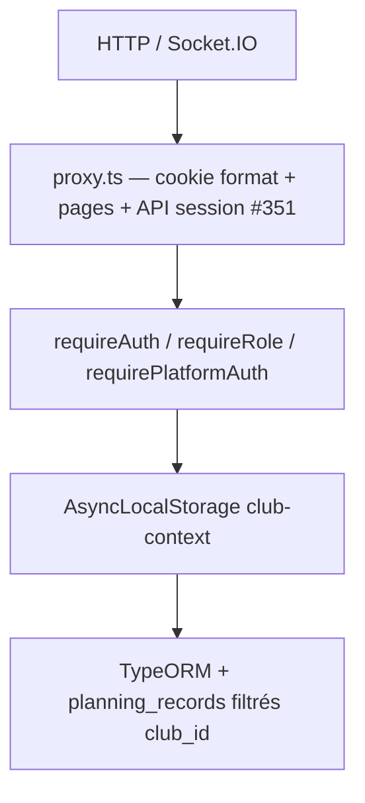

# Audit 02 — Sécurité et Multi-Tenant

**Repository :** `https://github.com/brahmiamine/afp-planning`  
**Périmètre :** code sur `main` au 2026-09-10  
**Méthode :** revue statique exhaustive des 92 `app/api/**/route.ts`, `proxy.ts`, auth, Socket.IO, push, secrets. `pnpm audit --prod` exécuté. Tests dynamiques Club A/B : **preuve statique + tests existants** ; pas de comptes live.  
**Question centrale :** un utilisateur du Club A peut-il lire/modifier/supprimer une ressource du Club B ?

**Réponse :** **Non** pour les API club authentifiées et Socket.IO, d’après le code et les tests d’isolation existants. Isolation = `session.user.clubId` → `setCurrentClubId` (ALS) → filtres SQL `clubId`/`club_id` + ownership. **0 IDOR cross-tenant confirmé.** Les admins plateforme **peuvent** agir sur tous les clubs (by design).

---

## Sommaire

1. [Score](#1-score)
2. [Résumé exécutif](#2-résumé-exécutif)
3. [Architecture de sécurité](#3-architecture-de-sécurité)
4. [Inventaire API (92 routes)](#4-inventaire-api-92-routes)
5. [Scénarios Cross-Tenant](#5-scénarios-cross-tenant)
6. [Authentification et sessions](#6-authentification-et-sessions)
7. [Entrées et vulnérabilités web](#7-entrées-et-vulnérabilités-web)
8. [Chat / Socket.IO](#8-chat--socketio)
9. [Notifications / Push](#9-notifications--push)
10. [Secrets, SCA](#10-secrets-sca)
11. [Findings](#11-findings)
12. [Plan de remédiation](#12-plan-de-remédiation)
13. [Definition of Done](#13-definition-of-done)

---

## 1. Score

**Note sécurité : 83 / 100**

| Dimension | Poids | Note | Écart |
|-----------|------:|-----:|-------|
| Isolation Multi-Tenant | 30 | 27 | Pattern ALS + SQL cohérent ; gaps de tests CRUD admin (pas d’exploit observé) |
| Authentification / sessions | 15 | 13 | scrypt, lockout DB, révocation proxy #351 ; reset MDP sans rate-limit |
| Autorisation / ownership API | 20 | 17 | WRITE_ROLES réel ; invitation DELETE hash (fonctionnel, pas IDOR) ; icalToken dans `/api/auth/me` |
| Socket.IO / Chat | 10 | 9 | #345/#346/#352 |
| Web Push | 5 | 4 | ownership + purge logout #344 ; UPSERT réassigne l’endpoint |
| Secrets / configuration | 10 | 7 | pas de secret committé ; pas de rotation ; pas de `.env.example` |
| Dépendances | 5 | 3 | `pnpm audit` : 0 critical/high, 15 moderate (jspdf/dompurify) |
| Tests sécurité | 5 | 3 | bons sur chat/share/users ; 40 routes sans `route.test.ts` |

**Findings :** P0 **0** (sécu) · P1 **2** · P2 **7** · P3 **6**  
*(FUNC-001 bootstrap n’est pas une fuite tenant ; classé fonctionnel/qualité.)*

---

## 2. Résumé exécutif

L’isolation multi-tenant est le point fort du produit. Les correctifs récents (#342 settings enum, #351 sessions révoquées, #345 event rooms, #346 send cross-club, #344 push logout, #352 rate-limit partagé, #350 FK) sont **dans le code**.

Risques restants = **hardening** (rate-limit des endpoints token publics, CSRF token, rotation de clé, surface plateforme) et **secrets d’exploitation** (pas de `.env.example`). Pas de `NEXT_PUBLIC_*` privé.

Référentiels : OWASP Top 10 2021, API Security Top 10 2023, ASVS L2 (cible), CWE-639/862/307/918.

---

## 3. Architecture de sécurité

| Couche | Fichier | Rôle |
|--------|---------|------|
| Proxy | `proxy.ts:93-159` | Cookie 64 hex ; `/club/*` `canEdit` ; API protégées : `getSessionUser` (#351, `:146-153`) |
| Session club | `session.ts` | Token 32 bytes, TTL 30j, révocation, club/user inactifs |
| Session plateforme | `platform-session.ts` | Cookie distinct |
| Auth handlers | `require.ts:8-38` | `requireAuth` pose ALS ; `requireRole` filtre `accessRole` |
| Tenant | `club-context.ts:10-35` | `getCurrentClubId()` throw si absent (#333, plus de fallback silencieux `APP_CLUB_ID` sur les requêtes) |
| Chat | `policy.ts:26-38`, `socket-server.ts` | `clubId` room + assignees publiés |
| Chiffrement | `secret-box.ts`, `server.ts:6-12` | `APP_ENCRYPTION_KEY` obligatoire en prod |

**Ownership :** presque toutes les tables métier portent `clubId`. Chaîne user → club pour sessions, notifications, push, outbox.

---

## 4. Inventaire API (92 routes)

Convention : **401** non authentifié (`require.ts:14`) · **403** mauvais rôle (`:32`).

### 4.1 `requireRole(admin / WRITE_ROLES)` — 42 fichiers

`accompagnateurs`, `availability-requests` (POST/DELETE ; GET = `requireAuth`), `categories`, `club/archives`, `club/indisponibilites`, `club/indisponibilites/review`, `clubs`, `dashboard/club`, `encadrants`, `entrainements`, `invitations` (liste/création), `matches`, `matches/[id]`, `matches/[id]/audit-log`, `matches-amicaux`, `matches-extras`, `officiels`, `planning/{analytics,assignment-swaps,attendance,auto-assign,event-templates,events/[eventType],events/... PUT/DELETE,export,historique,overview,publication,publication-all,reminders,saved-filters,shares,suggestions,waitlist,workload}`, `plateaux`, `recurring-events`, `recurring-events/[seriesId]`, `scraper`, `stades`, `users`, `users/[id]`.

Tenant : `auth.user.clubId` + ALS. Risque IDOR : **faible** si ALS posé. Mass assignment `clubId` : forcé à la session à la création user (`users/route.ts:79`).

### 4.2 `requireAuth` — 29 fichiers

`auth/me`, `availability-requests/[id]/respond`, `chat/*` (9), `logo-proxy`, `me/*` (8), `notifications`, `planning/attachments/[id]`, `planning/events/.../{attachments,collaboration,reports}`, `planning/travel`, `planning/weather`, `push/subscribe`, `push/unsubscribe`, `users/[id]/regenerate-ical-token`.

Ownership : `userId` session, `assertRoomAccess`, `event-access.ts`.

### 4.3 `requirePlatformAuth` — 6

`plateforme/clubs`, `plateforme/clubs/[id]`, `.../admins`, `.../admins/[userId]`, `.../opponent-clubs`, `plateforme/me`. **Cross-club intentionnel.**

### 4.4 CRON_SECRET — 2

`cron/planning-reminders`, `cron/scraper` — Bearer + `timingSafeEqual` (`cron/scraper/route.ts:9-24`). Rejet query/`x-cron-secret`.

### 4.5 Public login — 2

`auth/login`, `plateforme/login` — rate-limit DB.

### 4.6 Logout — 2

`auth/logout` (purge push #344), `plateforme/logout`.

### 4.7 Public token — 5

`password-reset/request`, `password-reset/confirm`, `ical/[token]`, `invitations/[token]/accept`, `public/planning/[token]`.

### 4.8 Mixte — 2

`settings` GET public (`?club=` rate-limité, 404 si inconnu/inactif, #342, `settings/route.ts:25-59`) / PUT admin.  
`invitations/[token]` GET public / DELETE admin.

### 4.9 Public sans auth — 1

`push/config` — clé VAPID **publique** uniquement.

### 4.10 Features admin — 1

`settings/planning-features`.

**Patterns `findOne({id})` sans club dans le WHERE** (revue) : session par token (`session.ts:124`) — capability ; room chat puis `authorizeRoomForUser` (`service.ts:171-206`) ; invitation par hash de token ; reset par `userId` du token ; settings tenant public rate-limité. **Aucun IDOR club confirmé.**

---

## 5. Scénarios Cross-Tenant

| Scénario | Conclusion | Preuve |
|----------|------------|--------|
| User Club A GET ressource Club B | **Protégé** | filtres `clubId` + tests `e2e/club-isolation.spec.ts`, `multi-tenant-event-ids.test.ts`, archives, indispos, invitations |
| User Club A POST/PATCH/DELETE Club B | **Protégé** | même pattern ; invitations DELETE cross-club 404 (`[token]/route.test.ts:89`) |
| `clubId` dans le body | **Ignoré / forcé session** | create user ; login `clubId` seulement pour désambiguïser emails multi-club (`login/route.ts:47-62`) |
| Dirigeant appelle action admin | **Protégé** | `requireRole(WRITE_ROLES)` 403 ; `/club` redirect |
| Admin club → droits plateforme | **Protégé** | cookies distincts |
| Socket Club A → room Club B | **Protégé** | `policy.ts:32` + test `socket-server.integration.test.ts:447` (#346) |
| Event chat non-affecté | **Protégé** | #345 `policy.ts:22-36` |
| Settings `?club=` enumération | **Mitigé** | 404 + rate-limit #342 |
| Partage public token Club A vs données Club B | **Protégé** | lookup `token_hash` (`records.ts:98-105`) |
| Cron sans secret | **Protégé** | 401 |
| Non vérifiable dynamiquement ici | comptes live A/B non créés dans cet audit | `Non vérifié dynamiquement — preuve statique uniquement` pour pentest runtime |

---

## 6. Authentification et sessions

| Contrôle | Fait |
|----------|------|
| Cookies | `HttpOnly`, `SameSite=lax`, `Secure` si `production` (`login/route.ts:125-131`) |
| Mot de passe | scrypt N=16384 r=8 p=1 keylen 64, salt 16, `timingSafeEqual` (`password.ts:11-51`) |
| Lockout | buckets IP + identité, seuils 5/8/12/20 (`login-rate-limit.ts:12-17`), DB partagée |
| Révocation | `revokeSession`, user/club inactif (`session.ts:124-140`), proxy API #351 |
| Reset MDP | SHA-256 stocké, 30 min, one-shot, révoque sessions ; **pas de rate-limit** sur request |
| Invitation | SHA-256 ; raw never stored |
| Placeholder | `claimedAt==null` ne peut pas login (`login/route.ts:79`) |
| Élévation | `accessRole` non modifiable via `/api/me/profile` (`me/profile/route.ts:21-38`) |

---

## 7. Entrées et vulnérabilités web

| Classe | Statut | Preuve | Référentiel |
|--------|--------|--------|-------------|
| Injection SQL | OK paramétré | `db.query(..., [?])` | A03 / CWE-89 |
| XSS | Faible | pas de `dangerouslySetInnerHTML` ; chat texte + linkify http(s) (`ChatConversation.tsx:154-181`) | A03 / CWE-79 |
| CSRF | Hardening | SameSite=lax, pas de token CSRF | A01 / CWE-352 |
| CORS | OK | pas d’open CORS API ; logo-proxy `*` images only (`logo-proxy/route.ts:208`) | |
| SSRF | Mitigé | logo-proxy DNS pin + IP privée (`logo-proxy/route.ts:14-21,184-206`) ; scrape URL = slug allowlist `[a-z0-9-]` pas URL libre | A10 / CWE-918 |
| Validation | Inégale | `BodyValidator` surtout events ; le reste à la main | API8 / CWE-20 |
| Rate-limit | Partiel | login, settings public, socket, upload ; **pas** reset MDP, accept invitation, ical, share GET | A07 / CWE-307 |
| Fuite erreurs | Hardening | scraper/cron 500 `details` (`scraper/route.ts:43-45`) | A04 / CWE-209 |
| Headers | OK | `X-Frame-Options: DENY` (`next.config.ts:45-70`) | |

---

## 8. Chat / Socket.IO

| Contrôle | Preuve |
|----------|--------|
| Auth cookie `session_token` | `socket-server.ts:242-252` |
| Origin allowlist | `:92-125` |
| Rooms | `chat:club:{clubId}:user:{userId}`, `chat:club:{clubId}`, `chat:room:{roomId}` après `chat:resume` autorisé |
| Join/emit | `assertRoomAccess` → `canAccessChatRoom` exige `user.clubId === room.clubId` |
| Event rooms | assignees snapshot publié + admin (#345) |
| Rate-limit | table `chat_rate_limit_events` + `GET_LOCK` (#352, `socket-rate-limit.ts:32-65`) ; messages 20/10s |
| Client `userId`/`clubId` | non utilisés comme source de vérité (session) |
| Revalidate session | 15s (`socket-server.ts:286-288`) ; disconnect si révoquée (`:442-447`) |

---

## 9. Notifications / Push

- Subscribe : `savePushSubscription(..., auth.user.id)` (`push/subscribe/route.ts:15-28`).
- Endpoint HTTPS allowlist (`push/endpoint.ts:1-17`).
- Logout purge **toutes** les subscriptions du user (#344, `auth/logout/route.ts:11`) — voir décision produit audit 05.
- ON DUPLICATE KEY réassigne `user_id` (`store.ts:36-37`) — même navigateur, nouveau compte : OK fonctionnellement ; pas une lecture cross-tenant.
- `User A` ne peut pas lister les notifs de `User B` (filtre `userId` session, `notifications/route.ts`).

---

## 10. Secrets, SCA

- **Aucun** `.env` / `.env.example` dans le repo. README placeholders `change-me`.  
- `NEXT_PUBLIC_VAPID_PUBLIC_KEY` = public by design.  
- Serveur : `APP_ENCRYPTION_KEY`, `CRON_SECRET`, `VAPID_PRIVATE_KEY`, SMTP. **Pas de rotation / dual-key** (`secret-box.ts`).  
- **Aucune valeur secrète recopiée ici.**

**SCA exécuté :** `pnpm audit --prod` → **20** vulns : **0 critical, 0 high, 15 moderate, 5 low**. Principalement `dompurify` via `jspdf` (exports PDF). Exploitabilité dans le flux PDF serveur : **limitée** (pas de sanitization HTML utilisateur via DOMPurify côté client chat). Recommandation : bumper `jspdf` quand un patch remonte `dompurify>=3.4.9`.

---

## 11. Findings

### SEC-001 — P1 — Rate-limit absent sur reset MDP / accept invitation / ical / share GET

- **Référentiel :** OWASP A07, API4, CWE-307, ASVS 2.2  
- **Preuve :** `password-reset/request/route.ts` sans `checkLoginRateLimit` ; `invitations/[token]/accept` ; `ical/[token]` ; `public/planning/[token]`.  
- **Scénario :** bruteforce de tokens (48 hex invitation / ical) ou flooding d’e-mails reset.  
- **Exploitabilité :** moyenne (espace token 24 bytes).  
- **Correction :** buckets IP partagés comme le login.  
- **Statut :** 🔴 Confirmé (absence de contrôle)

### SEC-002 — P1 — `/api/auth/me` expose `icalToken`

- **Référentiel :** A01 / CWE-200  
- **Preuve :** `auth/me/route.ts:12` + `session.ts:61-74`.  
- **Impact :** XSS futur ou extension malveillante = vol du calendrier personnel (capability URL).  
- **Correction :** endpoint dédié, ou scope.  
- **Statut :** 🔴 Confirmé · hardening si l’UI en a besoin

### SEC-003 — P2 — Pas de token CSRF (SameSite=lax only)

- A01 / CWE-352. POST cross-site depuis un site tiers bloqué par lax sur navigateur moderne ; formulaires same-site / attaques subdomain restent.  
- **Statut :** ⚪ Hardening

### SEC-004 — P2 — Pas de rotation `APP_ENCRYPTION_KEY`

- A02. Changement de clé = messages/SMTP indéchiffrables.  
- **Statut :** ⚪ Hardening

### SEC-005 — P2 — Pas de `.env.example`

- A05. Risque ops : `CRON_SECRET` vide, encryption manquante. `server.ts` refuse le boot prod sans encryption — mitigé pour cette clé seulement.  
- **Statut :** ⚪ Hardening

### SEC-006 — P2 — Validation inégale / mass assignment events

- Spread `...input` sur payloads events. BodyValidator sur canonical events, pas sur tout le directory.  
- **Statut :** 🟠 Très probable

### SEC-007 — P2 — 500 scraper/cron peut renvoyer `details`

- CWE-209. `scraper/route.ts:43-45`, `cron/scraper/route.ts:60-62`.  
- **Statut :** 🔴 Confirmé

### SEC-008 — P2 — `isClubTenantActive` true si ligne tenant absente

- `club-tenants.ts:29-31` — legacy mono-club.  
- **Statut :** 🟠 Très probable (comportement legacy)

### SEC-009 — P2 — Couverture tests A/B incomplète sur CRUD admin

- categories, stades, officiels, plateaux, export : pattern ALS, **peu de tests A→B**.  
- **Statut :** ⚪ Hardening tests (audit 08)

### SEC-010 — P3 — Cookie `Secure` false hors production

- Attendu en local.  
- **Statut :** ⚪ Hardening

### SEC-011 — P3 — Invitation GET révèle email/rôle

- By design pour l’inscription.  
- **Statut :** ⚪ Hardening

### SEC-012 — P3 — CSRF / SameSite et `logo-proxy` CORS `*`

- Images only.  
- **Statut :** ⚪ Hardening

### SEC-013 — P3 — SCA moderate jspdf/dompurify

- Voir §10.  
- **Statut :** 🟡 À vérifier (chaîne PDF)

**Non-findings (correctifs présents) :** #351 proxy revoked ; #342 settings enum ; #346 socket cross-club ; #345 event rooms ; #344 push logout ; #350 FK phase 1 ; passwords scrypt ; tokens hashés.

**Corrélation 01 :** FUNC-002 (revoke invitation) n’est **pas** un IDOR — l’admin ne peut tout simplement pas révoquer. FUNC-003 (`PUT matches` plus permissif que l’UI) = BFLA faible (même rôle admin).

---

## 12. Plan de remédiation

1. Rate-limit endpoints token publics (SEC-001).  
2. Réduire l’exposition `icalToken` (SEC-002).  
3. Uniformiser BodyValidator.  
4. Dual-key encryption.  
5. `.env.example` sans secrets.  
6. Tests A/B sur export + directory CRUD.  
7. Bumper jspdf/dompurify.

Ne **pas** réintroduire `APP_CLUB_ID` silencieux sur les requêtes métier (#333).

---

## 13. Definition of Done

- [x] 92 `route.ts` dans l’inventaire, groupés par modèle d’auth  
- [x] Chaque scénario Cross-Tenant a une conclusion  
- [x] P0/P1 citent OWASP/CWE + fichier:ligne (P0 sécu : 0)  
- [x] Aucune valeur secrète dans ce rapport  

**SCA :** exécuté (`pnpm audit --prod`). **Pentest runtime Club A/B :** non exécuté — preuve statique + tests repo.
