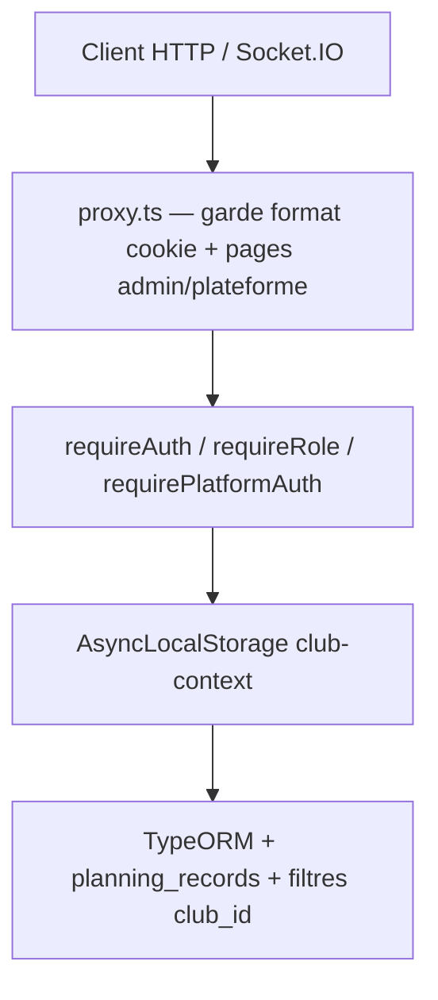

# Audit 02 — Sécurité et Multi-Tenant

**Projet :** AFP Planning (PlanningClub)  
**Date :** 2026-09-10  
**Périmètre :** code sur `main` — authentification, autorisation, API, Socket.IO, push, secrets, tests d'isolation  
**Méthode :** revue statique exhaustive + recoupement tests existants ; **non vérifié dynamiquement** pour la majorité des endpoints (environnement E2E non exécuté dans cet audit)

---

## Synthèse exécutive

| Indicateur | Valeur |
|---|---|
| **Score sécurité** | **84 / 100** |
| **P0** | 0 |
| **P1** | 1 |
| **P2** | 6 |
| **P3** | 5 |
| **Fuites cross-tenant confirmées** | 0 |
| **Fuites cross-tenant probables** | 0 (1 risque opérationnel P1) |

**Réponse à la question centrale :** un utilisateur authentifié du Club A **ne peut pas**, sur la base du code audité, lire/modifier/supprimer les ressources du Club B via les API protégées standard. L'isolation repose sur `session.user.clubId` + `setCurrentClubId` (ALS) + filtres SQL `club_id` / `clubId`. Les tests d'intégration et E2E couvrent plusieurs scénarios critiques (planning publié, campagnes de disponibilité, chat, partage public).

---

## 1. Architecture de sécurité

### 1.1 Couches

| Couche | Fichier(s) | Rôle |
|---|---|---|
| Proxy Next.js | `proxy.ts:93-153` | Cookie club `session_token` (64 hex) ou plateforme `platform_session_token` ; routes publiques listées ; `/club/*` réservé aux `admin` |
| Session club | `app/lib/auth/session.ts` | Token 32 bytes hex, TTL configurable, révocation, club actif |
| Session plateforme | `app/lib/auth/platform-session.ts` | Cookie séparé, admins plateforme |
| Auth handlers | `app/lib/auth/require.ts:8-38` | `requireAuth` → `getSessionUser` + `setCurrentClubId` ; `requireRole` filtre `accessRole` |
| Contexte tenant | `app/lib/auth/club-context.ts:10-26` | ALS ; `getCurrentClubId()` lève si absent |
| Données planning | `app/lib/planning/event-store.ts`, `records.ts` | Requêtes scoping via `getCurrentClubId()` / `defaultClubId()` |
| Chat | `app/lib/chat/policy.ts`, `service.ts`, `socket-server.ts` | `canAccessChatRoom` + `assertRoomAccess` |
| Chiffrement | `app/lib/crypto/secret-box.ts`, `server.ts:8-12` | `APP_ENCRYPTION_KEY` obligatoire en production au démarrage |

### 1.2 Modèle de rôles

| Rôle | `accessRole` | Permissions API écriture |
|---|---|---|
| Administrateur club | `admin` | `WRITE_ROLES` = `['admin']` — planning, comptes, config |
| Dirigeant | `dirigeant` | Espace `/mon-planning`, endpoints `requireAuth` personnels, lecture événements affectés |
| Admin plateforme | cookie plateforme | `/api/plateforme/*` — tous les clubs |
| Anonyme | — | Login, reset MDP, tokens publics, cron secret |

Les **fonctions opérationnelles** (`arbitre_club`, `encadrant`, `accompagnateur`) n'élèvent jamais les droits d'écriture (`app/lib/auth/roles.ts:55-58`).

### 1.3 Cookies et sessions

| Cookie | HttpOnly | Secure (prod) | SameSite | Invalidation |
|---|---|---|---|---|
| `session_token` | oui (`login/route.ts:105`) | oui | `lax` | `revokeSession`, expiration, utilisateur/club inactif, `revokeAllSessionsForClub` |
| `platform_session_token` | oui (`plateforme/login/route.ts:79`) | oui | `lax` | `revokePlatformSession` |

**Observation :** `proxy.ts:104-145` valide le **format** du token (64 hex) pour les routes non publiques, mais pas la session en base — la validation réelle est déléguée aux handlers via `requireAuth`. Cohérent mais défense en profondeur limitée au proxy.

---

## 2. Inventaire API (`app/api/**/route.ts` — 92 fichiers)

### 2.1 Répartition par modèle d'authentification

| Catégorie | Préfixes / routes | Auth | Tenant check |
|---|---|---|---|
| **Club — admin write** | `/api/planning/*`, `/api/users/*`, `/api/matches*`, `/api/entrainements`, `/api/categories`, `/api/stades`, `/api/officiels`, `/api/encadrants`, `/api/accompagnateurs`, `/api/plateaux`, `/api/recurring-events`, `/api/invitations` (liste/création), `/api/club/*`, `/api/scraper`, `/api/dashboard/club`, `/api/settings` (PUT), `/api/settings/planning-features`, `/api/clubs` | `requireRole(WRITE_ROLES)` ou `['admin']` | `auth.user.clubId` + `setCurrentClubId` |
| **Club — auth personnel** | `/api/me/*`, `/api/notifications`, `/api/push/*`, `/api/chat/*`, `/api/planning/events/...` (GET dirigeant), `/api/planning/weather`, `/api/planning/travel`, `/api/planning/attachments/*`, `/api/availability-requests` (GET/respond), `/api/logo-proxy` | `requireAuth` | session + ownership (`userId`, `assertRoomAccess`, `event-access`) |
| **Club — lecture publique settings** | `GET /api/settings` | aucune (public prefix proxy) | `?club=` ou `APP_CLUB_ID` (`settings/route.ts:15-19`) |
| **Token opaque** | `/api/ical/[token]`, `/api/public/planning/[token]`, `GET /api/invitations/[token]`, `POST .../accept` | token | hash SHA-256 + expiration + club actif |
| **Plateforme** | `/api/plateforme/*` (hors login/logout) | `requirePlatformAuth` | accès cross-club **intentionnel** (superadmin) |
| **Cron** | `/api/cron/planning-reminders`, `/api/cron/scraper` | `CRON_SECRET` | itère `listActiveClubIds` avec `runWithClubId` |
| **Auth** | `/api/auth/login`, `logout`, `password-reset/*`, `me` | public ou session | N/A |
| **Push config** | `GET /api/push/config` | public | expose clé VAPID publique uniquement |
| **PWA** | `/api/pwa/icon` | public (proxy) | branding par `?club=` |

### 2.2 Matrice cross-tenant par ressource (extrait)

| Ressource | GET | POST/PUT | DELETE | Mécanisme tenant | Test existant |
|---|---|---|---|---|---|
| Événements planning | admin: `clubId` DB ; dirigeant: snapshot publié | `event-store` + `clubId` | idem | `getCurrentClubId()` | `e2e/club-isolation.spec.ts`, `me/planning/route.test.ts` |
| Utilisateurs | `users/route.ts` filtre `clubId` | `findOneBy({ id, clubId })` | idem | session | `users/route.test.ts` |
| Chat messages | `assertRoomAccess` | idem | modération admin | `room.clubId === user.clubId` | `chat/service.test.ts`, socket integration |
| Notifications | `userId = auth.user.id` | PATCH id + `userId` | — | ownership | — |
| Push subscriptions | — | `auth.user.id` | `user_id` + endpoint hash | ownership | — |
| Partage public | token hash global | — | — | `share.clubId` après résolution | `public/planning/[token]/route.test.ts` |
| iCal | token utilisateur | — | — | `user.clubId` | — |
| Campagnes disponibilité | `getPlanningRecord` + `club_id` | idem | idem | ALS | `availability-requests/route.test.ts` |
| Indisponibilités club | `clubId` session | review scoped | — | session | `club/indisponibilites/*.test.ts` |
| Audit match | — | — | — | `clubId` dans route | `matches/[id]/audit-log/route.ts:30` |

**Aucun endpoint protégé identifié** acceptant un `clubId` arbitraire dans le body pour lire/écrire des données d'un autre club.

---

## 3. Findings

### SEC-001 — Risque opérationnel `APP_CLUB_ID` / `defaultClubId()` sans contexte ALS

| Champ | Valeur |
|---|---|
| **Statut** | 🟠 Très probable (impact si mauvaise config) |
| **Priorité** | P1 |
| **Domaine** | Multi-tenant / données |
| **Preuve** | `app/lib/planning/records.ts:53-55`, `84-91` — `defaultClubId()` retombe sur `APP_CLUB_ID \|\| 'afp'` si ALS vide ; `getCurrentClubId()` lève (`club-context.ts:20-25`) mais `defaultClubId()` non |
| **Scénario** | Nouveau handler oubliant `requireAuth`/`setCurrentClubId` en prod mono-club avec `APP_CLUB_ID` → requêtes sur le mauvais tenant silencieusement |
| **Exploitabilité** | Faible côté attaquant externe ; **élevée** en erreur de développement |
| **Correction** | Remplacer `defaultClubId()` par `getCurrentClubId()` partout, ou faire échouer `defaultClubId()` sans ALS |

---

### SEC-002 — Proxy API : validation session superficielle

| Champ | Valeur |
|---|---|
| **Statut** | ⚪ Hardening |
| **Priorité** | P2 |
| **Domaine** | Authentification |
| **Preuve** | `proxy.ts:104-145` — `hasWellFormedToken` sans `getSessionUser` sauf `/`, `/login`, `/club/*` |
| **Scénario** | Token révoqué/expiré atteint le handler (qui renvoie 401) ; charge serveur inutile |
| **Correction** | Valider session en proxy pour `/api/*` ou court-circuiter tôt |

---

### SEC-003 — Énumération de clubs via `GET /api/settings?club=`

| Champ | Valeur |
|---|---|
| **Statut** | 🟡 À vérifier dynamiquement |
| **Priorité** | P2 |
| **Domaine** | Fuite d'information |
| **Preuve** | `app/api/settings/route.ts:15-19`, `34-37` — non authentifié, paramètre `club` libre |
| **Scénario** | Énumérer les IDs de clubs existants et récupérer nom/logo/thème de la page login |
| **Impact** | Limité (données déjà semi-publiques pour le branding login) |
| **Correction** | Restreindre aux clubs actifs connus, rate-limit, ou exiger sous-domaine |

---

### SEC-004 — Secret cron scraper accepté en query string / header custom

| Champ | Valeur |
|---|---|
| **Statut** | 🟠 Très probable |
| **Priorité** | P2 |
| **Domaine** | Secrets / cron |
| **Preuve** | `app/api/cron/scraper/route.ts:8-19` — `?secret=` et `x-cron-secret` ; comparer `planning-reminders/route.ts:17-24` (Bearer + `timingSafeEqual` uniquement) |
| **Scénario** | Fuite du secret dans logs proxy, historique navigateur, Referer |
| **Correction** | Aligner sur Bearer + `timingSafeEqual` ; retirer query param |

---

### SEC-005 — Limites de débit chat Socket.IO en mémoire (multi-instances)

| Champ | Valeur |
|---|---|
| **Statut** | 🔴 Confirmé (limitation documentée) |
| **Priorité** | P2 |
| **Domaine** | Socket.IO / disponibilité |
| **Preuve** | `app/lib/chat/socket-server.ts:155-181`, `170-181` |
| **Scénario** | Déploiement multi-pods → contournement rate-limit handshake/messages |
| **Impact** | Pas de fuite cross-tenant ; abus DoS |
| **Correction** | Compteur partagé (Redis / MariaDB `GET_LOCK`) |

---

### SEC-006 — Absence de test Socket.IO cross-club sur `chat:resume` / `chat:send`

| Champ | Valeur |
|---|---|
| **Statut** | 🟡 À vérifier dynamiquement |
| **Priorité** | P2 |
| **Domaine** | Tests / chat |
| **Preuve** | `chat/service.test.ts:207-221` couvre HTTP ; `socket-server.integration.test.ts` teste changement de club même utilisateur, pas User A → room Club B |
| **Scénario** | User Club A envoie `roomId` d'un salon Club B |
| **Mitigation code** | `authorizeRoomForUser` (`service.ts:177-192`) + `policy.ts:23` |
| **Correction** | Ajouter test d'intégration socket cross-tenant |

---

### SEC-007 — Ré-abonnement push : réassignation d'endpoint

| Champ | Valeur |
|---|---|
| **Statut** | ⚪ Hardening |
| **Priorité** | P3 |
| **Domaine** | Push |
| **Preuve** | `app/lib/push/store.ts:36-37` — `ON DUPLICATE KEY UPDATE user_id = VALUES(user_id)` |
| **Scénario** | Deux comptes sur même navigateur → le second « vole » l'endpoint (comportement attendu changement de compte) |
| **Impact** | Faible ; endpoint lié au navigateur |
| **Correction** | Documenter ; révoquer subscriptions au logout |

---

### SEC-008 — Ambiguïté login email+mot de passe multi-clubs

| Champ | Valeur |
|---|---|
| **Statut** | 🔴 Confirmé (comportement documenté) |
| **Priorité** | P3 |
| **Domaine** | Authentification |
| **Preuve** | `app/api/auth/login/route.ts:48-56`, `70-82` |
| **Scénario** | Même email+MDP sur 2 clubs → premier candidat trouvé |
| **Impact** | UX / ambiguïté, pas IDOR |
| **Correction** | Sélecteur de club à la connexion |

---

### SEC-009 — Invitation DELETE : identifiant token vs hash incohérent

| Champ | Valeur |
|---|---|
| **Statut** | 🟡 À vérifier dynamiquement |
| **Priorité** | P3 |
| **Domaine** | API / cohérence |
| **Preuve** | `invitations/[token]/route.ts:19` (hash) vs `:60` (id brut) ; test utilise `invitation.id` (hash) |
| **Scénario** | Pas de cross-tenant (`clubId` filtré ligne 60) ; risque fonctionnel |
| **Correction** | `hashInvitationToken(token)` sur DELETE |

---

### SEC-010 — Pas de CSRF explicite sur mutations cookie

| Champ | Valeur |
|---|---|
| **Statut** | ⚪ Hardening |
| **Priorité** | P3 |
| **Domaine** | Web |
| **Preuve** | Cookies `SameSite=lax` ; pas de token CSRF |
| **Scénario** | Mutation cross-site via GET limitée ; POST cross-site bloqué par Lax pour la plupart |
| **Correction** | `SameSite=strict` pour sessions sensibles ou CSRF token |

---

### SEC-011 — `GET /api/invitations/[token]` expose métadonnées

| Champ | Valeur |
|---|---|
| **Statut** | ⚪ Hardening (by design) |
| **Priorité** | P3 |
| **Domaine** | Confidentialité |
| **Preuve** | `invitations/[token]/route.ts:31-37` — email, rôle, nom |
| **Scénario** | Token volé → infos invitation |
| **Correction** | Minimiser champs ; token haute entropie (48 hex) |

---

## 4. Authentification (détail)

| Contrôle | Implémentation | Fichier |
|---|---|---|
| Rate-limit login | IP + identité, buckets DB | `login/route.ts:32-45`, `login-rate-limit.ts` |
| Rate-limit plateforme | buckets séparés `platform-login:` | `plateforme/login/route.ts:29-42` |
| Mot de passe | bcrypt via `verifyPassword` | `lib/auth/password.ts` |
| Reset MDP | hash token, 30 min, révocation sessions | `password-reset/*` |
| Profils sans accès | `hasAccountAccess` bloque login/reset | `login/route.ts:74`, `password-reset/confirm/route.ts:45` |
| Club désactivé | `isClubTenantActive` invalide session | `session.ts:137-140` |
| Dernière admin | verrou pessimiste | `users/[id]/route.ts:47-61` |

---

## 5. Socket.IO (détail)

| Contrôle | Fichier:ligne |
|---|---|
| Auth handshake cookie session | `socket-server.ts:277-287` |
| Origin check | `socket-server.ts:85-118` |
| Rate-limit handshake | `socket-server.ts:214-237` |
| Revalidation session 15s | `socket-server.ts:301-323` |
| Changement club → leave rooms | `socket-server.ts:307-315` |
| Room access avant messages | `service.ts:172-192`, `socket-server.ts:343-350` |
| Chiffrement messages | `secret-box.ts` + `service.ts` |

**Scénario critique testé :** utilisateur transféré vers autre club ne reçoit plus les messages de l'ancien salon (`socket-server.integration.test.ts:519-541`).

**Scénario non testé en socket :** utilisateur Club A tente `roomId` Club B (mitigé côté `assertRoomAccess`).

---

## 6. Push notifications (détail)

| Endpoint | Contrôle |
|---|---|
| `POST /api/push/subscribe` | `requireAuth` ; `userId` = session ; endpoints HTTPS whitelist (`endpoint.ts:1-16`) |
| `POST /api/push/unsubscribe` | `user_id` + `endpoint_hash` |
| `GET /api/push/config` | clé publique VAPID seulement |
| Notifications DB | filtrées `userId = auth.user.id` (`notifications/route.ts:17-18`, `83`) |

Logout **ne supprime pas** automatiquement les subscriptions push (hardening SEC-007).

---

## 7. Secrets et variables d'environnement

| Variable | Exposition | Risque |
|---|---|---|
| `APP_ENCRYPTION_KEY` | serveur uniquement | Requis prod (`server.ts:8-12`) |
| `CRON_SECRET` | serveur | Fuite via query param scraper (SEC-004) |
| `VAPID_PUBLIC_KEY` / `NEXT_PUBLIC_VAPID_PUBLIC_KEY` | publique intentionnelle | OK |
| `BOOTSTRAP_*`, `PLATFORM_ADMIN_*` | env déploiement | Non committés ; CI utilise valeurs test |
| `DB_PASSWORD` dans CI | workflow uniquement | Valeur test `afp_password` — acceptable CI |

**Aucun secret réel committé** dans le dépôt (.env absent). `scripts/generate-vapid-keys.mjs` documente `NEXT_PUBLIC_VAPID_PUBLIC_KEY` sans valeur.

---

## 8. Tests de sécurité existants

| Fichier | Couverture |
|---|---|
| `e2e/club-isolation.spec.ts` | Club B ne voit pas événements publiés Club A |
| `app/api/availability-requests/route.test.ts` | Isolation campagnes cross-club |
| `app/api/public/planning/[token]/route.test.ts` | Token isole événements par club |
| `app/api/users/route.test.ts` | Création utilisateur scoping club |
| `app/api/invitations/[token]/route.test.ts` | Revoke cross-club refusé |
| `app/lib/chat/service.test.ts` | Salon autre club refusé |
| `app/lib/chat/socket-server.integration.test.ts` | Broadcast, typing, changement club |
| `app/api/logo-proxy/route.ssrf.test.ts` | SSRF |
| `app/api/planning/publication-access.integration.test.ts` | Accès publication |
| `proxy.test.ts` | Routes publiques / admin |

**Lacunes :** pas de test E2E systématique par route ; push/notifications cross-user ; socket cross-club explicite.

---

## 9. OWASP (pertinence)

| OWASP API / Web | Applicabilité | État |
|---|---|---|
| API1 BOLA / IDOR | Élevée | Bien mitigé (clubId session + ownership) |
| API2 Auth broken | Élevée | Sessions solides ; proxy superficiel |
| API3 Property level auth | Élevée | `event-access`, chat policy |
| API5 BFLA | Moyenne | `WRITE_ROLES` strict admin |
| API8 Misconfiguration | Moyenne | `APP_CLUB_ID` fallback |
| SSRF | Scraping, logo-proxy | Mitigations présentes |
| XSS | UI | Hors périmètre ; chat chiffré |

---

## 10. Score détaillé (/100)

| Domaine | Poids | Note | Commentaire |
|---|---|---|---|
| Isolation multi-tenant | 30% | 86 | ALS + filtres SQL + tests ciblés |
| Auth / sessions | 20% | 83 | Rate-limit, cookies, révocation |
| Autorisation API | 20% | 87 | WRITE_ROLES, event-access, ownership |
| Socket / chat | 10% | 84 | Bon modèle ; rate-limit mono-instance |
| Push / notifications | 5% | 82 | Ownership OK ; logout push |
| Secrets / config | 10% | 88 | Pas de fuite repo ; cron query param |
| Tests sécurité | 5% | 78 | E2E isolation ; lacunes socket/push |

**Score pondéré : 84 / 100**

---

## 11. Plan de remédiation

### Immédiat (P1)
1. **SEC-001** — Supprimer le fallback silencieux `APP_CLUB_ID` dans `defaultClubId()` ; exiger ALS.

### Court terme (P2)
2. **SEC-004** — Harmoniser auth cron scraper (Bearer only, `timingSafeEqual`).
3. **SEC-006** — Test socket User Club A → `roomId` Club B.
4. **SEC-003** — Rate-limit / validation `?club=` sur settings publics.
5. **SEC-005** — Rate-limit chat partagé si multi-instances prévu.
6. **SEC-002** — Validation session dans proxy pour `/api/*`.

### Hardening (P3)
7. Sélecteur club au login (SEC-008).
8. CSRF / `SameSite=strict` sessions admin (SEC-010).
9. Purge push subscriptions au logout (SEC-007).
10. Corriger hash DELETE invitation (SEC-009).

---

## 12. Causes racines transverses

1. **Défense en profondeur inégale** — proxy léger, handlers robustes.
2. **Fallback mono-tenant legacy** (`APP_CLUB_ID`, `afp`) pour compatibilité migration.
3. **Rate-limits volontairement locaux** (chat) vs distribués (login).
4. **Couverture tests bonne sur cas métier** mais pas matrice exhaustive 92 routes.

---

*Audit réalisé sans modification du produit (hors `/audits/**`).*
