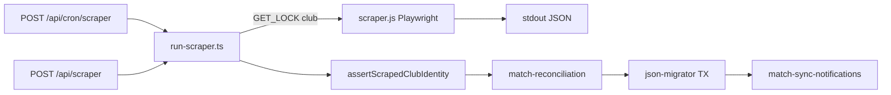

# Audit 03 — SportCorico et Scraping

**Repository :** `https://github.com/brahmiamine/afp-planning`  
**Périmètre :** code sur `main` au 2026-09-10  
**Méthode :** analyse statique + tests/fixtures HTML. **Aucun appel réseau vers SportCorico.** Aucun test destructif.

**Relation avec l’audit précédent :** obsolète sur #335 (logos AFP), #336 (notifs), #340 (fixtures). **Nouveau P1 :** le parser testé (`sportcorico-parser.dom.js`, catégorie #353) **n’est pas branché** dans `scraper.js` de production.

---

## Sommaire

1. [Score](#1-score)
2. [Architecture](#2-architecture)
3. [Configuration `matchesUrlKey` / `scraperClubName`](#3-configuration-matchesurlkey--scraperclubname)
4. [Déclenchement et concurrence](#4-déclenchement-et-concurrence)
5. [HTTP et sécurité](#5-http-et-sécurité)
6. [Parsing](#6-parsing)
7. [Normalisation et matching club](#7-normalisation-et-matching-club)
8. [Identité d’un match](#8-identité-dun-match)
9. [Matrice champ / source de vérité](#9-matrice-champ--source-de-vérité)
10. [Scénarios obligatoires (18)](#10-scénarios-obligatoires-18)
11. [Idempotence, archives, perf](#11-idempotence-archives-perf)
12. [Tests](#12-tests)
13. [Findings](#13-findings)
14. [Plan de remédiation](#14-plan-de-remédiation)
15. [Definition of Done](#15-definition-of-done)

---

## 1. Score

**Note : 74 / 100**

| Dimension | Poids | Note |
|-----------|------:|-----:|
| Identification stable des matchs | 25 | 20 |
| Idempotence / atomicité | 15 | 13 |
| Mises à jour et préservation internes | 15 | 13 |
| Disparition / annulation / report | 15 | 10 |
| Robustesse du parsing | 10 | 5 |
| Isolation tenant / sécurité | 10 | 8 |
| Performance | 5 | 3 |
| Tests | 5 | 2 |

**Findings :** P0 **0** · P1 **2** · P2 **6** · P3 **4**

Le poste Tests est bas : les fixtures prouvent un module **non utilisé** en production (`runDomParser` unused, warning ESLint `scraper.js:21`).

---

## 2. Architecture

| Fichier | Responsabilité | Entrée | Sortie | Appelé par |
|---------|----------------|--------|--------|------------|
| `scraper.js` (53 777 o) | Playwright liste + détail ; **parse inline** `page.evaluate` | `SCRAPER_MATCHES_URL_KEY`, `SCRAPER_CLUB_NAME` | stdout `__AFP_SCRAPER_RESULT__=` | `run-scraper.ts` `execFile` |
| `sportcorico-parser.js` | normalize/resolve URL key + bundle DOM | string | key / bundle | `scraper.js` (resolve + bundle **chargé mais unused**) |
| `sportcorico-parser.dom.js` | parsers purs + `extractMatchCategorie` (#353) | Document | club/list/detail | **tests seulement** |
| `club-identity.ts` | normalize / home / logos (#335) | noms | bool | `run-scraper.ts` ; **dupliqué inline** dans `scraper.js` |
| `fixtures/*.html` | HTML #340 | — | — | `sportcorico-parser.test.ts` |
| `run-scraper.ts` | lock, spawn, identity, sync, notifs | `clubId` | `{ runId, sync }` | API + cron |
| `output.ts` | parse stdout | stdout | `MatchesData` | run-scraper |
| `match-reconciliation.ts` | identité source ↔ interne | existing+incoming | décisions | run-scraper |
| `match-sync-notifications.ts` | notifs admin #336 | notifications[] | DB | run-scraper `:133` |
| `json-migrator.ts` | persist, missing, overrides | `MatchesData` | compteurs | reconciliation |
| `official-match-overrides.ts` | préserve corrections admin | source vs effective | override JSON | migrator |
| `api/scraper/route.ts` | manuel | session WRITE | JSON | `ScraperButton` |
| `api/cron/scraper/route.ts` | multi-clubs | Bearer `CRON_SECRET` | par club | cron externe (pas de workflow GH dans le repo) |

**Écart critique :** `runDomParser` (`scraper.js:21-28`) n’est **jamais appelé**. Le parse prod est le bloc `page.evaluate` (`scraper.js:1227-1241` sans `categorie`).

---

## 3. Configuration `matchesUrlKey` / `scraperClubName`

| Paramètre | Stockage | Validation | Obligatoire |
|-----------|----------|------------|-------------|
| `matchesUrlKey` | `club_tenants.matchesUrlKey` (`schemas.ts:620`) | `^[a-z0-9-]{1,255}$` | oui pour scraper |
| `scraperClubName` | `club_tenants.scraperClubName` | non vide si key présente | oui dès qu’une source existe (#221) |

Validation : `plateforme/clubs/route.ts:34-52`, `[id]/route.ts:75-109`. Runtime : `run-scraper.ts:45-57`. Masqué du club : `settings/route.ts:66-71,104-105`.

**Usage :**
- Key → `https://www.sportcorico.com/clubs/${key}` (`scraper.js:18-19`).
- Name → domicile/extérieur + logos + `assertScrapedClubIdentity` (`run-scraper.ts:62-78`).

### A-t-on besoin des DEUX ?

**Oui — complémentaires, pas redondants.**

1. La **cible HTTP** est un slug SportCorico (`matchesUrlKey`), pas une URL libre → SSRF limité.  
2. La **sécurité tenant** exige `scraperClubName` : une mauvaise key importerait le calendrier d’un autre club. Nom vide → throw (`run-scraper.ts:55-56`, test `:71-73`).  
3. Le repli compact utilise **les deux** (`run-scraper.ts:72-76`) — les sigles « A-S » / « AS » ne matchent pas sur le nom seul.

---

## 4. Déclenchement et concurrence

| Trigger | Auth | Preuve |
|---------|------|--------|
| `POST /api/scraper` | `requireRole(WRITE_ROLES)` + flag `scraperSync` | `api/scraper/route.ts:18-28` |
| `GET /api/scraper` | admin, liste runs | `:10-15` |
| `POST /api/cron/scraper` | Bearer + `timingSafeEqual` | `cron/scraper/route.ts:9-24` |
| `node scraper.js` | aucun auth app | `package.json` script `scrape` |

Locks : `GET_LOCK(afp_planning_scraper_<sha256>, 0)` (`run-scraper.ts:81-114`) — même club rejeté. Sync : `GET_LOCK(afp_planning_official_match_sync_v1:<clubId>, 15)` (`json-migrator.ts:47,196-201`). Cron **séquentiel** par club (`cron/scraper/route.ts:36-49`). Clubs différents isolés.

Pas d’anti-rejeu au-delà de la possession du secret.

---

## 5. HTTP et sécurité

| Contrôle | Statut | Preuve |
|----------|--------|--------|
| Host fixé + slug | OK | `scraper.js:19` |
| Allowlist key | OK | `run-scraper.ts:21,46` |
| Redirect host pin | **Non** | Playwright `goto` suit les redirects |
| Timeouts | 20s page / 120s process | `scraper.js:56` ; `run-scraper.ts:121` |
| Snapshot vide + actives | **abort** | `json-migrator.ts:257-258` |
| Snapshot tronqué | abort si ≥4 actives et ≥50% missing | `:68-76,261-265` |
| Crash process | `failScraperRun`, pas de sync | `run-scraper.ts:149-151` |

**Fail-safe disparition :** une erreur réseau / HTML cassé **n’est pas** interprétée comme « tous les matchs ont disparu ».

---

## 6. Parsing

Champs **production `scraper.js`** :

| Champ | Liste | Détail |
|-------|:-----:|:------:|
| date, time, local, away, competition, venue, logos, url, rawText | oui | oui |
| stadium / address / terrain / itinéraire / staff | — | oui |
| **categorie** | **non** | **non** |
| statut / score SportCorico | non | non |
| journée | dans la string compétition | |
| `horaireRendezVous` | kickoff − 90 min (`scraper.js:1195-1215`) | |

Sélecteurs Tailwind fragiles (`section.mb-10`, `border-l-8.border-primary`, `championnat-head`). Section absente → throw (`scraper.js:612-613`).

#353 `extractMatchCategorie` : `sportcorico-parser.dom.js:137-163`, tests `:122-148`. **Pas dans le `matches.push` prod** (`scraper.js:1227-1241`).

---

## 7. Normalisation et matching club

`club-identity.ts:1-55` : NFD, accents, lower, non-alnum, inclusion, acronyme, overlap tokens ≥50 %.

**AFP leftover :** matching `localTeam.includes("afp")` **supprimé** (`scraper.js:825` → `isHomeMatchForClub`). Résidus : fallback name `"Academie Football Paris 18"` (`:1283-1284`), filtre logo `championnet-s-paris-511117` (`:999,1050`), préfixe stdout `__AFP_`.

---

## 8. Identité d’un match

Ordre (`match-reconciliation.ts:198-296`) :

1. Exact `sourceMatchId` / `sourceMatchIds` / PK legacy = slug.  
2. Fuzzy score ≥ 85 et gap ≥ 10 (`:12-14`) : mêmes équipes/compétition (journée strippée)/venue ; date ≤ 14 j.  
3. Sinon nouveau `scr_<sha256(clubId\0sourceId)>` (`:131-137`).

Historique `sourceMatchIds` cap 20.

| Changement | Stabilité |
|------------|-----------|
| heure / RDV | même id |
| date ≤14 j | fuzzy |
| date >14 j | **nouveau** (doublon possible) |
| terrain | id OK ; `scheduleChanged` |
| adversaire/compétition renommés | score 0 → **nouveau** sauf même source id |
| statut reporté/annulé HTML | **non modélisé** |

---

## 9. Matrice champ / source de vérité

| Champ | Créé scrape | MAJ scrape | Override admin | Jamais écrasé |
|-------|:-----------:|:----------:|:--------------:|:-------------:|
| date, time, RDV, équipes, compétition, venue | oui | oui | oui (`official-match-overrides.ts:8-18`) | — |
| categorie | si présent incoming | oui | oui | prod n’envoie pas le champ |
| details.*, staff.* | oui | oui | oui | — |
| logos, url, rawText | oui | oui | non | — |
| sourceMatchId(s), sourceStatus, missing* | oui | oui | non | méta source |
| planningRevision | héritée | **non reset** | — | `json-migrator.ts:318-321` |
| Affectations MatchExtra | shell draft | patch flags only | — | spread `currentExtras` `:335-368` |
| publication / chat / assignment_state | — | — | — | keyed par eventId interne |

---

## 10. Scénarios obligatoires (18)

| # | Scénario | Conclusion | Preuve |
|---|----------|------------|--------|
| 1 | Nouveau match | **Géré** | `json-migrator.ts:336-338` draft |
| 2 | Inchangé | **Géré** | pas de `updatedCount` / notif |
| 3 | Changement heure | **Géré** | `scheduleChanged` time/RDV `:224-229` |
| 4 | Changement date | **Géré** (identité ≤14 j) | reconciliation + scheduleChanged |
| 5 | Changement terrain | **Géré** stadium/address | scheduleChanged details |
| 6 | Adversaire/compétition renommé | **Partiel** | nouveau si slug change (`match-reconciliation.test.ts:96-118`) ; même source id = update silencieux |
| 7 | Reporté | **Non géré** (pas de statut source) | pas de parse statut |
| 8 | Annulé (source) | **Partiel** | via pipeline missing 2 obs |
| 9 | Disparu | **Géré** | `:79-87,372-417` |
| 10 | Disparu puis revenu | **Géré** | `:289-314,353-358` |
| 11 | Manuel puis découvert SC | **Partiel** | officiel ≠ amical ; fuzzy sur officiels |
| 12 | SC « supprimé » puis rescrapé | **Géré** comme 405 delete officiel | `events/.../route.ts:363-367` |
| 13 | Double scraping même club | **Géré** | GET_LOCK timeout 0 |
| 14 | Concurrent 2 clubs | **Géré** | locks distincts ; cron séquentiel |
| 15 | Erreur réseau | **Géré** | fail run, pas de sync |
| 16 | HTML invalide | **Géré** | throw section |
| 17 | Parser 0 matchs | **Géré** si actives (abort) | `:257-258` |
| 18 | DST | **Non vérifiable** | heures = strings ; −90 min wrap midnight ; pas `Europe/Paris` dans scraper |
| — | Club A ≠ Club B | **Géré** | `clubId` partout ; ids hashés avec clubId |

---

## 11. Idempotence, archives, perf

- Re-run identique : upsert PK ; pas de notifs si `notifications.length===0` (`match-sync-notifications.ts:39`).  
- TX + `pessimistic_write` (`json-migrator.ts:203-216`).  
- Missing confirmé + publié → `cancelled` scraping (`:405-416`). Archives badges `past/missing/cancelled` (`archives/official-matches.ts:62-72`).  
- Perf : 1 page club + N détails, concurrence **15** (`scraper.js:1259-1264`). Runs stockent created/updated/missing — **pas** de compteur « unchanged ».

---

## 12. Tests

| Zone | Couvert | Fichier |
|------|---------|---------|
| Fixtures HTML | oui | `fixtures/*` + `sportcorico-parser.test.ts` |
| categorie #353 | module seulement | parser tests |
| Club identity #335 | oui | `run-scraper.test.ts` |
| Reconciliation | oui | `match-reconciliation.test.ts` |
| Snapshot guard / 2-obs | oui | `json-migrator.test.ts` |
| Overrides | oui | `json-migrator.override.integration.test.ts` |
| Notifs #336 | oui | `match-sync-notifications.integration.test.ts` |
| Cron Bearer | oui | `cron/scraper/route.test.ts` |
| **Prod path = parser partagé** | **non** | `runDomParser` unused |

---

## 13. Findings

### SCRAPE-001 — P1 — Parser testé ≠ parser production

- `runDomParser` never called (`scraper.js:21-28`) ; ESLint warning. Categorie #353 et fixtures #340 ne protègent pas le HTML réellement évalué.  
- **Impact :** un changement SportCorico peut casser prod avec tests verts.  
- **Correction :** `page.evaluate` doit appeler le bundle DOM unique.  
- **Statut :** 🔴 Confirmé

### SCRAPE-002 — P1 — `categorie` absente du payload prod

- `matches.push` sans champ (`scraper.js:1227-1241`) alors que le fuzzy peut l’utiliser.  
- **Statut :** 🔴 Confirmé

### SCRAPE-003 — P2 — Sélecteurs Tailwind fragiles

- **Statut :** 🔴 Confirmé

### SCRAPE-004 — P2 — Concurrence 15 contextes détail

- **Statut :** 🔴 Confirmé

### SCRAPE-005 — P2 — Rename équipes/compétition sans notif si source id stable

- **Statut :** 🟠 Très probable

### SCRAPE-006 — P2 — Report/cancel HTML non first-class

- **Statut :** 🔴 Confirmé

### SCRAPE-007 — P2 — Observabilité : pas de compteur unchanged / pendingMissing en DB run

- **Statut :** 🔴 Confirmé

### SCRAPE-008 — P3 — Résidus AFP (fallback name, championnet filter, préfixe)

- **Statut :** 🔴 Confirmé

### SCRAPE-009 — P3 — Redirect host non revalidé

- **Statut :** 🟠 Très probable

### SCRAPE-010 — P3 — Pas de workflow GH pour `/api/cron/scraper`

- Déclenchement externe **non déterminable**.  
- **Statut :** ⚪ Décision ops

### SCRAPE-011 — P3 — Defaults seed encore AFP (`settings.ts:84-85`)

- **Statut :** 🔴 Confirmé

**Corrigés vs ancien audit :** #335 matching/logos ; #336 notifs livrées ; #340 fixtures + fail-fast URL (module).

---

## 14. Plan de remédiation

1. Brancher `runDomParser` / supprimer le parse dupliqué (SCRAPE-001/002).  
2. Extraire categorie en prod.  
3. Réduire la concurrence ou la rendre configurable.  
4. Modéliser report/cancel si le HTML le permet.  
5. Nettoyer fallbacks AFP.  
6. Alerter si 0 matchs alors que le club en a habituellement (run history).

---

## 15. Definition of Done

- [x] 18 scénarios avec conclusion sourcée  
- [x] Question `matchesUrlKey`/`scraperClubName` tranchée : **les deux sont nécessaires**  
- [x] Matrice champ/source de vérité  
- [x] Aucun appel réseau SportCorico  

**Non exécuté dynamiquement :** scraping live, DST réel.
