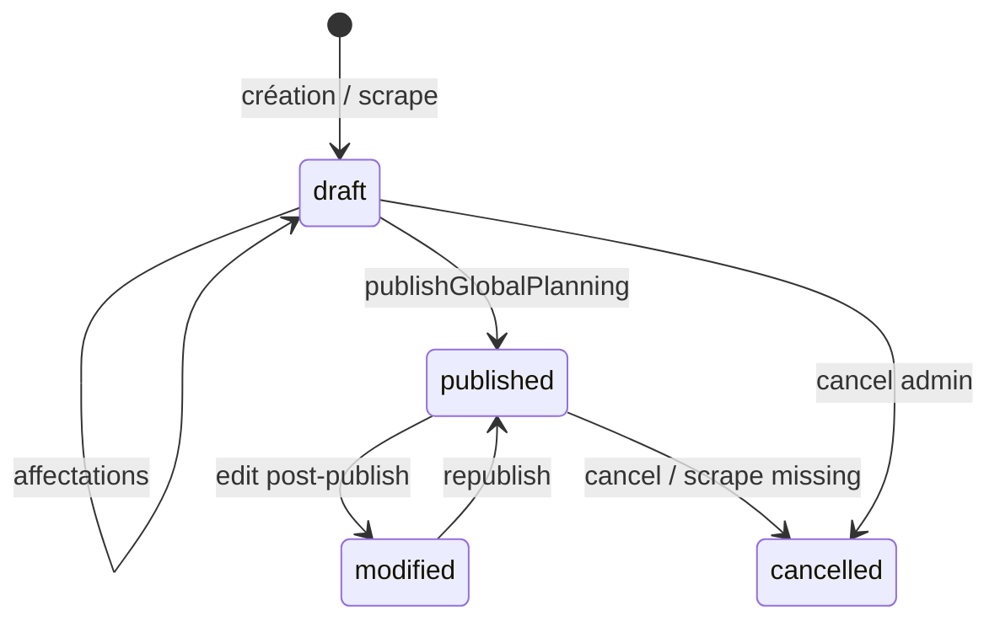

# Audit 04 — Planning, affectations et publication

**Projet :** AFP Planning  
**Date :** 2026-09-10  
**Méthode :** analyse statique ; tests unitaires recoupés ; **non vérifié dynamiquement** en UI

---

## Score : **74 / 100**

| Dimension | Note |
|-----------|------|
| Workflow | 78 |
| Affectations | 72 |
| Règles publication | 80 |
| Modification post-publication | 70 |
| Mon Planning | 82 |
| Indisponibilités | 68 |
| Notifications | 75 |
| Concurrence / tests | 65 |

**Findings :** P0 **0** · P1 **3** · P2 **7** · P3 **4**

---

## Concepts

| Concept | Représentation | Fichier |
|---------|----------------|---------|
| Match / événement | `MatchOfficial` + `MatchExtra` ou entrainement/plateau payload | `types/match.ts` |
| Préparation | `planningStatus: draft` | `MatchExtra` JSON |
| Publication | Snapshot global `published-planning` + statuts `published` | `published-planning.ts` |
| Affectation | Contacts par rôle dans payload (`arbitreTouche`, etc.) | `buildMatchAssignments` |
| Fonction match | `PlanningRole` → `PlanningFunction` | `person-link.ts` |
| Archive | `planning_event_state.archivedAt` | migration 0002 |

**Legacy :** ancien statut par événement ; aujourd'hui publication **globale** par club.

---

## Workflow réel



**Endpoints clés :**

| Action | Endpoint | Handler |
|--------|----------|---------|
| Preview blockers | `GET /api/planning/publication-all` | `getGlobalPlanningPublicationPreview` |
| Publier | `POST /api/planning/publication-all` | `publishGlobalPlanning` |
| Annuler / rouvrir | `POST /api/planning/publication` | `applyPlanningPublicationAction` |
| Sauver affectations | `PATCH .../events/[type]/[id]` | `saveRoleAssignments` |
| Auto-assign | `POST /api/planning/auto-assign` | suggestions + save |
| Mon Planning | `GET /api/me/planning` | `listPersonalAssignments` |

---

## Affectations

### Fonctions et mapping

| Rôle planning | Champ contact | Fonction user | PersonType |
|---------------|---------------|---------------|------------|
| `arbitre` | `arbitreTouche` | `arbitre_club` | `officiel` |
| `encadrant` | `contactEncadrants` | `encadrant` | `encadrant` |
| `accompagnateur` | `contactAccompagnateur` | `accompagnateur` | `accompagnateur` |

### Qui peut affecter
- **Admin uniquement** (`requireRole(['admin'])` sur endpoints planning write).

### Éligibilité
- User actif + `planningFunctions` contient la fonction (`findAssignablePerson`, `userHoldsFunction`).
- Suggestions filtrent indispo, conflits horaires, charge (`assignment-suggestions.ts`).

### Écarts identifiés
- **Save manuel** : pas de validation indispo/conflit systématique (PLAN-001).
- **Utilisateur autre club** : bloqué par `personId` lookup scoped club.
- **Doublon même rôle** : structure liste contacts — plusieurs entrées possibles ; publication vérifie couverture minimale, pas unicité personne.

---

## Règles de publication (prouvées)

### Conditions par défaut (officiel / amical)

```57:72:app/lib/planning/validation.ts
export const DEFAULT_PUBLICATION_ROLE_REQUIREMENTS: PublicationRoleRequirements = {
  arbitre: true,
  encadrant: true,
  accompagnateur: true,
};
```

Chaque rôle requis = au moins un contact **non declined** (`hasCoveredRole`, `activeContacts` — `p0-rules.ts`).

### Configurables (par club)

| Flag settings | Effet |
|---------------|-------|
| `features.publicationReadiness` | Active les checks readiness |
| `features.requireArbitreForPublication` | Toggle arbitre |
| `features.requireEncadrantForPublication` | Toggle encadrant |
| `features.requireAccompagnateurForPublication` | Toggle accompagnateur |
| `features.assignmentValidation` | Indispo, conflits, personId unknown |

### Où appliqué

| Couche | Appliqué | Contournable |
|--------|:--------:|:------------:|
| UI badges | ✅ indicatif | — |
| `publishGlobalPlanning` | ✅ | ❌ (409) |
| `saveRoleAssignments` | ❌ | ✅ |
| DB constraints | ❌ | ✅ |

**Entraînement / plateau :** encadrant seul si flag actif.

---

## Publication globale

- **Portée :** tous événements dans fenêtre publication (J-7 00:00 TZ club → futur) non annulés — `isWithinPublicationWindow`.
- **Signification « publié » :** record `planning_records` kind `published-planning` + chaque event `planningStatus: published` + snapshot JSON.
- **Mon Planning :** lit **snapshot publié**, pas données live — `listPublishedPlanningEventSnapshots`.
- **Filtres UI préparation :** n'affectent pas la portée publish (publish = fenêtre globale).

---

## Mon Planning

| Règle | Implémentation |
|-------|----------------|
| Auth + fonction | `hasAnyPlanningFunction` — 403 sinon |
| Visibilité statut | `published`, `modified`, ou `cancelled` (option) |
| Assignation | `personIdentityMatches(contact, user)` |
| Fonction affichée | rôle où user match + `hasPlanningFunction` |
| Multi-fonctions | une entrée par rôle dans `assignments[]` |

---

## Indisponibilités

| Contexte | Effet |
|----------|-------|
| Suggestions auto | candidat exclu si indispo pending/accepted |
| Publication (assignmentValidation) | blocker `unavailable` |
| Save manuel affectation | **aucun effet** |
| Indispo après affectation | bloque publish ultérieur |

`indispoBlocksPlanning` : tout sauf `rejected` — `officiel-availability.ts:156-159`.

---

## Modification après publication

| Modification | DB | Mon Planning | Notification | Republish |
|--------------|-----|--------------|--------------|-----------|
| Changer arbitre | `modified` | snapshot ancien jusqu'à republish | à la republish | requis |
| Horaire match | `modified` + scrape | idem | `rescheduled` | requis |
| Annulation | `cancelled` | visible si allowCancelled | `cancelled` | — |
| Scrape missing | auto-cancel si publié | après republish | via sync (non émis — voir audit 03) | — |

**Dirty state :** `planningStatus: modified` sert d'indicateur ; pas de `changedSincePublish` granulaire par champ.

---

## Scénarios analysés

| Scénario | Résultat attendu code | Statut |
|----------|----------------------|--------|
| Match complet → publication | OK si blockers vides | ✅ testé |
| Rôle manquant | 409 PlanningValidationError | ✅ `publication/route.test.ts` |
| User indispo affecté | Blocker si assignmentValidation | ✅ |
| Match non publié Mon Planning | invisible | ✅ `personal-planning.publication.test.ts` |
| Double clic publish | 2e run recalcule diff (possible doublon notif si changements identiques) | ⚠️ PLAN-002 |
| 2 admins simultanés | transaction publish ; revision optimistic sur assign | ⚠️ partiel |
| Publier ressource autre club | impossible (ALS) | ✅ tests cross-tenant |
| Republication sans changement | diff vide → peu/pas de notifications | ✅ |

---

## Findings

### P1

**PLAN-001** — Save affectation sans validation indispo/conflit  
Preuve : `saveRoleAssignments` vs `collectPublicationBlockers`. Impact : draft incohérent.

**PLAN-002** — Risque notifications dupliquées si republication rapide  
Preuve : idempotency outbox par clé mais republication identique non verrouillée. Impact : spam modéré.

**PLAN-003** — Pas de publish par événement malgré workspace par event  
Preuve : `applyPlanningPublicationAction` = cancel/reopen only. Impact : confusion UX — **Décision produit nécessaire**.

### P2 (sélection)

- PLAN-004 : Fenêtre publication J-7 non configurable en settings
- PLAN-005 : `modified` visible Mon Planning via snapshot — délai jusqu'à republish
- PLAN-006 : Auto-assign ne couvre pas accompagnateur par défaut dans certains flows
- PLAN-007 : Waitlist / swaps peu testés E2E
- PLAN-008 : Attendance post-event séparé du cycle publication
- PLAN-009 : Réconciliation scrape → `modified` sans notification admin
- PLAN-010 : Global publication testée API ; E2E 1 scénario seulement

### P3

- PLAN-011 à PLAN-014 : polish UI statuts, terminologie, exports

---

## Tests recensés

| Fichier | Couverture |
|---------|------------|
| `global-publication.test.ts` | publish, blockers, diff |
| `publication/route.test.ts` | API 409 |
| `publication-access.integration.test.ts` | accès |
| `personal-planning.publication.test.ts` | Mon Planning |
| `p0-rules.test.ts` | couverture rôles |
| `validation.test.ts` | readiness |
| `assignment-conflicts.test.ts` | conflits |
| `e2e/publication-cycle.spec.ts` | cycle browser |

---

## Décisions produit

1. Publication globale-only : confirmer ou ajouter publish sélectif ?
2. Bloquer save affectation si indispo (comme publish) ?
3. Chat événement : accès après désaffectation ?

---

## Plan de remédiation

1. Aligner validation save ↔ publish (feature flag)
2. Idempotence republication (verrou ou hash diff)
3. Émettre notifications scrape → planning
4. E2E : modification post-publish + republish
5. Documenter fenêtre J-7 et publish global

---

## 10 problèmes majeurs

1. Validation indispo absente à la sauvegarde
2. Publication uniquement globale
3. Notifications scrape absentes
4. Republication sans garde-fou anti-doublon
5. Snapshot Mon Planning stale jusqu'à republish
6. Chat événement post-désaffectation
7. Couverture E2E mince (1 spec)
8. `modified` sans granularité champ
9. Auto-assign incomplet selon types
10. Fenêtre publication hardcodée
