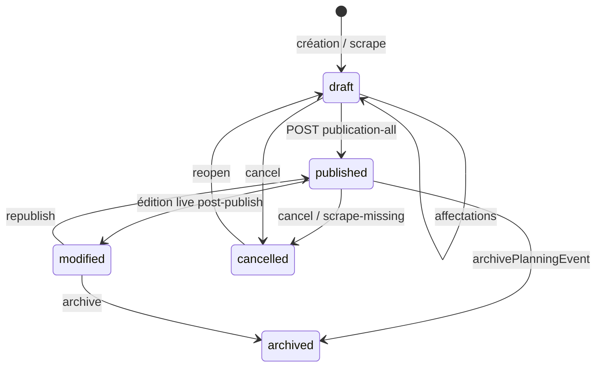

# Audit 04 — Planning, affectations et publication

**Repository :** `https://github.com/brahmiamine/afp-planning`  
**Périmètre :** code sur `main` au 2026-09-10  
**Méthode :** revue statique + tests unitaires recoupés (`global-publication.test.ts`, `publication-all/route.test.ts`, E2E `publication-cycle` / `post-publication-republish`). UI non rejouée dans un navigateur.  
**Relation :** l’audit 01 fournit le contexte métier ; **toutes les règles de publication ont été revérifiées ici** dans `global-publication.ts` et les routes.

---

## Sommaire

1. [Score](#1-score)
2. [Architecture et concepts](#2-architecture-et-concepts)
3. [Machine à états](#3-machine-à-états)
4. [Affectations](#4-affectations)
5. [Règles de publication (contournabilité API)](#5-règles-de-publication-contournabilité-api)
6. [Publication globale et Mon Planning](#6-publication-globale-et-mon-planning)
7. [Scénarios obligatoires (18)](#7-scénarios-obligatoires-18)
8. [Indisponibilités](#8-indisponibilités)
9. [Matrice modification après publication](#9-matrice-modification-après-publication)
10. [Notifications, chat, atomicité, perf](#10-notifications-chat-atomicité-perf)
11. [Tests](#11-tests)
12. [Findings](#12-findings)
13. [Décisions produit](#13-décisions-produit)
14. [Plan de remédiation](#14-plan-de-remédiation)
15. [Definition of Done](#15-definition-of-done)

---

## 1. Score

**Note : 72 / 100**

| Dimension | Poids | Note |
|-----------|------:|-----:|
| Cohérence du workflow | 20 | 16 |
| Affectations | 15 | 9 |
| Règles de publication et applicabilité serveur | 20 | 14 |
| Modifications post-publication / republication | 15 | 12 |
| Mon Planning | 10 | 8 |
| Indisponibilités | 10 | 6 |
| Notifications | 5 | 4 |
| Concurrence / atomicité | 5 | 3 |

**Findings :** P0 **0** · P1 **4** · P2 **7** · P3 **3**

---

## 2. Architecture et concepts

| Surface | Chemin |
|---------|--------|
| Préparation | `/club/planning` → `PlanningPreparationView.tsx` |
| Contrôle | `/club/planning/controle` → `PlanningControlList.tsx` (#341) |
| Workspace événement | `/club/evenements/[eventType]/[eventId]` |
| Mon Planning | `/mon-planning` |
| Publish UI | `PublishPlanningControl.tsx` |

| Concept | Représentation | Preuve |
|---------|----------------|--------|
| Match | `MatchOfficial` / amical + extras | `event-store.ts:58-72` |
| Événement | `PlanningEventSnapshot` (officiel\|amical\|entrainement\|plateau) | idem |
| Préparation | live `draft`/`modified` | `listPlanningEventSnapshots` |
| Publication | snapshot global `published-planning:{clubId}` | `published-planning.ts:27-32,610-625` |
| Affectation | `AssignmentContact[]` par `PlanningRole` | `event-store.ts:59` |
| Fonction | `PlanningFunction` user | `roles.ts:7-15` — **orthogonal** à `accessRole` |
| Archive | `planning_event_state.archived_at` + retrait snapshot | `event-lifecycle.ts:20-71` |

**Legacy :** per-event publish retiré (`publication-service.ts:6-18`) — cancel/reopen only. Statut inconnu traité comme `published` (`p0-rules.ts:10-17`).

**Endpoints :**

| Action | Route | Handler |
|--------|-------|---------|
| Preview | `GET /api/planning/publication-all` | `getGlobalPlanningPublicationPreview` |
| Publier | `POST /api/planning/publication-all` | `publishGlobalPlanning` — `WRITE_ROLES` |
| Cancel/reopen | `POST /api/planning/publication` | `applyPlanningPublicationAction` |
| Save rôles | via events / `saveRoleAssignments` | `event-store.ts:453` |
| PUT extras | `PUT /api/matches/[id]` | **sans validation** |
| Auto-assign | `POST /api/planning/auto-assign` | passe par `saveRoleAssignments` |
| Swaps | `POST /api/planning/assignment-swaps` | patch snapshot immédiat |
| Mon Planning | `GET /api/me/planning` | `listPersonalAssignments` |

---

## 3. Machine à états

Pas d’état `postponed`.

---

## 4. Affectations

| PlanningRole | Champ | PlanningFunction | PersonType |
|--------------|-------|------------------|------------|
| `arbitre` | `arbitreTouche` | `arbitre_club` | `officiel` |
| `encadrant` | `contactEncadrants` | `encadrant` | `encadrant` |
| `accompagnateur` | `contactAccompagnateur` | `accompagnateur` | `accompagnateur` |

Mapping : `person-link.ts:10-27`.

| Règle | Comportement | Preuve |
|-------|--------------|--------|
| Qui affecte | admin only | `WRITE_ROLES` |
| Éligibilité | club + active + fonction | `person-link.ts:46-74` |
| Doublon même rôle | dédup enrich | `assignment-contacts.ts:63-65` |
| Multi-fonctions | **autorisé** | `personal-planning.ts:321-323` |
| Inactif | bloqué au **publish** toujours | `global-publication.ts:117-126` |
| Autre club | lookup `clubId` | `person-link.ts:56` |
| Indispo / conflit | `saveRoleAssignments` + publish si flag | `event-store.ts:461-468` |
| `PUT matches` | **aucune** validation | `matches/[id]/route.ts:65-97` |
| Post-publish admin | `modified`, wait republish | `assignment-propagation.ts:9-48` |
| Swap approve | snapshot **immédiat** | `assignment-swaps/route.ts:164-177` |

`accessRole` n’est **jamais** utilisé pour l’éligibilité d’affectation.

---

## 5. Règles de publication (contournabilité API)

`collectPublicationBlockers` (`global-publication.ts:87-182`) :

1. **Toujours :** `personId` orphelin, assignee inactif.  
2. Si `publicationReadiness` : couverture de rôles + horaire valide (`validation.ts:74-93`).  
3. Si `assignmentValidation` : indispo, conflits, types (`validation.ts:129-176`).

Defaults flags **true** (`settings.ts:57-61`). Officiel/amical → 3 rôles ; entraînement/plateau → encadrant only (`validation.ts:63-71`).

| Règle | UI | API publish | Contournable API direct ? |
|-------|:--:|:-----------:|---------------------------|
| Minima rôles | badges | 409 si readiness ON | **Non** si flag ON ; **Oui** si flag OFF (settings admin) |
| Indispos | client bloque drag | 409 si validation ON | **Oui** via `PUT /api/matches/[id]` (même admin) ; **Non** via `saveRoleAssignments` si flag ON |
| Orphelin / inactif | — | 409 toujours | **Non** |
| Dirigeant publie | bouton absent | 403 | **Non** |
| Republish noop | bouton disabled | POST OK, pas de notifs #348 | Harmless |

Candidat audit 02 : `PUT matches` = même rôle admin, donc pas une élévation ; c’est une **incohérence de règle métier** (PLAN-001).

---

## 6. Publication globale et Mon Planning

- Portée : tous les événements non cancelled dans la fenêtre J−N (défaut 7) → futur (`published-planning.ts:75-135`, `global-publication.ts:231-238`). Les filtres UI **ne réduisent pas** l’ensemble publié (`PublishPlanningControl.tsx:89-94`).
- « Publié » en DB = (1) record snapshot `schemaVersion` + `publishedAt` + `events[]` (2) champs live `planningStatus/publishedAt/publishedByUserId`.
- **Mon Planning lit le snapshot**, pas le live (`personal-planning.ts:293-300`). Conditions d’apparition : auth + ≥1 `PlanningFunction` (`me/planning/route.ts:18-22`) + contact match + fonction actuelle + statut visible.

Multi-fonctions : une entrée par rôle, groupées par événement (`personal-planning.ts:87-121`).

---

## 7. Scénarios obligatoires (18)

| # | Scénario | Conclusion | Preuve |
|---|----------|------------|--------|
| 1 | Match complet → publication | **Géré** | `publication-all/route.test.ts:26-66` |
| 2 | Arbitre/encadrant/accompagnateur manquant | **Géré** si readiness ON | `validation.ts:83-90` → 409 |
| 3 | Utilisateur indisponible | **Partiel** | bloqué save/publish si flag ; **pas** `PUT matches` |
| 4 | Doublon d’affectation | **Géré** (dedupe) | `assignment-contacts.ts:63-65` |
| 5 | Plusieurs fonctions même personne | **Géré** (autorisé) | issue #210 tests |
| 6 | Non publié dans Mon Planning | **Géré** (invisible) | `personal-planning.ts:293-298` ; e2e cycle |
| 7 | Changement arbitre après publish | **Géré** (stale jusqu’à republish) | `assignment-propagation.ts:37-48` |
| 8 | Ajout/retrait affectation après publish | **Géré** sauf **swaps immédiats** | vs `assignment-swaps/route.ts:164-177` |
| 9 | Date/heure/terrain après publish | **Géré** (live modified, MP stale) | e2e `post-publication-republish.spec.ts:39-62` |
| 10 | Match annulé | **Géré** (visible après republish / kept in snapshot) | `publication-service.ts:30-36` |
| 11 | Match reporté | **Non géré** (pas de statut) | — |
| 12 | Disparu du scraping | **Géré** (auto-cancel 2 obs) | `json-migrator.ts:405-417` |
| 13 | Nouveau match après publication | **Géré** (`added` au republish) | diff `published-planning.ts:388-392` |
| 14 | Republication sans changement | **Géré** #348 | `global-publication.ts:377-381` ; test `:408-456` |
| 15 | Double clic | **Partiel** | UI disable ; API concurrent possible |
| 16 | Deux admins simultanés | **Partiel** | revision events ; snapshot save sans FOR UPDATE |
| 17 | Publication pendant modification | **Partiel** | 409 revision ; publish peut figer un mid-edit déjà sauvé |
| 18 | Publier ressource autre club | **Géré** | ALS + club-scoped ; tests multi-tenant |

---

## 8. Indisponibilités

| Contexte | Effet |
|----------|--------|
| Suggestions | exclusion | `assignment-suggestions.ts` |
| `saveRoleAssignments` | **bloque** si `assignmentValidation` | `event-store.ts:461-468` |
| Publish | **bloque** si flag | `global-publication.ts:151-179` |
| `PUT matches` / PATCH events hors saveRole | **aucun** | PLAN-001 |
| Indispo après affectation | pas d’auto-unassign ; bloque le publish ultérieur | |

`indispoBlocksPlanning` : tout sauf `rejected` (`officiel-availability.ts:156-159`).

---

## 9. Matrice modification après publication

| Changement | Live DB | Mon Planning | Notification | Republish ? |
|------------|---------|--------------|--------------|:-----------:|
| Affectation admin | `modified` + `modifiedAfterPublishAt` | ancien snapshot | à la republication | **Oui** |
| Swap approve | live + **patch snapshot assignments** | immédiat | notifs swap | Non |
| Date / heure / terrain | `modified` | stale | `rescheduled` au republish | **Oui** |
| Annulation | live `cancelled` | stale puis cancelled kept | `cancelled` au republish | pour visibilité |
| Scrape missing | auto `cancelled` | jusqu’à republish | admin `official_match_*` | pour vue membre |
| Archive | retiré du snapshot **now** | disparu | `removed` si futur | N/A |

**Dirty :** `planningStatus: 'modified'` + `modifiedAfterPublishAt`. Pas de `changedSincePublish` par champ. `planningRevision` sur extras live.

---

## 10. Notifications, chat, atomicité, perf

- Publish : enqueue si `diff.changed > 0` (`global-publication.ts:381-418`) ; delivery **après** commit (`:428-432`).  
- Draft assign : pas de notif. `notifyAssignmentChanges` **non branché**.  
- Event chat : assignees du **snapshot publié** (`chat/policy.ts:22-36`). Désaffecté perd l’accès après update snapshot (#345).  
- Atomicité : une TX pour statuts + snapshot + audit + outbox (`:272-426`) — « jamais de publication partielle » (commentaire).  
- Idempotency keys ancrées sur `before.publishedAt` (`:357-362`).  
- Perf : N+1 `savePlanningPublication` + `syncAssignmentStatesForRole` par candidat (`:282-313`).

---

## 11. Tests

| Zone | Fichiers |
|------|----------|
| Publish / #348 / inactifs | `global-publication.test.ts` |
| API publish | `publication-all/route.test.ts` (pas de cas dirigeant 403, pas de POST blockers) |
| Cancel/reopen | `publication/route.test.ts` |
| Mon Planning | `personal-planning.publication.test.ts` |
| Indispo save | `event-store.assignment-validation.integration.test.ts` |
| E2E | `publication-cycle.spec.ts`, `post-publication-republish.spec.ts` |
| Chat #345 | `chat/policy.test.ts` |

**Trous :** concurrent double publish ; `PUT matches` indispo ; postponed ; N+1 perf.

---

## 12. Findings

### PLAN-001 — P1 — APIs manuelles d’affectation sans validation
`PUT /api/matches/[id]` (`:65-97`) et certains PATCH events. Impact : drafts sales / publication 409 surprise. Corrélation 01 FUNC-003 et 02 (règle non uniforme).

### PLAN-002 — P1 — `savePublishedPlanning` sans `FOR UPDATE`
Contrasté avec `rewritePublishedPlanningRecord` (`published-planning.ts:638-645`). Deux admins peuvent se marcher dessus.

### PLAN-003 — P1 — Minima de publication optionnels via flags
`publicationReadiness` / `require*ForPublication`. Décision produit (01 D4).

### PLAN-004 — P1 — Dual visibilité post-publish (admin différé vs swap immédiat)
`assignment-propagation.ts` vs `assignment-swaps/route.ts:164-177`.

### PLAN-005 — P2 — Pas de statut `postponed`
### PLAN-006 — P2 — N+1 publication de masse
### PLAN-007 — P2 — `notifyAssignmentChanges` mort
### PLAN-008 — P2 — Cancel/reopen ne met pas à jour le snapshot (contrairement à archive)
### PLAN-009 — P2 — Texte feature `assignmentValidation` sous-estime le save
### PLAN-010 — P2 — UI bloque noop republish ; API l’autorise
### PLAN-011 — P3 — Nommage `publication` vs `publication-all`
### PLAN-012 — P3 — Legacy default `published` pour statut inconnu (`p0-rules.ts:10-17`)
### PLAN-013 — P3 — Fenêtre J−N via env seulement

---

## 13. Décisions produit

**P-1 Validation unique ?** A) Brancher validation sur tous les writes. B) Warn-only save, hard publish. C) UI only.  
**P-2 Dual immédiat/différé ?** A) Toujours différé. B) Toujours immédiat. C) Documenter swap (actuel).  
**P-3 Reporté ?** A) Nouveau statut. B) Cancel+motif. C) Datetime only.  
**P-4 Périmètre publish ?** A) Global only (actuel, `publication-service.ts:6-12`). B) Week-end filtré. C) Per-event (rejeté).  
**P-5 Chat après désaffectation ?** Révoquer (actuel #345) vs grâce / read-only.

---

## 14. Plan de remédiation

1. Unifier `saveRoleAssignments` comme unique write path (PLAN-001).  
2. `FOR UPDATE` sur le record snapshot (PLAN-002).  
3. Trancher P-1 à P-5.  
4. Tests API : dirigeant 403, publish avec blockers → 409, concurrent publish.  
5. Réduire N+1 (batch status writes).

---

## 15. Definition of Done

- [x] 18 scénarios sourcés  
- [x] Chaque règle de publication indique la contournabilité API  
- [x] Matrice post-publish date/heure/terrain/affectation/annulation/report  
- [x] Règles non déterminables → options concrètes  

**Non vérifié dynamiquement :** UI double-clic réel, charge N matchs, deux navigateurs admin.
