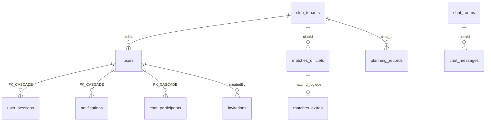

# Audit 06 — Base de données et API

**Repository :** `https://github.com/brahmiamine/afp-planning`  
**Périmètre :** code sur `main` au 2026-09-10  
**Méthode :** schémas + 20 migrations + 92 routes. `pnpm run db:migrate` **non exécuté** ici (pas de MariaDB locale) — `Non exécuté — vérification statique uniquement`. CI `main` exécute migrate puis tests : **76 fichiers failed** (ALS bootstrap + FK tests).

**Corrections vs audit 06 précédent :** « 18 migrations / aucune FK » est **faux**. Il y a **20** migrations et **3 FK** (0019). Table `chat_rate_limit_events` (0020).

---

## Sommaire

1. [Score](#1-score)
2. [Architecture Data/API](#2-architecture-dataapi)
3. [Modèle et ER](#3-modèle-et-er)
4. [Ownership et `findOne(id)`](#4-ownership-et-findoneid)
5. [Relations, unicité, indexes](#5-relations-unicité-indexes)
6. [Enums, dates, suppressions](#6-enums-dates-suppressions)
7. [Migrations](#7-migrations)
8. [Transactions](#8-transactions)
9. [Inventaire API](#9-inventaire-api)
10. [Validation, contrats, pagination, N+1, erreurs](#10-validation-contrats-pagination-n1-erreurs)
11. [Cas obligatoires](#11-cas-obligatoires)
12. [Findings](#12-findings)
13. [Plan de remédiation](#13-plan-de-remédiation)
14. [Definition of Done](#14-definition-of-done)

---

## 1. Score

**Note : 68 / 100**

| Dimension | Poids | Note |
|-----------|------:|-----:|
| Intégrité du modèle | 20 | 12 |
| Isolation multi-tenant des requêtes | 20 | 16 |
| Contrats API et validation | 15 | 11 |
| Transactions / concurrence | 15 | 11 |
| Migrations | 10 | 7 |
| Performance N+1 / index | 10 | 7 |
| Gestion des erreurs | 5 | 3 |
| Tests | 5 | 1 |

Le poste Tests/Migrations est tiré vers le bas par **FUNC-001** : `ensureJsonDataMigrated` casse le boot sur DB vide (`json-migrator.ts:453`) — CI rouge.

**Findings :** P0 **1** · P1 **4** · P2 **8** · P3 **4**

---

## 2. Architecture Data/API

```mermaid
flowchart LR
  Route[app/api/route.ts] --> Require[requireAuth/requireRole]
  Require --> ALS[setCurrentClubId]
  ALS --> Service[lib/planning|chat|notifications]
  Service --> ORM[TypeORM EntitySchema]
  Service --> RawSQL[planning_records SQL]
  ORM --> MariaDB[(MariaDB)]
  RawSQL --> MariaDB
```

| Composant | Preuve |
|-----------|--------|
| DataSource | `data-source.ts:31-44` — `synchronize: false`, `timezone: 'Z'` |
| Sync policy | `:18-28` — prod never ; non-prod seulement si `TYPEORM_SYNCHRONIZE=1` |
| Boot | `:60-69` initialize → `runSchemaMigrations` → optional sync |
| Entités | `schemas.ts` **22** EntitySchema, **pas** de `relations:` TypeORM |
| Runner | `migrations/runner.ts` — `GET_LOCK`, checksum immuable |
| Script | `package.json` `db:migrate` → `scripts/run-migrations.ts` |
| `getDb()` | `index.ts:12-31` — **puis** `ensureJsonDataMigrated` (P0) |
| Validation | `validation/request.ts` `BodyValidator` |

---

## 3. Modèle et ER

### 3.1 EntitySchema (22)

`Club`, `Categorie`, `Stade`, `MatchOfficial`, `MatchAmical`, `Entrainement`, `Plateau`, `MatchExtra`, `AppMeta`, `User`, `UserSession`, `Invitation`, `MatchAuditLog`, `Notification`, `PasswordResetToken`, `ChatRoom`, `ChatParticipant`, `ChatMessage`, `ChatReadState`, `ClubTenant`, `PlatformAdmin`, `PlatformSession` (`schemas.ts:89-704`).

| Entité | PK | Ownership → club | Soft |
|--------|-----|------------------|------|
| Match* / Extra / Cat / Stade / Club(opponents) / Invitation / Audit | composite ou `clubId` | colonne `clubId` | cancel / usedAt |
| User | `id` | `users.clubId` | `active`, `claimedAt` |
| UserSession | token | user → club | `revokedAt` · **FK CASCADE 0019** |
| Notification | `id` | user → club | `readAt` · **FK CASCADE 0019** |
| ChatParticipant | `(roomId,userId)` | room/user → club | **FK CASCADE 0019** |
| ChatRoom | `id` | `clubId` | `archivedAt` |
| ChatMessage | `id` | room → club | `deletedAt` |
| ClubTenant | `id` string | **racine tenant** | `active` |
| PlatformAdmin/Session | — | plateforme (pas club) | |
| AppMeta | `key` | global | |

### 3.2 Tables SQL-only

`planning_records`, `planning_attachments`, `planning_event_state`, `planning_assignment_state`, `push_subscriptions`, `planning_notification_outbox`, `chat_attachments`, `scraper_sync_runs`, `login_rate_limits`, `schema_migrations`, `chat_rate_limit_events` (0020). Ownership : `club_id` ou `user_id` → users.



---

## 4. Ownership et `findOne(id)`

Requêtes tenant-scoped via ALS `getCurrentClubId()` (`records.ts:86`) ou `where: { clubId: auth.user.clubId }`.

| Location | Pattern | Sûr ? |
|----------|---------|-------|
| `session.ts:124,132` | session/user by id | **Oui** — token capability |
| `chat/service.ts:171` | room by id puis `authorizeRoomForUser` | **Oui** |
| `me/profile.ts:18` | `auth.user.id` | **Oui** |
| `invitations/[token]/route.ts:19` | hash token | **Oui** (secret) |
| `password-reset/confirm.ts:42` | reset.userId | **Oui** |
| `settings/route.ts:46` | ClubTenant query id | **Oui** — public probe + RL |
| `json-migrator.ts:453` | `getCurrentClubId()` au bootstrap | **Non** — pas de tenant (DB-001) |
| `getPlanningRecord` | `id` + `club_id = getCurrentClubId()` | **Oui** si ALS posé ; **throw** sinon (#333) |

---

## 5. Relations, unicité, indexes

**FK MariaDB (0019) :** `fk_user_sessions_user_id`, `fk_notifications_user_id`, `fk_chat_participants_user_id` CASCADE (`referential-integrity.ts:48-70`). **Pas de FK** sur messages, invitations, push, outbox, planning_*, events.

**Unicité :**
- Email : `uq_users_club_email` (0017) — multi-club OK  
- Push : `endpoint_hash` UNIQUE + UPSERT  
- Outbox : `idempotency_key` UNIQUE  
- Chat : `roomKey`, `(roomId,sequence)`, `(roomId,sender,clientMessageId)`  
- Invitations : PK = token hash ; **pas** UNIQUE pending email  
- Source scrape : **pas** UNIQUE DB sur `sourceMatchId`

**Indexes justifiés :** notifications user/unread ; `planning_records.token_hash` ; chat messages sequence ; outbox `(status, next_attempt_at)` ; assignment_state person/event ; rate-limit buckets. Pas de `sort`/`orderBy` client → pas d’injection.

---

## 6. Enums, dates, suppressions

- Rôles : strings TS, pas ENUM SQL.  
- Dates match : strings `jj/mm/aaaa` / `hh:mm` ; instants via `eventStartTimestamp` TZ club défaut `Europe/Paris` (`schemas.ts:619`, `p0-rules.ts:70-82`) — DST testé côté planning, pas scraper.  
- DB connection UTC (`data-source.ts:42`).  
- Default colonne `'afp'` encore présent (`schemas.ts:4-6`) — risque si ALS oublié **avant** #333 ; maintenant throw plutôt que fuite.

Suppressions : hard user après `findUserReferences` (409 sinon) ; CASCADE sessions/notifs/participants ; messages anonymisés ; soft chat `deletedAt` ; archive event retire snapshot ; club deactivate révoque sessions.

---

## 7. Migrations

| ID | Nom | Effet |
|----|-----|-------|
| 0001 | planning_records_et_attachments | tables SQL + club |
| 0002 | planning_event_state | archive PK |
| 0003 | push_subscriptions | |
| 0004 | planning_notification_outbox | |
| 0005 | chat_attachments | |
| 0006 | scraper_sync_runs | |
| 0007 | planning_assignment_state | |
| 0008 | PK événements tenant-scoped | |
| 0009 | audit_log tenant | |
| 0010 | accessRole / planningFunctions | |
| 0011 | chat attachment quota indexes | |
| 0012 | profils sans accès `claimedAt` | |
| 0013 | invitations token hash | |
| 0014 | login_rate_limits | |
| 0015 | planning_records token_hash | |
| 0016 | outbox idempotency UNIQUE | |
| 0017 | email unique par club | |
| 0018 | tables entités TypeORM (plus de sync prod) | |
| **0019** | **FK users phase 1 + orphan cleanup** | |
| **0020** | **chat_rate_limit_events** | |

CI : `.github/workflows/ci.yml:79` et e2e `:117` `pnpm run db:migrate`.

**Note :** commentaire 0020 dupliqué (`schema-migrations.ts:46-50`).

---

## 8. Transactions

| Flux | TX | HTTP dans TX ? |
|------|----|----------------|
| Invitation accept | oui + lock | session **après** commit |
| Publication globale | oui | delivery **après** |
| Chat send / create room | oui + seq lock | non |
| User PUT/DELETE | oui | notifs après |
| Scraping | TX sync + advisory lock | notifs après |
| Mark-all-read notifs | UPDATE simple | n/a |
| JSON migrate bootstrap | lock GET_LOCK | **ALS manquant** |

---

## 9. Inventaire API

92 `route.ts` — voir audit 02 §4 pour le groupement auth (réutilisé, revérifié).

| Domaine | Auth | Validation | Codes typiques |
|---------|------|------------|----------------|
| Auth | public / session | hand | 400/401/409/429 |
| Users / directory | admin | hand | 400/403/404/409 |
| Planning canonical | admin / auth | BodyValidator events | 400/403/404/409 |
| Chat HTTP | auth | service | 400/403/413/429 |
| Plateforme | platform cookie | hand | 400/401/404/409 |
| Cron | Bearer secret | — | 401/500 |
| Public tokens | token | — | 404/410 |

**Consommateurs faibles / absents UI :** `/api/planning/publication` (UI = publication-all), `auto-assign`, `waitlist`, `travel`, `overview`, `suggestions`, event `attachments/collaboration/reports`, cron×2, `push/unsubscribe`. Ne pas supprimer sans confirmer flags.

Convention 401 vs 403 **respectée**.

---

## 10. Validation, contrats, pagination, N+1, erreurs

- BodyValidator : surtout `planning/events/**`. Directory/settings/me : hand.  
- `serializeUser` omet `passwordHash` / `icalToken` (`users/route.ts:10-24`) ; **`GET /api/auth/me` inclut `icalToken`** (`session.ts:73`) — API-001.  
- Pagination : notifs 100 ; messages cursor 1–200 ; archives/users/events **non bornés**.  
- N+1 : `listChatEvents` ; publish mass (audit 04). `listRooms` batché.  
- UNIQUE races : souvent 500 sauf quelques `ER_DUP_ENTRY` → 409 (platform admins).  
- CI tests : `ER_NO_REFERENCED_ROW_2` sur `user_sessions` (fixtures créent des sessions avant users / users déjà CASCADE-supprimés) — DB-003.

---

## 11. Cas obligatoires

| Cas | Comportement |
|-----|----------------|
| Deux créations simultanées (direct room / invitation) | UNIQUE + lock / 409 |
| Suppression parent user | 409 si refs ; sinon CASCADE FK + anonymize chat |
| User supprimé avec historique | messages anonymisés |
| Club désactivé | sessions null ; accept invitation 404 |
| Match supprimé | TX event+extras ; chat archivé lifecycle |
| Conversation + participant supprimé | CASCADE participant |
| Body invalide | 400 |
| ID inexistant | 404 |
| Non-auth | 401 |
| Mauvais rôle | 403 |
| Autre tenant | filtre club / 404 |
| Double requête identique | chat clientMessageId ; invitation 409 ; push UPSERT |
| **DB vide premier getDb()** | **throw ALS** — DB-001 |

---

## 12. Findings

### DB-001 — P0 — `migrateJsonData` exige ALS sur DB neuve
`json-migrator.ts:453` depuis `getDb()` (`index.ts:18-19`). Casse login/E2E/CI. Même cause que FUNC-001.  
**Statut :** 🔴 Confirmé (CI run `34512699676`)

### DB-002 — P1 — Majorité des tables sans FK
Phase 1 seulement (`referential-integrity.ts:7-8`). Orphelins possibles (messages, push, outbox, planning_*, invitations).

### DB-003 — P1 — Tests / fixtures incompatibles avec FK 0019
CI `ER_NO_REFERENCED_ROW_2` `user_sessions` → `users`. + `ER_DUP_ENTRY` `uq_users_ical_token`.

### DB-004 — P1 — Pas de UNIQUE DB `sourceMatchId`
Identité scrape applicative seulement.

### DB-005 — P1 — Invitations pending non uniques par email
Doublons d’invites possibles.

### API-001 — P2 — `icalToken` dans `/api/auth/me`
Corrélation SEC-002.

### API-002 — P2 — BodyValidator étroit
### API-003 — P2 — UNIQUE races → 500
### API-004 — P2 — `/api/planning/publication` orphelin UI
### API-005 — P2 — Listes unbounded (users, archives, events)
### API-006 — P2 — `listChatEvents` N+1
### API-007 — P3 — Default `'afp'` encore dans schémas
### API-008 — P3 — Commentaire migration 0020 dupliqué
### DB-006 — P3 — ChatReadState / PasswordResetToken / push sans FK
### API-009 — P3 — Mark-all-read sans TX (acceptable)

---

## 13. Plan de remédiation

1. **Fix bootstrap JSON** (DB-001) — débloque CI.  
2. Adapter factories de tests à 0019 (ordre insert user→session, icalToken unique).  
3. FK phase 2 (messages, invitations, push) après cleanup.  
4. UNIQUE sourceMatchId par club (payload ou colonne).  
5. Étendre BodyValidator + mapper ER_DUP → 409.  
6. Pagination listes admin.

**Décisions techniques :** (T1) garder dual stack EntitySchema + SQL planning_records vs unifier ; (T2) étendue des FK ; (T3) abandonner import `data/*.json`.

---

## 14. Definition of Done

- [x] 22 EntitySchema + SQL-only dans l’ER avec ownership  
- [x] 92 endpoints dans l’inventaire (détail auth = audit 02, recoupé)  
- [x] 20 migrations listées dans l’ordre  
- [x] Patterns `findOne/delete/update(id)` documentés  

**Migrations réelles sur DB vide :** non exécutées localement ; CI les exécute puis échoue au bootstrap JSON / FK tests.
